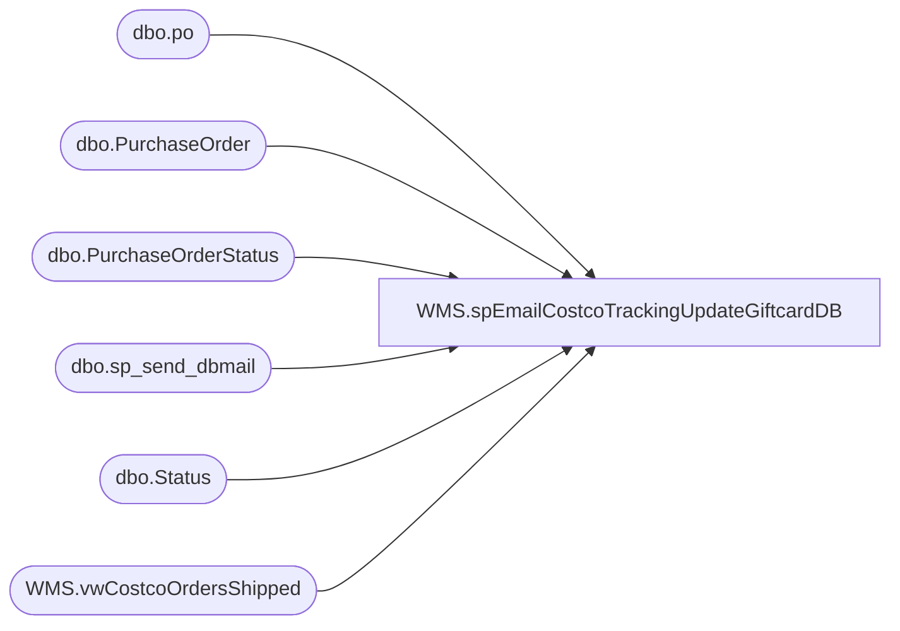

# WMS.spEmailCostcoTrackingUpdateGiftcardDB

**Database:** IntegrationStaging  

## Architecture Diagram



## Table Dependencies

| Referenced Table |
|---|
| dbo.po |
| dbo.PurchaseOrder |
| dbo.PurchaseOrderStatus |
| dbo.sp_send_dbmail |
| dbo.Status |
| WMS.vwCostcoOrdersShipped |

## Stored Procedure Code

```sql
CREATE proc [WMS].[spEmailCostcoTrackingUpdateGiftcardDB]

as

-- =====================================================================================================
-- Name: spEmailCostcoTrackingUpdateGiftcardDB
--
-- Description:	Sends email to Costco for items shipped to Costco each day, updates Gift Card Master Database with tracking number per PO
--		Name:			Date:			Comments:
--		Dan Tweedie		2020-4-2		Created proc.
-- =====================================================================================================


set nocount on 

IF (Object_ID('tempdb..#CostcoShipments') IS NOT null) DROP TABLE #CostcoShipments
select
	CostcoOrderNumber,
	CostcoWarehouse, 
	DeliveryName, 
	dlvMode,
	case when MasterTrackingNumber is null 
			Then 'No Tracking Number Assigned'
			else MasterTrackingNumber
	   end as MasterTrackingNumber,
	ProductName, 
	ShippedQty,
	Country
into #CostcoShipments
from WMS.vwCostcoOrdersShipped 
where cast(dateadd(hh, -5, ShipConfirmDateTime) as date) = cast(getdate() as date)


if (select count(*) from #CostcoShipments) > 0

begin

	declare @text nvarchar(max)

	if(select count(*) from #CostcoShipments where Country = 'US') > 0 

	begin

		set @text = '
		<font face =arial size = 4> ' +
			'<b>Build-A-Bear to Costco Shipment Notification</b>' +
			'<br><br>' +
			'<table border="1" <font face =arial size = 2>' +
			'<tr><th>PO</th><th>Whse#</th><th>Whse Name</th><th>Shipping Service</th><th>Tracking Number</th><th>SKU Description</th><th>Qty Shipped</th></tr>' +
			CAST ( ( SELECT td = CostcoOrderNumber, '',
							td = CostcoWarehouse, '',
							td = DeliveryName, '',
							td = dlvMode, '',
							td = MasterTrackingNumber, '',
							td = ProductName, '',
							td = ShippedQty, ''
						from  #CostcoShipments
						where Country = 'USA'
						order by CostcoOrderNumber, CostcoWarehouse, dlvMode, MasterTrackingNumber, ProductName
						FOR XML PATH('tr'), TYPE 
			) AS NVARCHAR(MAX) ) +
					'</font></table></font></p></p>
					<br>
					<br>
					<br>
				<font face =arial size = 1><i>The information in this message may be privileged, “confidential” and protected from disclosure and/or intended only for the addressee(s) named above.  If the reader of this message is not the intended recipient, or an employee or agent responsible for delivering this message to the intended recipient, you are hereby notified that any dissemination, distribution or copying of the communication is strictly prohibited.  If you have received this communication in error, please notify us immediately by replying to the message and deleting it from your computer.  Thank you beary much.</i></font>'
					
		exec msdb.dbo.sp_send_dbmail
		@profile_name = 'biadmin',
		@recipients = 'GiftCardCostcoNotification@buildabear.com',--'swells@costco.com;gabriel.poirier@costco.com;blarson@costco.com'
		@blind_copy_recipients = 'brysona@buildabear.com',
		@subject = 'Build-A-Bear to Costco Shipment Notification',
		@body = @text,
		@body_format = 'HTML'

	end

		if(select count(*) from #CostcoShipments where Country = 'CAN') > 0 

	begin

		set @text = '
		<font face =arial size = 4> ' +
			'<b>Build-A-Bear to Costco Shipment Notification</b>' +
			'<br><br>' +
			'<table border="1" <font face =arial size = 2>' +
			'<tr><th>PO</th><th>Whse#</th><th>Whse Name</th><th>Shipping Service</th><th>Tracking Number</th><th>SKU Description</th><th>Qty Shipped</th></tr>' +
			CAST ( ( SELECT td = CostcoOrderNumber, '',
							td = CostcoWarehouse, '',
							td = DeliveryName, '',
							td = dlvMode, '',
							td = MasterTrackingNumber, '',
							td = ProductName, '',
							td = ShippedQty, ''
						from  #CostcoShipments
						where Country = 'CAN'
						order by CostcoOrderNumber, CostcoWarehouse, dlvMode, MasterTrackingNumber, ProductName
						FOR XML PATH('tr'), TYPE 
			) AS NVARCHAR(MAX) ) +
					'</font></table></font></p></p>
					<br>
					<br>
					<br>
				<font face =arial size = 1><i>The information in this message may be privileged, “confidential” and protected from disclosure and/or intended only for the addressee(s) named above.  If the reader of this message is not the intended recipient, or an employee or agent responsible for delivering this message to the intended recipient, you are hereby notified that any dissemination, distribution or copying of the communication is strictly prohibited.  If you have received this communication in error, please notify us immediately by replying to the message and deleting it from your computer.  Thank you beary much.</i></font>'
					
		exec msdb.dbo.sp_send_dbmail
		@profile_name = 'biadmin',
		@recipients = 'gloria.ung@costco.com',--'GiftCardCostcoCanadaNotification@buildabear.com',--'swells@costco.com;gabriel.poirier@costco.com;blarson@costco.com'
		@blind_copy_recipients = 'santiagob@buildabear.com;lindak@buildabear.com',
		@subject = 'Build-A-Bear to Costco Shipment Notification',
		@body = @text,
		@body_format = 'HTML'

	end


End


if (select count(*) from #CostcoShipments) > 0
begin
--update gift card database
	---set the tracking number
	IF (Object_ID('tempdb..#CostcoTracking') IS NOT null) DROP TABLE #CostcoTracking
	select CostcoOrderNumber, max(MasterTrackingNumber) MasterTrackingNumber
	into #CostcoTracking
	from #CostcoShipments
	group by CostcoOrderNumber

	update po
	set po.ShipperTrackingNumber = ct.MasterTrackingNumber, 
	po.ShipDateTime = getdate()
	from KODIAK.GiftCardMstrData.dbo.PurchaseOrder po
	inner join #CostcoTracking ct on po.PurchaseOrderNumber = ct.CostcoOrderNumber
	where isnull(po.ShipperTrackingNumber,'x') <> isnull(ct.MasterTrackingNumber,'x')


	---set the shipped status
	DECLARE @POShipped INT
	SELECT @POShipped = StatusID FROM KODIAK.GiftCardMstrData.dbo.[Status] WHERE StatusDescription = 'PO Shipped'
	
	INSERT INTO KODIAK.GiftCardMstrData.dbo.PurchaseOrderStatus (PurchaseOrderID, StatusID, StatusMachineName, CRTED_BY, CRTED_DT)
	SELECT DISTINCT po.PurchaseOrderID, @POShipped, HOST_NAME(), SYSTEM_USER, po.ShipDateTime
	FROM KODIAK.GiftCardMstrData.dbo.PurchaseOrder po
	LEFT JOIN KODIAK.GiftCardMstrData.dbo.PurchaseOrderStatus pos ON po.PurchaseOrderID = pos.PurchaseOrderID AND @POShipped = StatusID
	WHERE PurchaseOrderNumber IN (SELECT CostcoOrderNumber FROM #CostcoTracking)
	AND pos.PurchaseOrderID IS NULL
end
```

