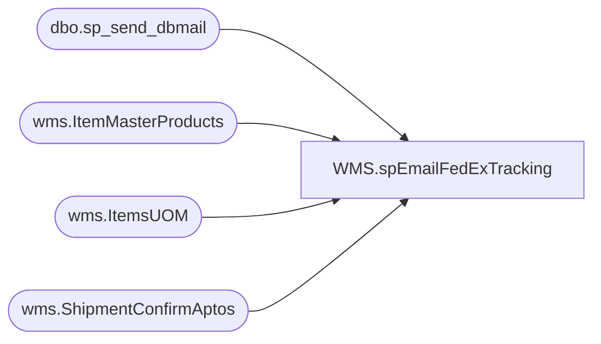

# WMS.spEmailFedExTracking

**Database:** IntegrationStaging  

## Architecture Diagram



## Table Dependencies

| Referenced Table |
|---|
| dbo.sp_send_dbmail |
| wms.ItemMasterProducts |
| wms.ItemsUOM |
| wms.ShipmentConfirmAptos |

## Stored Procedure Code

```sql
CREATE proc [WMS].[spEmailFedExTracking]

as

-- =====================================================================================================
-- Name: WMS.spEmailFedExTracking
--
-- Description:	Sends email to Distro team with FedEx tracking information from dynamics wms from the ship confirm to aptos dataset
--
-- Revision History
--		Name:			Date:			Comments:
--		Dan Tweedie		2020-02-24		Created proc.
-- =====================================================================================================


set nocount on


IF (Object_ID('tempdb..##WMShipments') IS NOT null) DROP TABLE ##WMShipments 
select 
	s.ToLocation as Store,
	s.AptosDistributionNumber as Distro,
	'FedEx' as Carrier,
	s.ModeOfDelivery,
	s.ContainerID as Carton,
	s.ContainerManifestID as Tracking,
	s.ItemNumber, 
	p.ProductName,
	cast((isnull(uom.Factor,1) * s.ContainerUnitsShipped) as int) as Qty,
	convert(varchar, cast(dateadd(hh, -6, s.ShipConfirmDatetime) as date), 101) ShipDate
into ##WMShipments
from wms.ShipmentConfirmAptos s
join wms.ItemMasterProducts p with (nolock) 
	on s.ItemNumber=p.ProductNumber
left join wms.ItemsUOM uom with (nolock) 
	on s.ItemNumber=uom.ProductNumber
	and s.ContainerUnitOfMeasure=uom.FromUnitSymbol and uom.ToUnitSymbol='ea'
	and uom.entity=1100
where 1=1
and s.Warehouse='9980' 
and s.AptosDistributionNumber > 0
and isnull(s.ContainerManifestID,'') <> ''
and datediff(dd, dateadd(hh, -6, s.ShipConfirmDatetime), getdate()) = 0


if (select count(*) from ##WMShipments) > 0

begin

	declare @text nvarchar(max)
	set @text = '
	<font face =arial size = 4> ' +
		'<b>Bearhouse FedEx Cartons Shipped Today</b>' +
		'<br><br>' +
		'<table border="1" <font face =arial size = 2>' +
		'<tr><th>STORE</th><th>DISTRO</th><th>CARRIER</th><th>CARTON</th><th>TRACKING</th><th>STYLE</th><th>SKU DESCRIPTION</th><th>QTY</th><th>SHIP DATE</th></tr>' +
		CAST ( ( SELECT td = Store, '',
						td = Distro, '',
						td = ModeOfDelivery, '',
						td = Carton, '',
						td = Tracking, '',
						td = ItemNumber, '',
						td = ProductName, '',
						td = Qty, '',
						td = ShipDate, ''
					from  ##WMShipments
					order by Store, ItemNumber, ModeOfDelivery
					FOR XML PATH('tr'), TYPE 
		) AS NVARCHAR(MAX) ) +
				'</font></table></font></p></p>
				<br>
				<br>
				<br>
			<font face =arial size = 1><i>The information in this message may be privileged, “confidential” and protected from disclosure and/or intended only for the addressee(s) named above.  If the reader of this message is not the intended recipient, or an employee or agent responsible for delivering this message to the intended recipient, you are hereby notified that any dissemination, distribution or copying of the communication is strictly prohibited.  If you have received this communication in error, please notify us immediately by replying to the message and deleting it from your computer.  Thank you beary much.</i></font>'
					
	exec msdb.dbo.sp_send_dbmail
	@profile_name = 'biadmin',
	@recipients = 'distrobears@buildabear.com;purchasing@buildabear.com',
	@copy_recipients = 'larryw@buildabear.com;shauns@buildabear.com;chuckw@buildabear.com',
	@subject = 'WM FedEx Tracking Numbers',
	@body = @text,
	@body_format = 'HTML'

end


if (select count(*) from ##WMShipments where Store = '1247') > 0

BEGIN

	set @text = '
		<font face =arial size = 4> ' +
			'<b>Bearhouse FedEx Cartons Shipped Today To Store 247</b>' +
			'<br><br>' +
			'<table border="1" <font face =arial size = 2>' +
			'<tr><th>STORE</th><th>DISTRO</th><th>CARRIER</th><th>CARTON</th><th>TRACKING</th><th>STYLE</th><th>SKU DESCRIPTION</th><th>QTY</th><th>SHIP DATE</th></tr>' +
			CAST ( ( SELECT td = Store, '',
						td = Distro, '',
						td = ModeOfDelivery, '',
						td = Carton, '',
						td = Tracking, '',
						td = ItemNumber, '',
						td = ProductName, '',
						td = Qty, '',
						td = ShipDate, ''
					from  ##WMShipments
					where Store = '1247'
					order by Store, ItemNumber, ModeOfDelivery
					FOR XML PATH('tr'), TYPE 
			) AS NVARCHAR(MAX) ) +
					'</font></table></font></p></p>
					<br>
					<br>
					<br>
				<font face =arial size = 1><i>The information in this message may be privileged, “confidential” and protected from disclosure and/or intended only for the addressee(s) named above.  If the reader of this message is not the intended recipient, or an employee or agent responsible for delivering this message to the intended recipient, you are hereby notified that any dissemination, distribution or copying of the communication is strictly prohibited.  If you have received this communication in error, please notify us immediately by replying to the message and deleting it from your computer.  Thank you beary much.</i></font>'
					
		exec msdb.dbo.sp_send_dbmail
		@profile_name = 'biadmin',
		@recipients = 'store247@buildabear.com',
		@copy_recipients = 'shauns@buildabear.com;chuckw@buildabear.com',
		@subject = 'WM FedEx Tracking Numbers For Store 247',
		@body = @text,
		@body_format = 'HTML'

END
```

