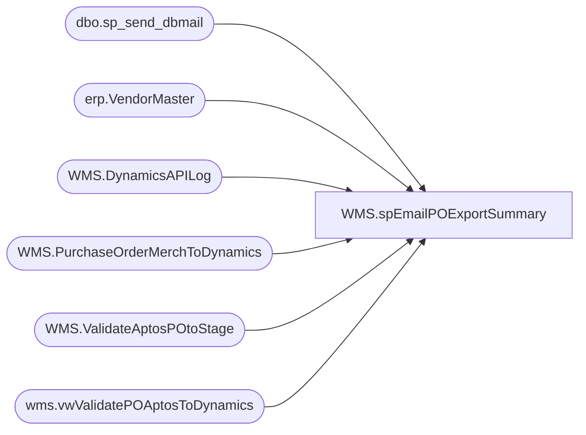

# WMS.spEmailPOExportSummary

**Database:** IntegrationStaging  

## Architecture Diagram



## Table Dependencies

| Referenced Table |
|---|
| dbo.sp_send_dbmail |
| erp.VendorMaster |
| WMS.DynamicsAPILog |
| WMS.PurchaseOrderMerchToDynamics |
| WMS.ValidateAptosPOtoStage |
| wms.vwValidatePOAptosToDynamics |

## Stored Procedure Code

```sql
CREATE proc [WMS].[spEmailPOExportSummary] 
@BatchID nvarchar(100)

as


--====================================================================================================
--	Dan Tweedie	2019-08-20	Created proc to send summary after each PO export from Aptos to Dynamics
--====================================================================================================

set nocount on

IF (Object_ID('tempdb..#PO') IS NOT null) DROP TABLE #PO;


select 
	e.PONumber as AptosPONumber, 
	convert(varchar, isnull(e.UpdateDate, e.InsertDate), 120) as StageDate,
	convert(varchar, e.ExportedToDynamicsDate, 120) as ExportedToDynamicsDate,
	--case 
	--		when substring(api.ResponseBody, charindex('Purchase order PO1200', api.ResponseBody, 1)+15, 11) like 'PO1200%' 
	--			then substring(api.ResponseBody, charindex('Purchase order PO1200', api.ResponseBody, 1)+15, 11) 
	--		else NULL
	--end as Dynamics1200PO,
	case 
		when substring(api.ResponseBody, charindex('Purchase order PO', api.ResponseBody, 1)+15, 11) like 'PO%'
			then substring(api.ResponseBody, charindex('Purchase order PO', api.ResponseBody, 1)+15, 11)
		else NULL
	end as DynamicsPO,
	case 
		when api.ResponseBody like '%hasErrors":true%' 
			then 'Yes'
		else 'NO'
	end as HasError,
	substring(api.ResponseBody, charindex('responseMsg', api.ResponseBody,1), 1000) APIResponseMessage,
	api.ResponseBody,
	api.BatchID,
	e.VendorCode,
	e.FactoryCode
into #PO
from WMS.PurchaseOrderMerchToDynamics e with (nolock)
join erp.VendorMaster vm with (nolock) 
	on vm.Entity = 1200
	and cast(e.VendorCode as nvarchar) =
		case 
			when vm.OrganizationPhoneticName like '%-%' 
			then substring(vm.OrganizationPhoneticName, 1, charindex('-',vm.OrganizationPhoneticName)-1) 
			else vm.OrganizationPhoneticName 
		end
	and e.FactoryCode =
		case 
			when vm.OrganizationPhoneticName like '%-%' 
			then substring(vm.OrganizationPhoneticName, charindex('-',vm.OrganizationPhoneticName)+1, 20) 
			else e.FactoryCode
		end
left join WMS.DynamicsAPILog api with (nolock)
	on api.IntegrationName='WMS_PurchaseOrderToDynamics'
	and e.BatchID=api.BatchID
	and e.PONumber=api.AptosDocumentNumber 
	and vm.VendorAccountNumber=api.PO_OrderAccountNumber
where e.BatchID = @BatchID
or e.ExportedToDynamicsDate is null
group by 
	e.PONumber, 
	convert(varchar, isnull(e.UpdateDate, e.InsertDate), 120),
	convert(varchar, e.ExportedToDynamicsDate, 120),
	--case 
	--		when substring(api.ResponseBody, charindex('Purchase order PO1200', api.ResponseBody, 1)+15, 11) like 'PO1200%' 
	--			then substring(api.ResponseBody, charindex('Purchase order PO1200', api.ResponseBody, 1)+15, 11) 
	--		else NULL
	--end,
	case 
		when substring(api.ResponseBody, charindex('Purchase order PO', api.ResponseBody, 1)+15, 11) like 'PO%'
			then substring(api.ResponseBody, charindex('Purchase order PO', api.ResponseBody, 1)+15, 11)
		else NULL
	end,
	case 
		when api.ResponseBody like '%hasErrors":true%' 
			then 'Yes'
		else 'NO'
	end,
	substring(api.ResponseBody, charindex('responseMsg', api.ResponseBody,1), 1000),
	api.ResponseBody,
	api.BatchID,
	e.VendorCode,
	e.FactoryCode

if (select count(*) from #PO where ExportedToDynamicsDate is NOT NULL) > 0

begin

declare 
	@text nvarchar(max)

	set @text = 
		'<font face =arial size = 2><B>PO Export Summary - Aptos to Dynamics</B><br><br></font>' +
			'<table border="1">' +
				'<tr><th><font face =arial size = 2>AptosPONumber</font></th>' +
					'<th><font face =arial size = 2>ExportedToDynamicsDate</font></th>' +
					--'<th><font face =arial size = 2>Dynamics1200PO</font></th>' +
					'<th><font face =arial size = 2>DynamicsPO</font></th>' +
					'<th><font face =arial size = 2>APIResponseMessage</font></th>' + 
					'<th><font face =arial size = 2>BatchID</font></th></tr>' +
		'<font face =arial size = 2>' +
			CAST ( ( SELECT td = AptosPONumber,'',
							td = ExportedToDynamicsDate, '',
							--td = isnull(Dynamics1200PO,'n/a'), '',
							td = isnull(DynamicsPO,'n/a'), '',
							td = APIResponseMessage, '',
							td = BatchID, ''
					  from #PO
					  where ExportedToDynamicsDate is NOT NULL
					  and HasError='NO' 
					  group by 
						AptosPONumber,
						ExportedToDynamicsDate,
						--isnull(Dynamics1200PO,'n/a'),
						isnull(DynamicsPO,'n/a'),
						APIResponseMessage,
						BatchID
					  order by AptosPONumber
					  FOR XML PATH('tr'), TYPE 
					) AS NVARCHAR(MAX) ) +
			'</font></table></font></p></p>
			<br>
			<font face =arial size = 1><B>This report was run from stl-ssis-p-01.IntegrationStaging.WMS.spEmailPOExportSummary vis SSIS WMS_PurchaseOrderToDynamics.</B></font>
			<br>
			<br>
		<font face =arial size = 1><i>The information in this message may be privileged, “confidential” and protected from disclosure and/or intended only for the addressee(s) named above.  If the reader of this message is not the intended recipient, or an employee or agent responsible for delivering this message to the intended recipient, you are hereby notified that any dissemination, distribution or copying of the communication is strictly prohibited.  If you have received this communication in error, please notify us immediately by replying to the message and deleting it from your computer.  Thank you beary much.</i></font>'

		exec msdb.dbo.sp_send_dbmail
		@profile_name = 'biadmin',
		@recipients = 'elizabethw@buildabear.com;ScottP@buildabear.com;EntSysSupport@buildabear.com',
		@body = @text,
		@subject = 'PO Export Summary - Aptos to Dynamics',
		@body_format = 'HTML'


end


	
--SEND EMAIL FOR ERRORS
if (select count(*) from #PO where hasError='yes') > 0

begin 
	set @text = 
		'<font face =arial size = 2><B>PO Export Errors - Aptos to Dynamics</B><br><br></font>' +
			'<table border="1">' +
				'<tr><th><font face =arial size = 2>AptosPONumber</font></th>' +
					'<th><font face =arial size = 2>ExportedToDynamicsDate</font></th>' +
				--	'<th><font face =arial size = 2>Dynamics1200PO</font></th>' +
					'<th><font face =arial size = 2>DynamicsPO</font></th>' +
					'<th><font face =arial size = 2>HasError</font></th>' +
					'<th><font face =arial size = 2>APIResponseMessage</font></th>' + 
					'<th><font face =arial size = 2>ResponseBody</font></th>' + 
					'<th><font face =arial size = 2>BatchID</font></th></tr>' +
		'<font face =arial size = 2>' +
			CAST ( ( SELECT td = AptosPONumber,'',
							td = isnull(ExportedToDynamicsDate, 'n/a'), '',
					--		td = isnull(Dynamics1200PO,'n/a'), '',
							td = isnull(DynamicsPO,'n/a'), '',
							td = isnull(HasError,'n/a'), '',
							td = isnull(APIResponseMessage,'n/a'), '',
							td = isnull(ResponseBody,'n/a'), '',
							td = isnull(BatchID,'n/a'), ''
					  from #PO
					  where HasError='yes' 
					  order by AptosPONumber
					  FOR XML PATH('tr'), TYPE 
					) AS NVARCHAR(MAX) ) +
			'</font></table></font></p></p>
			<br>
			<font face =arial size = 1><B>This report was run from stl-ssis-p-01.IntegrationStaging.WMS.spEmailPOExportSummary vis SSIS WMS_PurchaseOrderToDynamics.</B></font>
			<br>
			<br>
		<font face =arial size = 1><i>The information in this message may be privileged, “confidential” and protected from disclosure and/or intended only for the addressee(s) named above.  If the reader of this message is not the intended recipient, or an employee or agent responsible for delivering this message to the intended recipient, you are hereby notified that any dissemination, distribution or copying of the communication is strictly prohibited.  If you have received this communication in error, please notify us immediately by replying to the message and deleting it from your computer.  Thank you beary much.</i></font>'

		exec msdb.dbo.sp_send_dbmail
		@profile_name = 'biadmin',
		@recipients = 'elizabethw@buildabear.com;ScottP@buildabear.com;EntSysSupport@buildabear.com',
		@body = @text,
		@subject = 'PO Export Errors - Aptos to Dynamics',
		@body_format = 'HTML'
end


--SEND EMAIL PO's not Exported - Should mean that there may not vendor match betweeen merch and dynamics, based on the view used for exporting
if (
		select count(*) 
		from #PO 
		where datediff(dd, ExportedToDynamicsDate, getdate()) <= 3
		AND (
					(
						ExportedToDynamicsDate is null 
						and (
								datediff(mi, StageDate, getdate()) <=10 --staged less than 10 min ago
								OR
								( --or send every 2 hours at first run of the hour
									datepart(hh, getdate()) in (8,10,12,14,16,18,20) 
									and datepart(mi, getdate()) between 1 and 15
								)
							)
					 )
				OR
				ResponseBody is NULL ---errored and didn't get through the API, didn't get a response
			)
	) > 0

begin 
	set @text = 
		'<font face =arial size = 2><B>PO''s Not Exporting - Aptos to Dynamics</B><br><br></font>' +
			'<table border="1">' +
				'<tr><th><font face =arial size = 2>AptosPONumber</font></th>' +
					'<th><font face =arial size = 2>AptosVendorCode</font></th>' +
					'<th><font face =arial size = 2>AptosFactoryCode</font></th>' +
					'<th><font face =arial size = 2>StageDate</font></th>' +
		'<font face =arial size = 2>' +
			CAST ( ( SELECT 
							td = AptosPONumber,'',
							td = isnull(VendorCode, 'n/a'), '',
							td = isnull(FactoryCode, 'n/a'), '',
							td = isnull(StageDate, 'n/a'), ''
					  from #PO
					  where datediff(dd, ExportedToDynamicsDate, getdate()) <= 3
						AND (
									(
										ExportedToDynamicsDate is null 
										and (
												datediff(mi, StageDate, getdate()) <=10 --staged less than 10 min ago
												OR
												( --or send every 2 hours at first run of the hour
													datepart(hh, getdate()) in (8,10,12,14,16,18,20) 
													and datepart(mi, getdate()) between 1 and 15
												)
											)
									 )
								OR
								ResponseBody is NULL ---errored and didn't get through the API, didn't get a response
							)
					  group by AptosPONumber, StageDate, VendorCode, FactoryCode
					  order by StageDate desc, AptosPONumber
					  FOR XML PATH('tr'), TYPE 
					) AS NVARCHAR(MAX) ) +
			'</font></table></font></p></p>
			<br>
			<font face =arial size = 1><B>This report was run from stl-ssis-p-01.IntegrationStaging.WMS.spEmailPOExportSummary vis SSIS WMS_PurchaseOrderToDynamics.</B></font>
			<br>
			<br>
		<font face =arial size = 1><i>The information in this message may be privileged, “confidential” and protected from disclosure and/or intended only for the addressee(s) named above.  If the reader of this message is not the intended recipient, or an employee or agent responsible for delivering this message to the intended recipient, you are hereby notified that any dissemination, distribution or copying of the communication is strictly prohibited.  If you have received this communication in error, please notify us immediately by replying to the message and deleting it from your computer.  Thank you beary much.</i></font>'

		exec msdb.dbo.sp_send_dbmail
		@profile_name = 'biadmin',
		@recipients = 'elizabethw@buildabear.com;ScottP@buildabear.com;EntSysSupport@buildabear.com',
		@body = @text,
		@subject = 'PO''s Not Exporting - Aptos to Dynamics',
		@body_format = 'HTML'
end


--send email for PO's from tpm_po_create_line_1 that did not get staged into IntegrationStaging.wms.

if (select count(*) from WMS.ValidateAptosPOtoStage) > 0

begin 
	set @text = 
		'<font face =arial size = 2><B>PO''s Staged for TPM - Not Staged for Dynamics</B><br><br></font>' +
			'<table border="1">' +
				'<tr><th><font face =arial size = 2>PONumber</font></th>' +
					'<th><font face =arial size = 2>POLineNumber</font></th>' +
					'<th><font face =arial size = 2>VendorCode</font></th>' +
					'<th><font face =arial size = 2>FactoryCode</font></th>' +
		'<font face =arial size = 2>' +
			CAST ( ( SELECT 
							td = PONumber,'',
							td = isnull(POLineNumber, 'n/a'), '',
							td = isnull(VendorCode, 'n/a'), '',
							td = isnull(FactoryCode, 'n/a'), ''
					  from WMS.ValidateAptosPOtoStage
					  FOR XML PATH('tr'), TYPE 
					) AS NVARCHAR(MAX) ) +
			'</font></table></font></p></p>
			<br>
			<font face =arial size = 1><B>This report was run from stl-ssis-p-01.IntegrationStaging.WMS.spEmailPOExportSummary vis SSIS WMS_PurchaseOrderToDynamics.</B></font>
			<br>
			<br>
		<font face =arial size = 1><i>The information in this message may be privileged, “confidential” and protected from disclosure and/or intended only for the addressee(s) named above.  If the reader of this message is not the intended recipient, or an employee or agent responsible for delivering this message to the intended recipient, you are hereby notified that any dissemination, distribution or copying of the communication is strictly prohibited.  If you have received this communication in error, please notify us immediately by replying to the message and deleting it from your computer.  Thank you beary much.</i></font>'

		exec msdb.dbo.sp_send_dbmail
		@profile_name = 'biadmin',
		@recipients = 'elizabethw@buildabear.com;ScottP@buildabear.com;EntSysSupport@buildabear.com',
		@body = @text,
		@subject = 'PO''s Staged for TPM - Not Staged for Dynamics',
		@body_format = 'HTML'
end

---send email for PO's not staged for the API -- likely due to no vendor / factory
if (select count(*) from wms.vwValidatePOAptosToDynamics where BatchID=@BatchID) > 0
begin 
	set @text = 
		'<font face =arial size = 2><B>PO''s Not Staged for Dynamics API</B><br><br></font>' +
			'<table border="1">' +
				'<tr><th><font face =arial size = 2>PONumber</font></th>' +
					'<th><font face =arial size = 2>POLineNumber</font></th>' +
					'<th><font face =arial size = 2>VendorCode</font></th>' +
					'<th><font face =arial size = 2>FactoryCode</font></th>' +
					'<th><font face =arial size = 2>VendorFactoryInDynamics</font></th>' +
		'<font face =arial size = 2>' +
			CAST ( ( SELECT 
							td = PONumber,'',
							td = isnull(POLineNumber, ''), '',
							td = isnull(VendorCode, ''), '',
							td = isnull(FactoryCode, ''), '',
							td = VendorFactoryInDynamics, ''
					  from wms.vwValidatePOAptosToDynamics 
					  where BatchID=@BatchID
					  FOR XML PATH('tr'), TYPE 
					) AS NVARCHAR(MAX) ) +
			'</font></table></font></p></p>
			<br>
			<font face =arial size = 1><B>This report was run from stl-ssis-p-01.IntegrationStaging.WMS.spEmailPOExportSummary vis SSIS WMS_PurchaseOrderToDynamics.</B></font>
			<br>
			<br>
		<font face =arial size = 1><i>The information in this message may be privileged, “confidential” and protected from disclosure and/or intended only for the addressee(s) named above.  If the reader of this message is not the intended recipient, or an employee or agent responsible for delivering this message to the intended recipient, you are hereby notified that any dissemination, distribution or copying of the communication is strictly prohibited.  If you have received this communication in error, please notify us immediately by replying to the message and deleting it from your computer.  Thank you beary much.</i></font>'

		exec msdb.dbo.sp_send_dbmail
		@profile_name = 'biadmin',
		@recipients = 'elizabethw@buildabear.com;ScottP@buildabear.com;EntSysSupport@buildabear.com',
		@body = @text,
		@subject = 'PO''s Not Staged for Dynamics API',
		@body_format = 'HTML'
end
```

