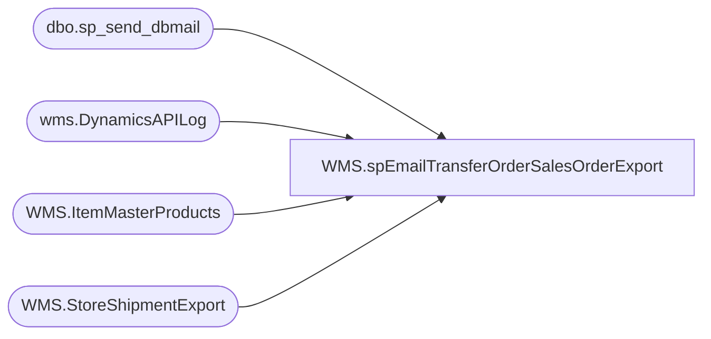

# WMS.spEmailTransferOrderSalesOrderExport

**Database:** IntegrationStaging  

## Architecture Diagram



## Table Dependencies

| Referenced Table |
|---|
| dbo.sp_send_dbmail |
| wms.DynamicsAPILog |
| WMS.ItemMasterProducts |
| WMS.StoreShipmentExport |

## Stored Procedure Code

```sql
CREATE proc [WMS].[spEmailTransferOrderSalesOrderExport] 
@BatchID nvarchar(100)

--========================================================================================================================
--	Dan Tweedie	2019-08-20	Created proc to send summary after each Aptos Distro to TO / SO export from Aptos to Dynamics
--========================================================================================================================

as

set nocount on

IF (Object_ID('tempdb..#Orders') IS NOT null) DROP TABLE #Orders;

with 
ExportedShipments as
	(
		select 
			OrderType,
			convert(varchar(10), ShipDate,101) as ShipDate,
			convert(varchar(10), ReceiptDate,101) as ReceiptDate,
			AptosShipmentNumber	as BABAptosShipmentNumber,
			DeliveryTerms,
			case when left(ModeOfDelivery, 5)='FEDEX' and CountryCode <> 'US' then 'INTLFX' else ModeOfDelivery end as ModeOfDelivery,	
			ToWarehouse,
			FromWarehouse,
			ItemNumber,	
			AptosDistroNumber as BABAptosDistroNumber,
			AptosDistroLineNumber as BABAptosDistroLineNumber,
			quantity,	
			UnitOfMeasure as UOM,	
			InventoryStatus
		from WMS.StoreShipmentExport 
		where 1=1
	),
DynamicsAPI as
	(
		select 
			api.StoreShipmentNumber, 
			case 
				when api.ResponseBody like '%Transfer order%was created successully%' and api.ResponseBody not like '%"hasErrors":true%' then 1 
				when api.ResponseBody like '%Intercompany sales order%has been created%' and api.ResponseBody not like '%"hasErrors":true%' then 1
				when api.ResponseBody like '%"hasErrors":true%' then 0
			else 0 end as APISuccess,
			case 
				when api.ResponseBody like '%Transfer order%was created successully%'
					then substring(api.ResponseBody, charindex('Transfer order ', api.ResponseBody, 1)+15, 12)
				when api.ResponseBody like '%Intercompany sales order%has been created%'
					then replace(substring(api.ResponseBody, charindex('Intercompany sales order ', api.ResponseBody, 1)+24, 16), ' ha', '')
				else NULL
			end as DynamicsOrder,
			api.BatchID,
			api.responseBody,
			api.InsertDate as APIDate
		from wms.DynamicsAPILog api
		where api.IntegrationName in ('WMS_TransferOrderCreateFromAptos', 'WMS_POtoSOIntercompanyOrderCreate')
	)
select 
	es.OrderType,
	es.BABAptosShipmentNumber, 
	es.BABAptosDistroNumber,
	--es.BABAptosDistroLineNumber,
	es.ModeOfDelivery,	
	es.ToWarehouse,
	es.ItemNumber,
	im.ProductName,
	--es.quantity,
	isnull(api.APISuccess,0) APISuccess,
	api.ApiDate,
	isnull(api.DynamicsOrder,'') DynamicsOrder,
	api.BatchID
into #Orders
from ExportedShipments es
left join DynamicsAPI api on es.BABAptosShipmentNumber=api.StoreShipmentNumber
join WMS.ItemMasterProducts im on es.ItemNumber=im.ProductNumber
where 1=1
and api.BatchID=@BatchID
group by 
	es.OrderType,
	es.BABAptosShipmentNumber, 
	es.BABAptosDistroNumber,
	es.ModeOfDelivery,	
	es.ToWarehouse,
	es.ItemNumber,
	im.ProductName,
	isnull(api.APISuccess,0),
	api.DynamicsOrder,
	api.BatchID,
	api.ApiDate

if (select count(*) from #Orders where APISuccess = 1) > 0

begin

declare 
	@text nvarchar(max)

	set @text = 
		'<font face =arial size = 2><B>TO / SO Export Summary - Aptos to Dynamics</B><br><br></font>' +
			'<table border="1">' +
				'<tr><th><font face =arial size = 2>OrderType</font></th>' +
					'<th><font face =arial size = 2>BABAptosShipmentNumber</font></th>' +
					'<th><font face =arial size = 2>BABAptosDistroNumber</font></th>' +
					'<th><font face =arial size = 2>ModeOfDelivery</font></th>' +
					'<th><font face =arial size = 2>ToWarehouse</font></th>' + 
					'<th><font face =arial size = 2>DynamicsOrder</font></th>' + 
					'<th><font face =arial size = 2>APISuccess</font></th>' +
					'<th><font face =arial size = 2>BatchID</font></th></tr>' +
		'<font face =arial size = 2>' +
			CAST ( ( SELECT td = OrderType,'',
							td = BABAptosShipmentNumber, '',
							td = BABAptosDistroNumber, '',
							td = ModeOfDelivery, '',
							td = ToWarehouse, '',
							td = DynamicsOrder, '',
							td = APISuccess, '',
							td = BatchID, ''
					  from #Orders
					  where APISuccess = 1
					  group by 
						OrderType,
						BABAptosShipmentNumber,
						BABAptosDistroNumber,
						ModeOfDelivery,
						ToWarehouse,
						DynamicsOrder,
						APISuccess,
						BatchID
					  order by ToWarehouse,BABAptosShipmentNumber
					  FOR XML PATH('tr'), TYPE 
					) AS NVARCHAR(MAX) ) +
			'</font></table></font></p></p>
			<br>
			<font face =arial size = 1><B>This report was run from stl-ssis-t-01.IntegrationStaging.WMS.spEmailTransferOrderSalesOrderExport vis SSIS WMS_TransferOrderCreateFromAptos.</B></font>
			<br>
			<br>
		<font face =arial size = 1><i>The information in this message may be privileged, “confidential” and protected from disclosure and/or intended only for the addressee(s) named above.  If the reader of this message is not the intended recipient, or an employee or agent responsible for delivering this message to the intended recipient, you are hereby notified that any dissemination, distribution or copying of the communication is strictly prohibited.  If you have received this communication in error, please notify us immediately by replying to the message and deleting it from your computer.  Thank you beary much.</i></font>'

		exec msdb.dbo.sp_send_dbmail
		@profile_name = 'biadmin',
		@recipients = 'distrobears@buildabear.com;Bearhouse365@buildabear.com;Santiagob@buildabear.com',
		@blind_copy_recipients = 'elizabethw@buildabear.com;',
		@body = @text,
		@subject = 'TO / SO Export Summary - Aptos to Dynamics',
		@body_format = 'HTML'


		---NEW BLOCK FOR DISTRO SUMMARY TO DISTRO TEAM...

		declare @count int
		select @count=count(*) from #Orders where APISuccess = 1

		set @text = 
        '<font face =arial size = 2><B>Distros Exported To WMS: ' + cast(@count as varchar) + '</B><br><br></font>' +
                '<table border="1">' +
                '<tr><th><font face =arial size = 2>Style</font></th>' +
                 '<th><font face =arial size = 2>Store</font></th>' +
                 '<th><font face =arial size = 2>Description</font></th>' + 
                '<th><font face =arial size = 2>CreateDateEastern</font></th></tr>' +  
                 '<font face =arial size = 2>' +
            CAST ( ( SELECT 
            --itemnumber,BABShipmentNumber,ToWarehouse,ProductName,DynamicsOrder,ApiDate,ApiSuccess
					        td = ItemNumber,'',
                            td = ToWarehouse, '',
                            td = ProductName,'',
                            td = ApiDate,'' 
                      from #Orders
                      where APISuccess = 1
					  group by 
						ItemNumber,
						ToWarehouse,
						ProductName,
						APIDate
                      order by ItemNumber, ToWarehouse
                      FOR XML PATH('tr'), TYPE 
                    ) AS NVARCHAR(MAX) ) +
            '</font></table></font></p></p>
            <br>
            <font face =arial size = 1><B>This report was run from stl-ssis-t-01.IntegrationStaging.WMS.spEmailTransferOrderSalesOrderExport vis SSIS WMS_TransferOrderCreateFromAptos.</B></font>
            <br>
            <br>
        <font face =arial size = 1><i>The information in this message may be privileged, “confidential” and protected from disclosure and/or intended only for the addressee(s) named above.  If the reader of this message is not the intended recipient, or an employee or agent responsible for delivering this message to the intended recipient, you are hereby notified that any dissemination, distribution or copying of the communication is strictly prohibited.  If you have received this communication in error, please notify us immediately by replying to the message and deleting it from your computer.  Thank you beary much.</i></font>'

 
        exec msdb.dbo.sp_send_dbmail
        @profile_name = 'biadmin',
        @recipients = 'OhioOUTBOUND@buildabear.com;DistroBears@buildabear.com;biadmin@buildabear.com',
        @body = @text,
        @subject = 'Merch to WMS Distro Export',
        @body_format = 'HTML'

end

if (select count(*) from #Orders where APISuccess = 0) > 0
begin

--declare 
--	@text nvarchar(max)

	set @text = 
		'<font face =arial size = 2><B>TO / SO Export Error Summary - Aptos to Dynamics</B><br><br></font>' +
			'<table border="1">' +
				'<tr><th><font face =arial size = 2>OrderType</font></th>' +
					'<th><font face =arial size = 2>BABAptosShipmentNumber</font></th>' +
					'<th><font face =arial size = 2>BABAptosDistroNumber</font></th>' +
					'<th><font face =arial size = 2>ModeOfDelivery</font></th>' +
					'<th><font face =arial size = 2>ToWarehouse</font></th>' + 
					'<th><font face =arial size = 2>DynamicsOrder</font></th>' + 
					'<th><font face =arial size = 2>APISuccess</font></th>' +
					'<th><font face =arial size = 2>BatchID</font></th></tr>' +
		'<font face =arial size = 2>' +
			CAST ( ( SELECT td = OrderType,'',
							td = BABAptosShipmentNumber, '',
							td = BABAptosDistroNumber, '',
							td = ModeOfDelivery, '',
							td = ToWarehouse, '',
							td = DynamicsOrder, '',
							td = APISuccess, '',
							td = BatchID, ''
					  from #Orders
					  where APISuccess = 0
					  order by ToWarehouse,BABAptosShipmentNumber
					  FOR XML PATH('tr'), TYPE 
					) AS NVARCHAR(MAX) ) +
			'</font></table></font></p></p>
			<br>
			<font face =arial size = 1><B>This report was run from stl-ssis-t-01.IntegrationStaging.WMS.spEmailTransferOrderSalesOrderExport vis SSIS WMS_TransferOrderCreateFromAptos.</B></font>
			<br>
			<br>
		<font face =arial size = 1><i>The information in this message may be privileged, “confidential” and protected from disclosure and/or intended only for the addressee(s) named above.  If the reader of this message is not the intended recipient, or an employee or agent responsible for delivering this message to the intended recipient, you are hereby notified that any dissemination, distribution or copying of the communication is strictly prohibited.  If you have received this communication in error, please notify us immediately by replying to the message and deleting it from your computer.  Thank you beary much.</i></font>'

		exec msdb.dbo.sp_send_dbmail
		@profile_name = 'biadmin',
		@recipients = 'EntSysSupport@buildabear.com',
		@body = @text,
		@subject = 'TO / SO Export Error Summary - Aptos to Dynamics',
		@body_format = 'HTML'


end
```

