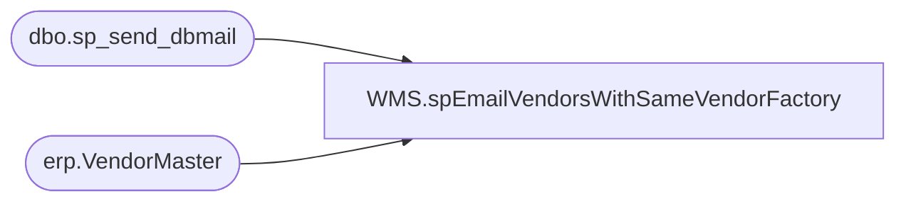

# WMS.spEmailVendorsWithSameVendorFactory

**Database:** IntegrationStaging  

## Architecture Diagram



## Table Dependencies

| Referenced Table |
|---|
| dbo.sp_send_dbmail |
| erp.VendorMaster |

## Stored Procedure Code

```sql
CREATE proc [WMS].[spEmailVendorsWithSameVendorFactory]

as

-- =====================================================================================================
-- Name: WMS.spEmailVendorsWithSameVendorFactory
--
-- Description:	Sends email to report vendors in Dynamics with the same vendor-factory confir
--
-- Revision History
--		Name:			Date:			Comments:
--		Dan Tweedie		2020-02-24		Created proc.
-- =====================================================================================================


set nocount on


IF (Object_ID('tempdb..##VendorFactory') IS NOT null) DROP TABLE ##VendorFactory;
with 
Multis as
	(
		select 
			Entity,
			OrganizationPhoneticName
		from erp.VendorMaster with (nolock)
		where OrganizationPhoneticName is not NULL 
		and OrganizationPhoneticName <> ''
		group by Entity, OrganizationPhoneticName
		having count(*) > 1
	)
select 
	v.Entity,
	v.OrganizationPhoneticName,
	v.VendorOrganizationName
into ##VendorFactory
from erp.VendorMaster v with (nolock)
join Multis m 
	on v.Entity=m.Entity
	and v.OrganizationPhoneticName=m.OrganizationPhoneticName


if (select count(*) from ##VendorFactory) > 0

begin

	declare @text nvarchar(max)
	set @text = '
	<font face =arial size = 4> ' +
		'<b>Dynamics Vendors with the Same VendorCode-FactoryCode in the OrganizationPhoneticName</b>' +
		'<br><br>' +
		'<table border="1" <font face =arial size = 2>' +
		'<tr><th>Entity</th><th>OrganizationPhoneticName</th><th>VendorOrganizationName</th></tr>' +
		CAST ( ( SELECT td = Entity, '',
						td = OrganizationPhoneticName, '',
						td = VendorOrganizationName, ''
					from  ##VendorFactory
					order by Entity, OrganizationPhoneticName, VendorOrganizationName
					FOR XML PATH('tr'), TYPE 
		) AS NVARCHAR(MAX) ) +
				'</font></table></font></p></p>
				<br>
				<br>
				<br>
			<font face =arial size = 1><i>The information in this message may be privileged, “confidential” and protected from disclosure and/or intended only for the addressee(s) named above.  If the reader of this message is not the intended recipient, or an employee or agent responsible for delivering this message to the intended recipient, you are hereby notified that any dissemination, distribution or copying of the communication is strictly prohibited.  If you have received this communication in error, please notify us immediately by replying to the message and deleting it from your computer.  Thank you beary much.</i></font>'
					
	exec msdb.dbo.sp_send_dbmail
	@profile_name = 'biadmin',
	@recipients = 'dawngo@buildabear.com;elizabethw@buildabear.com;scottp@buildabear.com',
	@copy_recipients = 'dant@buildabear.com;timc@buildabear.com',
	@subject = 'Dynamics Vendors with the Same VendorCode-FactoryCode',
	@body = @text,
	@body_format = 'HTML'

end
```

