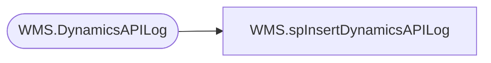

# WMS.spInsertDynamicsAPILog

**Database:** IntegrationStaging  

## Architecture Diagram



## Table Dependencies

| Referenced Table |
|---|
| WMS.DynamicsAPILog |

## Stored Procedure Code

```sql
-- =============================================
-- Author:		<Author,,Name>
-- Create date: <Create Date,,>
-- Description:	<Description,,>
-- =============================================
CREATE PROCEDURE [WMS].[spInsertDynamicsAPILog] 
@IntegrationName nvarchar(100),
@MergedJson nvarchar(max)  = NULL,
@ContentType nvarchar(255)  = NULL, 
@ContentLength Numeric(20,0)  = NULL, 
@HttpStatusCode smallint  = NULL, 
@HttpResponseUrl nvarchar(2084)  = NULL, 
@HttpStatusCodeName nvarchar(255)  = NULL, 
@ResponseBody nvarchar(max)  = NULL,
@ExceptionError nvarchar(max) = NULL,
@InsertDate datetime,
@WebOrderNumber nvarchar(10)

AS
BEGIN
	-- SET NOCOUNT ON added to prevent extra result sets from
	-- interfering with SELECT statements.
	SET NOCOUNT ON;

	INSERT INTO WMS.DynamicsAPILog 
	(
		IntegrationName
		,MergedJson
		,ContentType
		,ContentLength
		,HttpStatusCode
		,HttpResponseUrl
		,HttpStatusCodeName
		,ResponseBody
		,ExceptionError
		,InsertDate
		,WebOrderNumber
	)
	VALUES
	(
		@IntegrationName
		,@MergedJson
		,@ContentType
		,@ContentLength
		,@HttpStatusCode
		,@HttpResponseUrl
		,@HttpStatusCodeName
		,@ResponseBody
		,@ExceptionError
		,@InsertDate
		,@WebOrderNumber
	)

END
```

