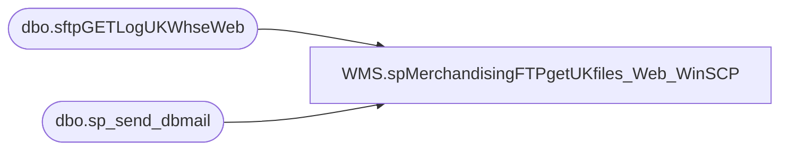

# WMS.spMerchandisingFTPgetUKfiles_Web_WinSCP

**Database:** IntegrationStaging  

## Architecture Diagram



## Table Dependencies

| Referenced Table |
|---|
| dbo.sftpGETLogUKWhseWeb |
| dbo.sp_send_dbmail |

## Stored Procedure Code

```sql
CREATE proc [WMS].[spMerchandisingFTPgetUKfiles_Web_WinSCP] -- Stored Proc name
as
-- =====================================================================================================
-- Name: spMerchandisingFTPgetUKfiles_Web_WinSCP
--
-- Description:	FTP's to UK Clipper server to retrieve Whse files.
--				Captures log, sends email if failure occurs.
--
-- Input:	NA
--
-- Output: log file and emails only if failure occurs
--
-- Dependencies: NA
--				 
-- Revision History
--		Name:			Date:			Comments:
--		Tim Callahan	09/05/2017		Created proc based of UK Retail Proc
--		Tim Callahan	11/20/2018		Updated proc to account for the PRODBAL file we now receive from Clipper 
--		Tim Callahan	2025-01-31		Ported over from Bedrockdb02 as part of Aptos Decommission
-- =====================================================================================================
set nocount on

-- Delete Previous Log Files
IF (Object_ID('tempdb..#DEL') IS NOT NULL) DROP TABLE #DEL
create table #DEL(output varchar(1000))
insert #DEL exec master..xp_cmdshell 'dir \\stl-ssis-p-01\IntegrationStaging\3PW\UK_Distro\FTP\WinSCP\Logs\Inbound\sftp_UK_WEB_GET.log /B'
insert #DEL exec master..xp_cmdshell 'dir \\stl-ssis-p-01\IntegrationStaging\3PW\UK_Distro\FTP\WinSCP\Logs\Inbound\sftpGETwebLog.txt /B'
delete from #DEL where output is null or output = 'File Not Found'

IF (select count(*) from #DEL where output = 'sftp_UK_WEB_GET.log') > 0
	begin
		exec master..xp_cmdshell 'del \\stl-ssis-p-01\IntegrationStaging\3PW\UK_Distro\FTP\WinSCP\Logs\Inbound\sftp_UK_WEB_GET.log'
	end
IF (select count(*) from #DEL where output = 'sftpGETwebLog.txt') > 0
	begin
		exec master..xp_cmdshell 'del \\stl-ssis-p-01\IntegrationStaging\3PW\UK_Distro\FTP\WinSCP\Logs\Inbound\sftpGETwebLog.txt'
	end

--declare and set ftp variables 
					declare 
							@winSCP varchar(1000),
							@ini varchar(1000),
							@script varchar(1000),
							@log varchar(1000),
							@SFTP varchar(4000)										
						
					select
							@winSCP = '"\\stl-ssis-p-01\C$\Program Files (x86)\WinSCP\winscp.com"',
							@ini = ' /ini=\\stl-ssis-p-01\IntegrationStaging\3PW\UK_Distro\FTP\WinSCP\WINSCP.ini',
							@script = ' /script=\\stl-ssis-p-01\IntegrationStaging\3PW\UK_Distro\FTP\WinSCP\Scripts\Get\sftpGETweb.txt',
							@log = ' /log=\\stl-ssis-p-01\IntegrationStaging\3PW\UK_Distro\FTP\WinSCP\Logs\Inbound\sftp_UK_WEB_GET.log',
							@SFTP = concat(@winSCP, @ini, @script, @log)

--create temp tables for ftp logs

IF (Object_ID('IntegrationStaging..sftpGETLogUKWhseWeb') IS NOT NULL) DROP TABLE sftpGETLogUKWhseWeb
create table sftpGETLogUKWhseWeb
(ftpLog varchar(4000))

--execute sql/ftp
----connect to ftp server, if connection unsuccessful, send email
insert sftpGETLogUKWhseWeb exec master..xp_cmdshell @SFTP

	--select * from sftpGETLogUKWhseWeb -- Troubleshooting Purposes 

		if (select count(*) from sftpGETLogUKWhseWeb where ftplog like '%.txt%' or ftplog like '%.dat%' ) < 1
			begin
				declare 
					@Log_query varchar(1000),
					@Log_filename varchar(100),
					@Log_file_location varchar(100),
					@Log_bcp varchar(1000),
					@body varchar(4000)

			
				set @Log_query = 'select * from [stl-ssis-p-01].IntegrationStaging.dbo.sftpGETLogUKWhseWeb'
				set @Log_filename = 'sftpGETwebLog.txt'
				set @Log_file_location = '\\stl-ssis-p-01\IntegrationStaging\3PW\UK_Distro\FTP\WinSCP\Logs\Inbound\'
				set @Log_bcp = 'bcp "' + @Log_query + '" queryout "' + @Log_file_location + @Log_filename + '" -t, -T -c -S[stl-ssis-p-01]'

				exec master..xp_cmdshell @Log_bcp
										
				set @body =	'An attempt to SFTP Whse files from Clipper - UK Web to BAB appears to have failed. Please investigate.' 
							+ char(10) + char(13) + 
							'See the attached log for details.'
							+ char(10) + char(13) + 
							+ char(10) + char(13) + 
							'This process is managed by [stl-ssis-p-01].IntegrationStaging.wms.spMerchandisingFTPgetUKfiles_Web_WinSCP'
		
				EXEC [stl-ssis-p-01].msdb.dbo.sp_send_dbmail
				@profile_name = 'BiAdmin',
				@recipients = 'EntSysSupport@buildabear.com;', 
				@subject = 'SFTP Failure: Download Supply Chain Files from Clipper Webstore - UK to BAB',
				@body = @body,
				@file_attachments = '\\stl-ssis-p-01\IntegrationStaging\3PW\UK_Distro\FTP\WinSCP\Logs\Inbound\sftpGETwebLog.txt',
				@importance = 'HIGH'
						
			end
			
------
	--move files to the interface directories
	declare @moveInventory varchar(1000),
		    @moveCBR varchar(1000),
			@moveReceipt varchar(1000),
			@moveStockAdj varchar(1000),
			@moveProdBal varchar(1000)

	select @moveInventory = 'move \\stl-ssis-p-01\IntegrationStaging\3PW\UK_Distro\FTP\WinSCP\Hold\Web\INVENTORY_WEB_*.txt \\stl-ssis-p-01\IntegrationStaging\3PW\UK_Distro\INVENTORY\Web'
	select @moveCBR = 'move \\stl-ssis-p-01\IntegrationStaging\3PW\UK_Distro\FTP\WinSCP\Hold\Web\STSIMCTN.UKWEB.*.txt \\stl-ssis-p-01\IntegrationStaging\3PW\UK_Distro\WebCBR'
	select @movereceipt = 'move \\stl-ssis-p-01\IntegrationStaging\3PW\UK_Distro\FTP\WinSCP\Hold\Web\recv*.dat \\stl-ssis-p-01\IntegrationStaging\3PW\UK_Distro\RECEIPTS'
	select @movestockadj = 'move \\stl-ssis-p-01\IntegrationStaging\3PW\UK_Distro\FTP\WinSCP\Hold\Web\STOCKADJUSTMENT_WEB_*.txt \\stl-ssis-p-01\IntegrationStaging\3PW\UK_Distro\STOCKADJ\Web'
	-- Remarked out ProdBal Move on Jan 31 2025 - Do not want this to interfere with UK Web Inventory SSIS that pulls the prod bal file hourly 
	--select @moveProdBal = 'move \\stl-ssis-p-01\IntegrationStaging\3PW\UK_Distro\FTP\WinSCP\Hold\Web\PRODBAL_WEB_*.txt \\stl-ssis-p-01\IntegrationStaging\3PW\UK_Distro\PRODBAL\WEB'

	exec master..xp_cmdshell @moveInventory
	exec master..xp_cmdshell @moveCBR
	exec master..xp_cmdshell @movereceipt
	exec master..xp_cmdshell @movestockadj
	--exec master..xp_cmdshell @moveProdBal
-------------------------------------------------------------------------------------------------------------------------------------
	---now do a final dir command and send email report to confirm that files were retrieved.
	IF (Object_ID('tempdb..##dirInventory') IS NOT NULL) DROP TABLE ##dirInventory
	create table ##dirInventory(files varchar(4000))
	
	IF (Object_ID('tempdb..##dirCBR') IS NOT NULL) DROP TABLE ##dirCBR
	create table ##dirCBR(files varchar(4000))

	IF (Object_ID('tempdb..##dirReceipt') IS NOT NULL) DROP TABLE ##dirReceipt
	create table ##dirReceipt(files varchar(4000))

	IF (Object_ID('tempdb..##dirStockAdj') IS NOT NULL) DROP TABLE ##dirStockAdj
	create table ##dirStockAdj(files varchar(4000))

	IF (Object_ID('tempdb..##dirProdBal') IS NOT NULL) DROP TABLE ##dirProdBal
	create table ##dirProdBal(files varchar(4000))
	
	declare @dirInventory varchar(1000),
			@dirCBR varchar(1000),
			@dirReceipt varchar(1000),
			@dirStockAdj varchar(1000),
			@dirProdBal varchar(1000)

	select @dirInventory = 'dir \\stl-ssis-p-01\IntegrationStaging\3PW\UK_Distro\INVENTORY\Web /B'
	select @dirCBR = 'dir \\stl-ssis-p-01\IntegrationStaging\3PW\UK_Distro\WebCBR /B'
	select @dirReceipt = 'dir \\stl-ssis-p-01\IntegrationStaging\3PW\UK_Distro\RECEIPTS\ /B'
	select @dirStockAdj = 'dir \\stl-ssis-p-01\IntegrationStaging\3PW\UK_Distro\STOCKADJ\Web /B'
	--select @dirProdBal = 'dir \\stl-ssis-p-01\IntegrationStaging\3PW\UK_Distro\PRODBAL\WEB /B'

	insert ##dirInventory
	exec master..xp_cmdshell @dirInventory

	insert ##dirCBR
	exec master..xp_cmdshell @dirCBR
	
	insert ##dirReceipt
	exec master..xp_cmdshell @dirreceipt
	
	insert ##dirStockAdj
	exec master..xp_cmdshell @dirstockadj

	--insert ##dirProdBal
	--exec master..xp_cmdshell @dirProdBal

/*	declare @inv int,			
			@cbr int,
			@rcpt int,
			@adj int,
			@PBal int,
			@text nvarchar(max)

	select @inv = count(*) from ##dirInventory where files like '%.txt'
	select @cbr = count(*) from ##dirCBR where files like '%.txt'
	select @rcpt = count(*) from ##dirReceipt where files like 'RECV_WEB%'
	select @adj = count(*) from ##dirStockAdj where files like '%.txt'
	select @PBal = count(*) from ##dirProdBal where files like '%.txt'

	set @text = '<font face =arial size = 2>' + 
			'Clipper File Count Summary<br>' +
			'(files retrieved from the Clipper UK Webstore SFTP server and successfully located to our interface directories on \\stl-ssis-p-01\IntegrationStaging\3PW\UK_Distro)' + 
			'<br><br>' +
			'<table border="1">' +
			'<tr><th>CBR</th><th>RECEIPT</th><th>ADJUSTMENT</th><th>INVENTORY</th><th>PRODBAL</th></tr>' +
			CAST ( ( SELECT td = @cbr,'',
							td = @rcpt, '',
							td = @adj, '',
							td = @inv, '',
							td = @PBal, ''
					  FOR XML PATH('tr'), TYPE 
			) AS NVARCHAR(MAX) ) +
			'</font></table></font></p></p>
			<br>
			<font face =arial size = 1>This report was run from bedrockdb02.me_01.dbo.spMerchandisingFTPgetUKfiles_Web_WinSCP.</font>
			<br>
			<br>'

	exec msdb.dbo.sp_send_dbmail
		@profile_name = 'merchadmin',
		@recipients = 'MerchAdmin@buildabear.com', -- Change to MerchAdmin once in production
		@body = @text,
		@subject = 'Clipper UK Webstore File Summary',
		@body_format = 'HTML'
*/
```

