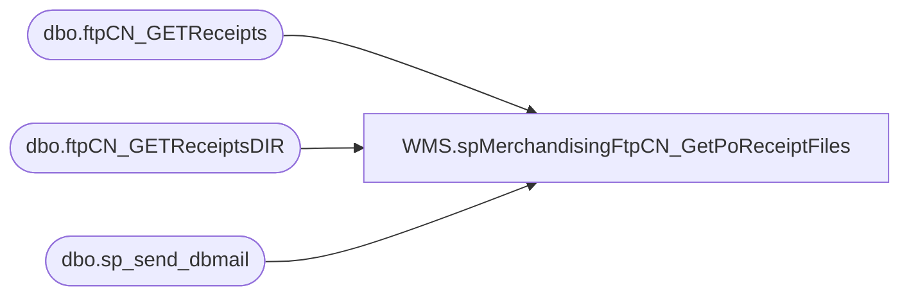

# WMS.spMerchandisingFtpCN_GetPoReceiptFiles

**Database:** IntegrationStaging  

## Architecture Diagram



## Table Dependencies

| Referenced Table |
|---|
| dbo.ftpCN_GETReceipts |
| dbo.ftpCN_GETReceiptsDIR |
| dbo.sp_send_dbmail |

## Stored Procedure Code

```sql
CREATE proc [WMS].[spMerchandisingFtpCN_GetPoReceiptFiles]

as

-- =====================================================================================================
-- Name: spMerchandisingFtpCN_GetPoReceiptFiles
--
-- Description:	Downloads staged PO Receipt files from Shanghai warehouse system, stages files for import to Merchandising system
--
-- Revision History
--		Name:			Date:			Comments:
--		Dan Tweedie		03/29/2016		Created proc
--		Tim Callahan	2025-01-31		Ported over from Bedrockdb02 as part of Aptos Decommission
-- =====================================================================================================
	
set nocount on


--==================================================================================================================================================
--DELETE PREVIOUS LOG FILES
IF (Object_ID('tempdb..#DEL3') IS NOT NULL) DROP TABLE #DEL3
create table #DEL3(output varchar(1000))
	insert #DEL3 exec master..xp_cmdshell 'dir \\stl-ssis-p-01\IntegrationStaging\3PW\CN_Distro\FTP\WinSCP\Logs\Inbound\CNReceiptsDownload.log /B'
	insert #DEL3 exec master..xp_cmdshell 'dir \\stl-ssis-p-01\IntegrationStaging\3PW\CN_Distro\FTP\WinSCP\Logs\Inbound\ftpCN_GETReceiptsLog.txt /B'
	insert #DEL3 exec master..xp_cmdshell 'dir \\stl-ssis-p-01\IntegrationStaging\3PW\CN_Distro\FTP\WinSCP\Logs\Inbound\CNReceiptsDIR.log /B'
	insert #DEL3 exec master..xp_cmdshell 'dir \\stl-ssis-p-01\IntegrationStaging\3PW\CN_Distro\FTP\WinSCP\Logs\Inbound\ftpCN_GETReceiptsDIRLog.txt /B'
delete from #DEL3 where output is null or output = 'File Not Found'

IF (select count(*) from #DEL3 where output = 'CNReceiptsDownload.log') > 0
	begin
		exec master..xp_cmdshell 'del \\stl-ssis-p-01\IntegrationStaging\3PW\CN_Distro\FTP\WinSCP\Logs\Inbound\CNReceiptsDownload.log'
	end
IF (select count(*) from #DEL3 where output = 'ftpCN_GETReceiptsLog.txt') > 0
	begin
		exec master..xp_cmdshell 'del \\stl-ssis-p-01\IntegrationStaging\3PW\CN_Distro\FTP\WinSCP\Logs\Inbound\ftpCN_GETReceiptsLog.txt'
	end	
IF (select count(*) from #DEL3 where output = 'CNReceiptsDIR.log') > 0
	begin
		exec master..xp_cmdshell 'del \\stl-ssis-p-01\IntegrationStaging\3PW\CN_Distro\FTP\WinSCP\Logs\Inbound\CNReceiptsDIR.log'
	end	
IF (select count(*) from #DEL3 where output = 'ftpCN_GETReceiptsDIRLog.txt') > 0
	begin
		exec master..xp_cmdshell 'del \\stl-ssis-p-01\IntegrationStaging\3PW\CN_Distro\FTP\WinSCP\Logs\Inbound\ftpCN_GETReceiptsDIRLog.txt'
	end

--==================================================================================================================================================
------CHECK FOR EXISTENCE OF RECEIPT FILE
--==================================================================================================================================================
declare 
		@winSCP varchar(1000),
		@ini varchar(1000),
		@script varchar(1000),
		@log varchar(1000),
		@FTP varchar(4000),
		@Log_query varchar(1000),
		@Log_filename varchar(100),
		@Log_file_location varchar(100),
		@Log_bcp varchar(1000),
		@body varchar(4000)

select 
		@winSCP = '"\\stl-ssis-p-01\C$\Program Files (x86)\WinSCP\winscp.com"',
		@ini = ' /ini=\\stl-ssis-p-01\IntegrationStaging\3PW\CN_Distro\FTP\WinSCP\WINSCP.ini',
		@script = ' /script=\\stl-ssis-p-01\IntegrationStaging\3PW\CN_Distro\FTP\WinSCP\Scripts\PoReceipts\PoReceiptsDIR.txt',
		@log = ' /log=\\stl-ssis-p-01\IntegrationStaging\3PW\CN_Distro\FTP\WinSCP\Logs\Inbound\CNPoReceiptsDIR.log',
		@FTP = concat(@winSCP, @ini, @script, @log)

IF (Object_ID('IntegrationStaging..ftpCN_GETReceiptsDIR') IS NOT NULL) DROP TABLE ftpCN_GETReceiptsDIR
create table ftpCN_GETReceiptsDIR
(ftpLog varchar(4000))

insert ftpCN_GETReceiptsDIR exec master..xp_cmdshell @FTP

if (select count(*) from ftpCN_GETReceiptsDIR where ftpLog like '%.csv') > 0


--==================================================================================================================================================
------DOWNLOAD RECEIPTS FILE
--==================================================================================================================================================
		BEGIN
							
				select 
						@script = ' /script=\\stl-ssis-p-01\IntegrationStaging\3PW\CN_Distro\FTP\WinSCP\Scripts\PoReceipts\PoReceipts.txt',
						@log = ' /log=\\stl-ssis-p-01\IntegrationStaging\3PW\CN_Distro\FTP\WinSCP\Logs\Inbound\CNReceiptsDownload.log',
						@FTP = concat(@winSCP, @ini, @script, @log)

				--create temp tables for ftp logs
				IF (Object_ID('IntegrationStaging..ftpCN_GETReceipts') IS NOT NULL) DROP TABLE ftpCN_GETReceipts
				create table ftpCN_GETReceipts
				(ftpLog varchar(4000))

				--execute sql/ftp
				----connect to ftp server, if connection unsuccessful, send email
						insert ftpCN_GETReceipts exec master..xp_cmdshell @FTP
						if (select count(*) from ftpCN_GETReceipts where ftplog like '%.csv%[100%]') < 1
							begin
								set @Log_query = 'select * from [stl-ssis-p-01].IntegrationStaging.dbo.ftpCN_GETReceipts'
								set @Log_filename = 'ftpCN_GETReceiptsLog.txt'
								set @Log_file_location = '\\stl-ssis-p-01\IntegrationStaging\3PW\CN_Distro\FTP\WinSCP\Logs\Inbound\'
								set @Log_bcp = 'bcp "' + @Log_query + '" queryout "' + @Log_file_location + @Log_filename + '" -t, -T -c -S[stl-ssis-p-01]'

								exec master..xp_cmdshell @Log_bcp
															
								set @body =	'An attempt to FTP download from Ocean East Logistics failed.' 
											+ char(10) + char(13) + 
											'See the attached logs for details.'
											+ char(10) + char(13) + 
											+ char(10) + char(13) + 
											'This process is managed by [stl-ssis-p-01].IntegrationStaging.wms.spMerchandisingFtpCN_GetPoReceiptFiles'
							
								EXEC [stl-ssis-p-01].msdb.dbo.sp_send_dbmail
								@profile_name = 'BiAdmin',
								@recipients = 'EntSysSupport@buildabear.com',
								@subject = 'FTP Failure: CN Receipts File Download from China Whse failed.',
								@body = @body,
								@file_attachments = '\\stl-ssis-p-01\IntegrationStaging\3PW\CN_Distro\FTP\WinSCP\Logs\Inbound\ftpCN_GETReceiptsLog.txt;\\stl-ssis-p-01\IntegrationStaging\3PW\CN_Distro\FTP\WinSCP\Logs\Inbound\CNReceiptsDownload.log',
								@importance = 'HIGH'
							end


		END
--==================================================================================================================================================
```

