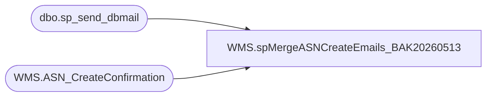

# WMS.spMergeASNCreateEmails_BAK20260513

**Database:** IntegrationStaging  

## Architecture Diagram



## Table Dependencies

| Referenced Table |
|---|
| dbo.sp_send_dbmail |
| WMS.ASN_CreateConfirmation |

## Stored Procedure Code

```sql
create proc [WMS].[spMergeASNCreateEmails_BAK20260513]

as
----================================================================================================================================================
-- Matthew Lewis	2026-05-12 Creation of SP to send emails for ASN numbers
--================================================================================================================================================
declare @html nvarchar(max),
		@head nvarchar(max),
		@ASNHTML nvarchar(max),
		@Subject varchar(max)
declare @ASNsForEmail TABLE(AsnShipmentNumber XML, [Message] XML, hasErrors varchar(255), errorMessage XML)


----------------------------------------------------------------------------------------
--   Get my initial dataset 
----------------------------------------------------------------------------------------
insert into @ASNsForEmail
	select 	AsnShipmentNumber, message, CASE WHEN hasErrors > 0 THEN 'Y' ELSE 'N' END, 
	 errorMessage
	 FROM WMS.ASN_CreateConfirmation with(nolock)
	 where InsertDate > DATEADD(minute, -231, GETDATE())
	 order by InsertDate desc

----------------------------------------------------------------------------------------
--   Setting the Subject, the opening tags for the full html, and the heading
----------------------------------------------------------------------------------------
set @Subject = 'Factory Data Exchange New ASN report for ' +  CONVERT(VARCHAR, GETDATE())  

set @html = '<html><style>h3{margin-bottom:0px; font-family:Calibri;}div{margin-left:50px; font-family:Calibri;}</style>'

set @head = '<head><style>' +
	'td {border: solid black 1px;padding-left:5px;padding-right:5px;padding-top:1px;padding-bottom:1px;font-size:11pt;} td span {padding:5px;}' +
	'</style></head><body>' +
	'<div style="margin-top:20px; margin-left:5px; margin-bottom:15px; font-weight:bold; font-size:1.3em; font-family:calibri;">New ASNs for ' +  CONVERT(VARCHAR, GETDATE())   + '</div>'

	set @ASNHTML = '<div><h3>New ASNs</h3>New ASNs since last run time</div><div><table cellpadding=0 cellspacing=0 border=0>' +
	'<tr bgcolor=#4b6c9e>' +
	'<td align=center><font face="calibri" color=White><b>ASN Shipment #</b></font></td>' +    -- Manually type headers
	'<td align=center><font face="calibri" color=White><b>Message ID</b></font></td>' +    -- Manually type headers
	'<td align=center><font face="calibri" color=White><b>Has Error?</b></font></td>' +    -- Manually type headers
	'<td align=center><font face="calibri" color=White><b>Error Message</b></font></td>'     -- Manually type headers

----------------------------------------------------------------------------------------
--   Assembling the body HTML
----------------------------------------------------------------------------------------
declare @body varchar(max)
select @body =
(
	select  td = AsnShipmentNumber
	, td = [Message] 
	, td =  hasErrors
	, td = errorMessage     -- Here we put the column names
	
	FROM  @ASNsForEmail
	for XML raw('tr'), elements
)

set @body = REPLACE(@body, '<td>', '<td align=center><font face="calibri">')
set @body = REPLACE(@body, '</td>', '</font></td>')
set @body = REPLACE(@body, '_x0020_', space(1))
set @body = REPLACE(@body, '_x003D_', '=')
set @body = REPLACE(@body, '<tr><TRRow>0</TRRow>', '<tr bgcolor=#F8F8FD>')
set @body = REPLACE(@body, '<tr><TRRow>1</TRRow>', '<tr bgcolor=#EEEEF4>')
set @body = REPLACE(@body, '<TRRow>0</TRRow>', '')


SET @ASNHTML =  @ASNHTML + @body + '</table></div><BR>'

set @html = @html + @head + ISNULL(@ASNHTML,'') 
set @html = '<div style="color:Black; font-size:11pt; font-family:Calibri; width:100px;">' + @html + '</div>'


	exec msdb.dbo.sp_send_dbmail
		@profile_name = 'biadmin',
		@recipients = 'matthewl@buildabear.com',
		@body = @html,
		@subject = @Subject,
		@body_format = 'HTML'
```

