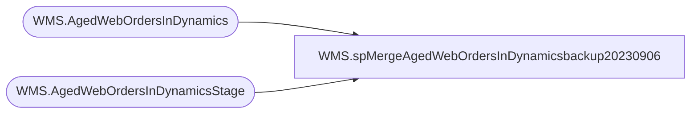

# WMS.spMergeAgedWebOrdersInDynamicsbackup20230906

**Database:** IntegrationStaging  

## Architecture Diagram



## Table Dependencies

| Referenced Table |
|---|
| WMS.AgedWebOrdersInDynamics |
| WMS.AgedWebOrdersInDynamicsStage |

## Stored Procedure Code

```sql
CREATE proc [WMS].[spMergeAgedWebOrdersInDynamicsbackup20230906]

as

set nocount on


--truncate table WMS.AgedWebOrdersInDynamics
--insert WMS.AgedWebOrdersInDynamics
--select 
--	x.SalesOrderNumber,	
--	x.SalesOrderStatus,	
--	x.SalesOrderProcessingStatus,	
--	x.SalesOrderOriginCode,	
--	x.SalesOrderPoolId,	
--	x.ShippingCarrierId,	
--	x.ShippingCarrierServiceId,	
--	x.OrderCreationDateTime,	
--	x.DeliveryModeCode,	
--	x.ItemNumber,	
--	x.OrderedSalesQuantity,	
--	x.LineDescription,	
--	x.WebOrderNumber,	
--	x.WaveID,	
--	x.ReleasedDateAndTime,
--	x.ContainerID,	
--	x.WorkID,	
--	x.DeckOrderDate,
--	datediff(dd, x.OrderCreationDateTime, getdate()) as DynamicsOrderAge,
--	case 
--		when exists (select s.SalesOrderNumber from WMS.AgedWebOrdersInDynamicsStage s where s.WaveID is not null and s.SalesOrderNumber = x.SalesOrderNumber) 
--			then 1 
--		else 0 
--	end as isWaved,
--	case 
--		when exists (select s.SalesOrderNumber from WMS.AgedWebOrdersInDynamicsStage s where s.DeliveryModeCode = 'STND' and s.SalesOrderNumber = x.SalesOrderNumber) 
--			then 1
--		else 0
--	end as isIntl,
--	getdate() as InsertDate
--from WMS.AgedWebOrdersInDynamicsStage x


merge into WMS.AgedWebOrdersInDynamics as target
using 
	(
		select 
			x.SalesOrderNumber,	
			x.SalesOrderStatus,	
			x.SalesOrderProcessingStatus,	
			x.SalesOrderOriginCode,	
			x.SalesOrderPoolId,	
			x.ShippingCarrierId,	
			x.ShippingCarrierServiceId,	
			x.OrderCreationDateTime,	
			x.DeliveryModeCode,	
			x.ItemNumber,	
			x.OrderedSalesQuantity,	
			x.LineDescription,	
			x.WebOrderNumber,	
			x.WaveID,	
			x.ReleasedDateAndTime,
			x.ContainerID,	
			x.WorkID,	
			x.DeckOrderDate,
			datediff(dd, x.OrderCreationDateTime, getdate()) as DynamicsOrderAge,
			case 
				when exists (select s.SalesOrderNumber from WMS.AgedWebOrdersInDynamicsStage s where s.WaveID is not null and s.SalesOrderNumber = x.SalesOrderNumber) 
					then 1 
				else 0 
			end as isWaved,
			case 
				when exists (select s.SalesOrderNumber from WMS.AgedWebOrdersInDynamicsStage s where s.DeliveryModeCode = 'STND' and s.SalesOrderNumber = x.SalesOrderNumber) 
					then 1
				else 0
			end as isIntl,
			case 
				when exists (select s.SalesOrderNumber from WMS.AgedWebOrdersInDynamicsStage s where s.ItemNumber in ('027500') and s.SalesOrderNumber = x.SalesOrderNumber) 
					then 1 
				else 0 
			end as isRyv,
			case 
				when exists (select s.SalesOrderNumber from WMS.AgedWebOrdersInDynamicsStage s where s.ItemNumber in ('000015', '022610', '023019') and s.SalesOrderNumber = x.SalesOrderNumber)
					then 1 
				else 0 
			end as isEmb,
			case 
				when exists (select s.SalesOrderNumber from WMS.AgedWebOrdersInDynamicsStage s where s.ItemNumber in ('027500') and s.SalesOrderNumber = x.SalesOrderNumber) 
					then 
						case when datediff(dd, x.OrderCreationDateTime, getdate()) < 7 then 0 
							when datediff(dd, x.OrderCreationDateTime, getdate()) >= 7 then datediff(dd, x.OrderCreationDateTime, getdate()) -7 else 0 end
				when exists (select s.SalesOrderNumber from WMS.AgedWebOrdersInDynamicsStage s where s.ItemNumber in ('000015', '022610', '023019') and s.SalesOrderNumber = x.SalesOrderNumber)
					then 
						case when datediff(dd, x.OrderCreationDateTime, getdate()) < 7 then 0 
							when datediff(dd, x.OrderCreationDateTime, getdate()) >= 7 then datediff(dd, x.OrderCreationDateTime, getdate()) -7 else 0 end 
				else datediff(dd, x.OrderCreationDateTime, getdate())
			end as ProcessingAge,
			isShippedOrCancelledInDeck
		from WMS.AgedWebOrdersInDynamicsStage x
	) as source
	on
		target.SalesOrderNumber=source.SalesOrderNumber
		and
		target.WebOrderNumber=source.WebOrderNumber
		and
		target.ItemNumber=source.ItemNumber
		and 
		isnull(target.ContainerID,'x')=isnull(source.ContainerID,'x') --No container until waved
when matched 
	and
		isnull(target.SalesOrderStatus,'x')<>isnull(source.SalesOrderStatus,'x') or
		isnull(target.SalesOrderProcessingStatus,'x')<>isnull(source.SalesOrderProcessingStatus,'x') or
		isnull(target.SalesOrderOriginCode,'x')<>isnull(source.SalesOrderOriginCode,'x') or	
		isnull(target.SalesOrderPoolId,'x')<>isnull(source.SalesOrderPoolId,'x') or	
		isnull(target.ShippingCarrierId,'x')<>isnull(source.ShippingCarrierId,'x') or	
		isnull(target.ShippingCarrierServiceId,'x')<>isnull(source.ShippingCarrierServiceId,'x') or	
		isnull(target.OrderCreationDateTime,getdate())<>isnull(source.OrderCreationDateTime,getdate()) or	
		isnull(target.DeliveryModeCode,'x')<>isnull(source.DeliveryModeCode,'x') or	
		isnull(target.OrderedSalesQuantity,0)<>isnull(source.OrderedSalesQuantity,0) or	
		isnull(target.LineDescription,'x')<>isnull(source.LineDescription,'x') or	
		isnull(target.WaveID,'x')<>isnull(source.WaveID,'x') or
		isnull(target.ReleasedDateAndTime,getdate())<>isnull(source.ReleasedDateAndTime,getdate()) or	
		isnull(target.WorkID,'x')<>isnull(source.WorkID,'x') or	
		isnull(target.DeckOrderDate,getdate())<>isnull(source.DeckOrderDate,getdate()) or	
		isnull(target.DynamicsOrderAge,0)<>isnull(source.DynamicsOrderAge,0) or	
		isnull(target.isWaved,0)<>isnull(source.isWaved,0) or	
		isnull(target.isIntl,0)<>isnull(source.isIntl,0) or
		isnull(target.isRyv,0)<>isnull(source.isRyv,0) or
		isnull(target.isEmb,0)<>isnull(source.isEmb,0) or
		isnull(target.ProcessingAge,52)<>isnull(source.ProcessingAge,52) or
		isnull(target.isShippedOrCancelledInDeck,99)<>isnull(source.isShippedOrCancelledInDeck,99)
	then update
		set
			target.SalesOrderStatus=source.SalesOrderStatus,	
			target.SalesOrderProcessingStatus=source.SalesOrderProcessingStatus,
			target.SalesOrderOriginCode=source.SalesOrderOriginCode,	
			target.SalesOrderPoolId=source.SalesOrderPoolId,	
			target.ShippingCarrierId=source.ShippingCarrierId,	
			target.ShippingCarrierServiceId=source.ShippingCarrierServiceId,	
			target.OrderCreationDateTime=source.OrderCreationDateTime,	
			target.DeliveryModeCode=source.DeliveryModeCode,	
			target.OrderedSalesQuantity=source.OrderedSalesQuantity,	
			target.LineDescription=source.LineDescription,	
			target.WaveID=source.WaveID,
			target.ReleasedDateAndTime=source.ReleasedDateAndTime,	
			target.WorkID=source.WorkID,	
			target.DeckOrderDate=source.DeckOrderDate,	
			target.DynamicsOrderAge=source.DynamicsOrderAge,	
			target.isWaved=source.isWaved,	
			target.isIntl=source.isIntl,
			target.isRyv=source.isRyv,
			target.isEmb=source.isEmb,
			target.ProcessingAge=source.ProcessingAge,
			target.isShippedOrCancelledInDeck=source.isShippedOrCancelledInDeck,
			target.UpdateDate=getdate()
when not matched by target
	then insert
		(
			SalesOrderNumber,	
			SalesOrderStatus,	
			SalesOrderProcessingStatus,	
			SalesOrderOriginCode,	
			SalesOrderPoolId,	
			ShippingCarrierId,	
			ShippingCarrierServiceId,	
			OrderCreationDateTime,	
			DeliveryModeCode,	
			ItemNumber,	
			OrderedSalesQuantity,	
			LineDescription,
			WebOrderNumber,	
			WaveID,	
			ReleasedDateAndTime,	
			ContainerID,	
			WorkID,	
			DeckOrderDate,	
			DynamicsOrderAge,	
			isWaved,	
			isIntl,
			isRyv,
			isEmb,
			ProcessingAge,
			isShippedOrCancelledInDeck,
			InsertDate
		)
	values
		(
			source.SalesOrderNumber,	
			source.SalesOrderStatus,	
			source.SalesOrderProcessingStatus,	
			source.SalesOrderOriginCode,	
			source.SalesOrderPoolId,	
			source.ShippingCarrierId,	
			source.ShippingCarrierServiceId,	
			source.OrderCreationDateTime,	
			source.DeliveryModeCode,	
			source.ItemNumber,	
			source.OrderedSalesQuantity,	
			source.LineDescription,
			source.WebOrderNumber,	
			source.WaveID,	
			source.ReleasedDateAndTime,	
			source.ContainerID,	
			source.WorkID,	
			source.DeckOrderDate,	
			source.DynamicsOrderAge,	
			source.isWaved,	
			source.isIntl,
			source.isRyv,
			source.isEmb,
			source.ProcessingAge,
			source.isShippedOrCancelledInDeck,
			getdate()
		)
when not matched by source
then delete

;


WMS,spMergeAptosItemsTo3PL,CREATE proc [WMS].[spMergeAptosItemsTo3PL] 
as

set nocount on

merge into wms.AptosItemsTo3PL as target
using wms.AptosItemsTo3PLStage as source
on 
	target.style_code=source.style_code
when matched 
	and 
		isnull(target.short_desc,'x')<>isnull(source.short_desc,'x')
		or
		isnull(target.distribution_multiple,0)<>isnull(source.distribution_multiple,0)
		or
		isnull(target.order_multiple,0)<>isnull(source.order_multiple,0)
then update
	set
		target.short_desc=source.short_desc,
		target.distribution_multiple=source.distribution_multiple,
		target.order_multiple=source.order_multiple,
		target.UpdateDate=getdate()
when not matched by target
then insert
	(
		style_code,
		short_desc,
		distribution_multiple,
		order_multiple,
		InsertDate
	)
values
	(
		source.style_code,
		source.short_desc,
		source.distribution_multiple,
		source.order_multiple,
		getdate()
	)
when not matched by source
then delete
;
```

