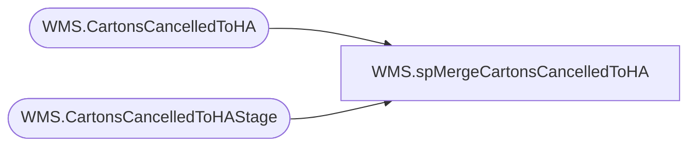

# WMS.spMergeCartonsCancelledToHA

**Database:** IntegrationStaging  

## Architecture Diagram



## Table Dependencies

| Referenced Table |
|---|
| WMS.CartonsCancelledToHA |
| WMS.CartonsCancelledToHAStage |

## Stored Procedure Code

```sql
CREATE proc [WMS].[spMergeCartonsCancelledToHA]

as 

-------------------------------------------------------------------------------------------------------
-- Kelly Farrar	2019-07-09	Created Proc for merging Carton Cancelled To HA data
-------------------------------------------------------------------------------------------------------

set nocount on

merge into [IntegrationStaging].[WMS].[CartonsCancelledToHA] as target
using [IntegrationStaging].[WMS].CartonsCancelledToHAStage as source 
on 
	(
		target.[_upstream.MessageId]=source.[_upstream.MessageId]
	)
When Matched and
	(
	
		isnull(target.[warehouse],'x')<>isnull(source.[warehouse],'x')
			OR
		isnull(target.[containerId],'x')<>isnull(source.[containerId],'x')
		OR
		isnull(target.[_upstream.EnqueuedTimeUTC],'x')<>isnull(source.[_upstream.EnqueuedTimeUTC],'x')
	)
Then Update
	set 
		target.[warehouse]=source.[warehouse],
		target.[containerId]=source.[containerId],
		target.[_upstream.EnqueuedTimeUTC]=source.[_upstream.EnqueuedTimeUTC],
		target.UpdateDate=getdate()

When Not Matched by target
Then Insert
	(

		[warehouse],
		[containerId],
		[_upstream.EnqueuedTimeUTC],
		[_upstream.MessageId],
		[InsertDate]

		)
Values
	(
		
		source.[warehouse],
		source.[containerId],
		source.[_upstream.EnqueuedTimeUTC],
		source.[_upstream.MessageId],
		getdate()
	)
;

-------------------------------------------------------------------------------------------------------
```

