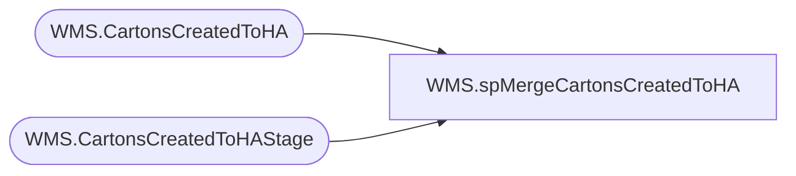

# WMS.spMergeCartonsCreatedToHA

**Database:** IntegrationStaging  

## Architecture Diagram



## Table Dependencies

| Referenced Table |
|---|
| WMS.CartonsCreatedToHA |
| WMS.CartonsCreatedToHAStage |

## Stored Procedure Code

```sql
CREATE proc [WMS].[spMergeCartonsCreatedToHA]

as 

-------------------------------------------------------------------------------------------------------
-- Kelly Farrar	2019-07-09	Created Proc for merging Carton Created To HA data
-------------------------------------------------------------------------------------------------------

set nocount on

merge into [IntegrationStaging].[WMS].[CartonsCreatedToHA] as target
using [IntegrationStaging].[WMS].[CartonsCreatedToHAStage] as source 
on 
	(
		target.[_upstream.MessageId]=source.[_upstream.MessageId]
	)
When Matched and
	(
	
		isnull(target.[waveId],'x')<>isnull(source.[waveId],'x')
		OR
		isnull(target.[numberOfContainers],'0')<>isnull(source.[numberOfContainers],'0')
		OR
		isnull(target.[releasedDateAndTime],'x')<>isnull(source.[releasedDateAndTime],'x')
		OR
		isnull(target.[warehouse],'x')<>isnull(source.[warehouse],'x')
			OR
		isnull(target.[waveStatus],'x')<>isnull(source.[waveStatus],'x')
		OR
		isnull(target.[_upstream.EnqueuedTimeUTC],'x')<>isnull(source.[_upstream.EnqueuedTimeUTC],'x')
	)
Then Update
	set 

		target.[waveId]=source.[waveId],
		target.[numberOfContainers]=source.[numberOfContainers],
		target.[releasedDateAndTime]=source.[releasedDateAndTime],
		target.[warehouse]=source.[warehouse],
		target.[waveStatus]=source.[waveStatus],
		target.[_upstream.EnqueuedTimeUTC]=source.[_upstream.EnqueuedTimeUTC],
		target.UpdateDate=getdate()

When Not Matched by target
Then Insert
	(
		[waveId],
		[numberOfContainers],
		[releasedDateAndTime],
		[warehouse],
		[waveStatus],
		[_upstream.EnqueuedTimeUTC],
		[_upstream.MessageId],
		[InsertDate]

		)
Values
	(
		
		source.[waveId],
		source.[numberOfContainers],
		source.[releasedDateAndTime],
		source.[warehouse],
		source.[waveStatus],
		source.[_upstream.EnqueuedTimeUTC],
		source.[_upstream.MessageId],
		getdate()
	)
;

-------------------------------------------------------------------------------------------------------
```

