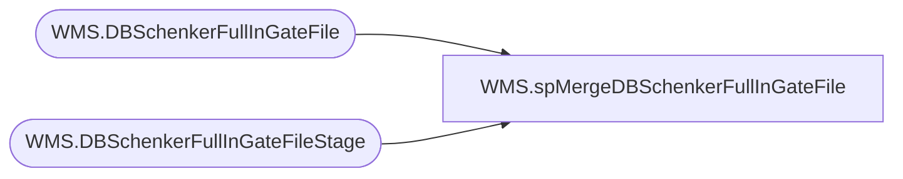

# WMS.spMergeDBSchenkerFullInGateFile

**Database:** IntegrationStaging  

## Architecture Diagram



## Table Dependencies

| Referenced Table |
|---|
| WMS.DBSchenkerFullInGateFile |
| WMS.DBSchenkerFullInGateFileStage |

## Stored Procedure Code

```sql
CREATE proc [WMS].[spMergeDBSchenkerFullInGateFile]

as
--================================================================================================================================================
--	Dan Tweedie	2109-08-26	Created proc to merge file data from DB Schenker, which will be used to create a PO Receipt into Dynamics entity 1200
--================================================================================================================================================

set nocount on 


merge into WMS.DBSchenkerFullInGateFile as target 
using WMS.DBSchenkerFullInGateFileStage as source
on 
	(
		target.PurchaseOrder=source.PurchaseOrder
		and
		target.ProductCode=source.ProductCode
		and
		target.ShippedQty=source.ShippedQty
		and
		target.FullIngateAtLoadPort=source.FullIngateAtLoadPort
		and
		target.POL=source.POL
		and
		target.MANUFACTURERCODE=source.MANUFACTURERCODE

	)
when not matched by target
then insert
	(
		PurchaseOrder,
		ProductCode,
		ShippedQty,
		FullIngateatLoadPort,
		POL,
		MANUFACTURERCODE,
		InsertDate
	)
values
	(
		source.PurchaseOrder,
		source.ProductCode,
		source.ShippedQty,
		source.FullIngateatLoadPort,
		source.POL,
		source.MANUFACTURERCODE,
		getdate()
	)
;
```

