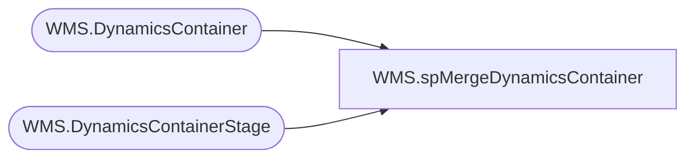

# WMS.spMergeDynamicsContainer

**Database:** IntegrationStaging  

## Architecture Diagram



## Table Dependencies

| Referenced Table |
|---|
| WMS.DynamicsContainer |
| WMS.DynamicsContainerStage |

## Stored Procedure Code

```sql
create proc [WMS].[spMergeDynamicsContainer]

as

set nocount on
;

merge into WMS.DynamicsContainer as target
using WMS.DynamicsContainerStage as source
on 
	(
		target.ContainerID=source.ContainerID
		and
		target.ItemID=source.ContainerID
	)
when matched
	and
		(
			isnull(target.BABStoreNumber,'x')<>isnull(source.BABStoreNumber,'x') or
			isnull(target.LicensePlateId,'x')<>isnull(source.LicensePlateId,'x') or
			isnull(target.dataAreaId,'x')<>isnull(source.dataAreaId,'x') or
			isnull(target.DeliveryName,'x')<>isnull(source.DeliveryName,'x') or
			isnull(target.Height,0)<>isnull(source.Height,0) or
			isnull(target.Length,0)<>isnull(source.Length,0) or
			isnull(target.Qty,0)<>isnull(source.Qty,0) or
			isnull(target.ShipmentId,'x')<>isnull(source.ShipmentId,'x') or
			isnull(target.Weight,0)<>isnull(source.Weight,0) or	
			isnull(target.WHSShipmentTable_Address,'x')<>isnull(source.WHSShipmentTable_Address,'x') or
			isnull(target.WHSShipmentTable_ShipConfirmUTCDateTime,getdate())<>isnull(source.WHSShipmentTable_ShipConfirmUTCDateTime,getdate()) or	
			isnull(target.WHSShipmentTable_WaveId,'x')<>isnull(source.WHSShipmentTable_WaveId,'x') or
			isnull(target.Width,0)<>isnull(source.Width,0)
		)
then update
	set
		target.BABStoreNumber=source.BABStoreNumber,	
		target.LicensePlateId=source.LicensePlateId,	
		target.dataAreaId=source.dataAreaId,
		target.DeliveryName=source.DeliveryName,	
		target.Height=source.Height,	
		target.Length=source.Length,	
		target.Qty=source.Qty,	
		target.ShipmentId=source.ShipmentId,	
		target.Weight=source.Weight,	
		target.WHSShipmentTable_Address=source.WHSShipmentTable_Address,	
		target.WHSShipmentTable_ShipConfirmUTCDateTime=source.WHSShipmentTable_ShipConfirmUTCDateTime,	
		target.WHSShipmentTable_WaveId=source.WHSShipmentTable_WaveId,
		target.Width=source.Width,
		target.UpdateDate=getdate()
when not matched by target
then insert
	(
		BABStoreNumber,	
		LicensePlateId,	
		ContainerId,	
		ItemId,	
		dataAreaId,	
		DeliveryName,	
		Height,	
		Length,	
		Qty,	
		ShipmentId,	
		Weight,	
		WHSShipmentTable_Address,	
		WHSShipmentTable_ShipConfirmUTCDateTime,	
		WHSShipmentTable_WaveId,
		Width,
		InsertDate
	)
values
	(
		source.BABStoreNumber,	
		source.LicensePlateId,	
		source.ContainerId,	
		source.ItemId,	
		source.dataAreaId,	
		source.DeliveryName,	
		source.Height,	
		source.Length,	
		source.Qty,	
		source.ShipmentId,	
		source.Weight,	
		source.WHSShipmentTable_Address,	
		source.WHSShipmentTable_ShipConfirmUTCDateTime,	
		source.WHSShipmentTable_WaveId,	
		source.Width,
		getdate()
	)
;
```

