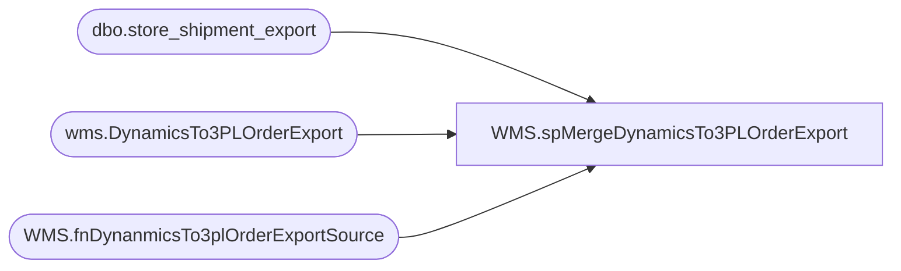

# WMS.spMergeDynamicsTo3PLOrderExport

**Database:** IntegrationStaging  

## Architecture Diagram



## Table Dependencies

| Referenced Table |
|---|
| dbo.store_shipment_export |
| wms.DynamicsTo3PLOrderExport |
| WMS.fnDynanmicsTo3plOrderExportSource |

## Stored Procedure Code

```sql
CREATE proc [WMS].[spMergeDynamicsTo3PLOrderExport] 

--========================================================================================================================================
--	Dan Tweedie		2020-09-08	Created Proc to merge Distros from Dynamics to wms.DynamicsTo3PLOrderExport as final stage before CSV export
--	Tim Callahan	2022-07-12	Modified proc to use new  table value function as source in order to group supply and merch TOs on a single shipment document number 
--	Tim Callahan	2022-08-18	Modified Key Condition , removed ref_field_1 as this is a derived value and can vary. 
--								This became necessary due to continued duplicate picktickets generating from Dynamics. 
--========================================================================================================================================

as 

set nocount on

declare @Seed bigint 
select @seed = round(max(document_number), 0) from bedrockdb02.me_01.dbo.store_shipment_export 
;

with SourceFunction as 
(

select * from  [WMS].[fnDynanmicsTo3plOrderExportSource] (@Seed)

)

merge into wms.DynamicsTo3PLOrderExport as target
--using wms.DynamicsTo3PLOrderExportStage as source
using SourceFunction as source
on 
	(
		target.SourceID=source.SourceID
		and
		target.DestID=source.DestID
		and
		target.distribution_number=source.distribution_number
		and
		--target.ref_field_1=source.ref_field_1 -- Removed This as a Merge Condition
		--and
		target.rec_type=source.rec_type
		and
		target.style_code=source.style_code
	)
when not matched by target
	then insert
		(
			sourceid,	
			destid,	
			rec_type,	
			message,	
			style_code,	
			quantity,	
			release_date,	
			distribution_number,	
			ref_field_1,	
			DynamicsOrderId,
			short_desc,	
			vendor_style,	
			color_code,	
			document_number,	
			InsertDate
		)
	values
		(
			source.sourceid,	
			source.destid,	
			source.rec_type,	
			source.message,	
			source.style_code,	
			source.quantity,	
			source.release_date,	
			source.distribution_number,	
			source.ref_field_1,	
			source.DynamicsOrderId,
			source.short_desc,	
			source.vendor_style,	
			source.color_code,	
			source.document_number,	
			getdate()
		)
;
```

