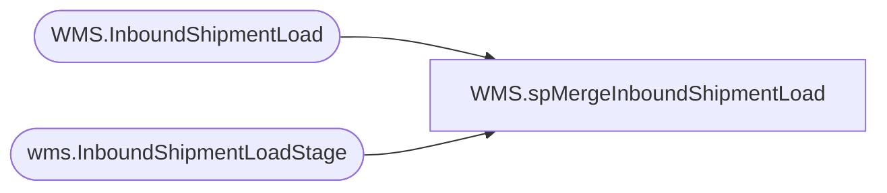

# WMS.spMergeInboundShipmentLoad

**Database:** IntegrationStaging  

## Architecture Diagram



## Table Dependencies

| Referenced Table |
|---|
| WMS.InboundShipmentLoad |
| wms.InboundShipmentLoadStage |

## Stored Procedure Code

```sql
CREATE proc [WMS].[spMergeInboundShipmentLoad]

as

------------------------------------------------------------------------------------------------------------------------------------------------------------
----	Tim Callahan	-2022-06-03	- Created Proc - Merges Warehouse Shipment Invoice data from WMS.InboundShipmentLoadStage to WMS.InboundShipmentLoad
----	Tim Callahan	-2022-11-21	- Updated Proc - Updated Source as we need to include a new field per JIRA BIB-474
----	Tim Callahan	-2023-10-30	- Updated Proc - Updated Parent License Plate Derived Columan per JIRA BIB-696
----											   - Only  deployed the change for 9960 on 10/30/2023 as pilot will add 9970 after a week of no issues
----	Tim Callahan	-2025-02-03	- Updated Proc - Added where condition to source query as part of Aptos Decom  
------------------------------------------------------------------------------------------------------------------------------------------------------------

set nocount on

Merge into WMS.InboundShipmentLoad as target
--using WMS.InboundShipmentLoadStage  as source
using
(
	select ShipDate, 
	--ExpectedReceiptDate, 
	isnull(ExpectedReceiptDate, cast (getdate()+7 as date)) as ExpectedReceiptDate,
	DeliveryTerms, 
	ItemNumber, 
	TransferQuantity, 
	UOM, 
	BABAptosDistroNumber, 
	InventoryStatus, 
	LicensePlate, 
	ContainerID, 
	[3PLDocumentNumber], 
	OrderCreateSource, 
	Entity, 
	FromWarehouse, 
	ToWarehouse, 
	AptosShipmentNumber, 
	ModeOfDelivery, 
	OrderId, 
	BABAptosDistroLineNumber, 
	case when FromWarehouse = '9960' and Entity = '1100'
		--then 'SWC'+[OrderId] -- Replaced with below on 10/30/2023
			then 'SWC'+[3PLDocumentNumber]
		when FromWarehouse = '9970' and Entity = '2110'
			--then 'SUK' +[OrderId]
			then 'SUK' +[3PLDocumentNumber] -- Have this queued up after 9960 Pilot 
		else null 
		end as ParentLicensePlate

	from wms.InboundShipmentLoadStage
	-- When Ready for Aptos Cutover unremark out this section
	/*
	where 1=1
	and OrderId is not null -- Added Condition on 20250203 - If we cannot lookup the Dynamics TO Number we should not merge the records as it will fail to post to Dynamics 
	*/
	-- End of Aptos Unremark out section 
	group by ShipDate, 
	--ExpectedReceiptDate, 
	isnull(ExpectedReceiptDate, cast (getdate()+7 as date)),
	DeliveryTerms, 
	ItemNumber, 
	TransferQuantity, 
	UOM, 
	BABAptosDistroNumber, 
	InventoryStatus, 
	LicensePlate, 
	ContainerID, 
	[3PLDocumentNumber], 
	OrderCreateSource, 
	Entity, 
	FromWarehouse, 
	ToWarehouse, 
	AptosShipmentNumber, 
	ModeOfDelivery, 
	OrderId, 
	BABAptosDistroLineNumber

) as source 
on 
	(
		isnull(target.ToWarehouse,'x') = isnull(source.ToWarehouse,'x')
		and
		isnull(target.OrderId,'x') = isnull(source.OrderId,'x')
		and
		isnull(target.LicensePlate,'x') = isnull(source.LicensePlate,'x')
		and
		isnull(target.ItemNumber,'x') = isnull(source.ItemNumber,'x')
		and 
		isnull(target.Entity,'x') = isnull(source.Entity,'x')
		and 
		isnull(target.ContainerId,'x')=isnull(source.ContainerId,'x')

	)
when NOT MATCHED by Target
	then
		Insert
			(
				ShipDate, 
				ExpectedReceiptDate, 
				AptosShipmentNumber, 
				DeliveryTerms, 
				ModeOfDelivery, 
				ToWarehouse, 
				FromWarehouse, 
				Entity, 
				OrderId, 
				ItemNumber, 
				TransferQuantity, 
				UOM, 
				BABAptosDistroNumber, 
				BABAptosDistroLineNumber, 
				InventoryStatus, 
				LicensePlate, 
				ContainerId, 
				InsertDate, 
				[3PLDocumentNumber],
				OrderCreateSource, 
				ParentLicensePlate

			)
		values
			(
				source.ShipDate, 
				source.ExpectedReceiptDate, 
				source.AptosShipmentNumber, 
				source.DeliveryTerms, 
				source.ModeOfDelivery, 
				source.ToWarehouse, 
				source.FromWarehouse, 
				source.Entity, 
				source.OrderId, 
				source.ItemNumber, 
				source.TransferQuantity, 
				source.UOM, 
				source.BABAptosDistroNumber, 
				source.BABAptosDistroLineNumber, 
				source.InventoryStatus, 
				source.LicensePlate, 
				source.ContainerId,
				getdate(), 
				source.[3PLDocumentNumber],
				source.OrderCreateSource, 
				source.ParentLicensePlate
				
				)


;
```

