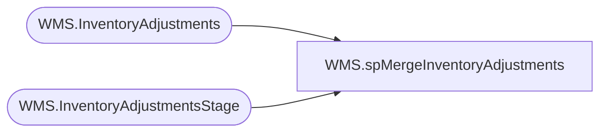

# WMS.spMergeInventoryAdjustments

**Database:** IntegrationStaging  

## Architecture Diagram



## Table Dependencies

| Referenced Table |
|---|
| WMS.InventoryAdjustments |
| WMS.InventoryAdjustmentsStage |

## Stored Procedure Code

```sql
create proc [WMS].[spMergeInventoryAdjustments]

----------------------------------------------------------------------------------------------------------------------------------------
--Dan Tweedie	2019-07-17	Created proc to merge inventory adjustments from D365 WMS to IntegrationStaging so we can export to Merch
----------------------------------------------------------------------------------------------------------------------------------------

as

set nocount on

merge into WMS.InventoryAdjustments as target
using WMS.InventoryAdjustmentsStage as source 
on 
	target.Warehouse=source.Warehouse
	and 
	target.ItemNumber=source.ItemNumber
	and
	target.ReasonCode=source.ReasonCode
	and 
	target.JournalType=source.JournalType
	and 
	target.MessageID=source.MessageID
when not matched by target
then insert
	(
		ItemNumber,
		Warehouse,
		AdjustedQuantity,
		ReasonCode,
		JournalType,
		EnqueuedTimeUTC,
		MessageId,
		InsertDate
	)
	values
	(
		source.ItemNumber,
		source.Warehouse,
		source.AdjustedQuantity,
		source.ReasonCode,
		source.JournalType,
		source.EnqueuedTimeUTC,
		source.MessageId,
		getdate()
	)
;
```

