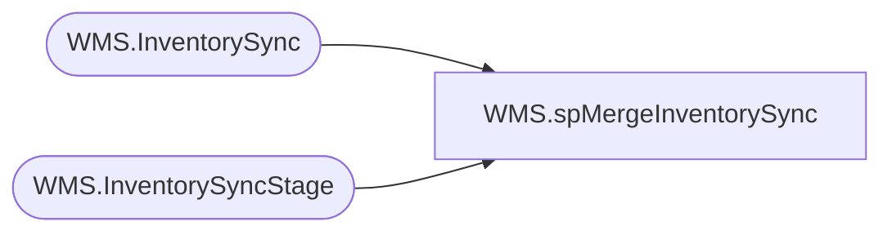

# WMS.spMergeInventorySync

**Database:** IntegrationStaging  

## Architecture Diagram



## Table Dependencies

| Referenced Table |
|---|
| WMS.InventorySync |
| WMS.InventorySyncStage |

## Stored Procedure Code

```sql
CREATE proc [WMS].[spMergeInventorySync]

as
-----------------------------------------------------------------------------
--	Dan Tweedie	2019-07-04	Created proc, merges Inventory from Dynamics WMS
-----------------------------------------------------------------------------

set nocount on


Merge into WMS.InventorySync as target
using 
	(
		select i.*
		from WMS.InventorySyncStage i
		join 
			(
				select 
					Warehouse,
					ItemNumber,
					InventoryStatus,
					max(MessageDate) MaxMessageDate
				from wms.InventorySyncStage 
				group by 
					Warehouse,
					ItemNumber,
					InventoryStatus
			) s 
			on	
			i.warehouse=s.warehouse 
			and i.itemNumber=s.itemNumber
			and i.inventorystatus=s.inventoryStatus
			and i.MessageDate=s.MaxMessageDate
		where i.warehouse is not NULL
	) as source
on 
	target.Warehouse=source.Warehouse
	and 
	target.ItemNumber=source.ItemNumber
	and
	target.InventoryStatus=source.InventoryStatus
when matched 
	and
		isnull(target.PhysicalInventory,0)<>isnull(source.PhysicalInventory,0)
		or
		isnull(target.PhysicalReserved,0)<>isnull(source.PhysicalReserved,0)
		or
		isnull(target.AvailablePhysical,0)<>isnull(source.AvailablePhysical,0)
		or
		isnull(target.AvailPhysExactDimensions,0)<>isnull(source.AvailPhysExactDimensions,0)
		or
		isnull(target.OrderedInTotal,0)<>isnull(source.OrderedInTotal,0)
		or
		isnull(target.OnOrder,0)<>isnull(source.OnOrder,0)
		or 
		isnull(target.OrderedReserved,0)<>isnull(source.OrderedReserved,0)
		or
		isnull(target.AvailableReservation,0)<>isnull(source.AvailableReservation,0)
		or
		isnull(target.TotalAvailable,0)<>isnull(source.TotalAvailable,0)
		or
		isnull(target.MessageDate, '3030-12-31')<>isnull(source.MessageDate, '3030-12-31')
then update
	set
		target.PhysicalInventory=source.PhysicalInventory,
		target.PhysicalReserved=source.PhysicalReserved,
		target.AvailablePhysical=source.AvailablePhysical,
		target.AvailPhysExactDimensions=source.AvailPhysExactDimensions,
		target.OrderedInTotal=source.OrderedInTotal,
		target.OnOrder=source.OnOrder,
		target.OrderedReserved=source.OrderedReserved,
		target.AvailableReservation=source.AvailableReservation,
		target.TotalAvailable=source.TotalAvailable,
		target.MessageDate=source.MessageDate,
		target.UpdateDate=getdate()
when not matched by target
	then insert
		(
			Warehouse,
			ItemNumber,
			InventoryStatus,
			PhysicalInventory,
			PhysicalReserved,
			AvailablePhysical,
			AvailPhysExactDimensions,
			OrderedInTotal,
			OnOrder,
			OrderedReserved,
			AvailableReservation,
			TotalAvailable,
			MessageDate,
			InsertDate
		)
	values
		(
			source.Warehouse,
			source.ItemNumber,
			source.InventoryStatus,
			source.PhysicalInventory,
			source.PhysicalReserved,
			source.AvailablePhysical,
			source.AvailPhysExactDimensions,
			source.OrderedInTotal,
			source.OnOrder,
			source.OrderedReserved,
			source.AvailableReservation,
			source.TotalAvailable,
			source.MessageDate,
			getdate()
		)
when not matched by source
	then update
		set
			target.PhysicalInventory = 0,
			target.PhysicalReserved= 0,
			target.AvailablePhysical= 0,
			target.AvailPhysExactDimensions= 0,
			target.OrderedInTotal= 0,
			target.OnOrder= 0,
			target.OrderedReserved= 0,
			target.AvailableReservation= 0,
			target.TotalAvailable= 0,
			target.MessageDate=getdate(),
			target.UpdateDate=getdate()
			
;
```

