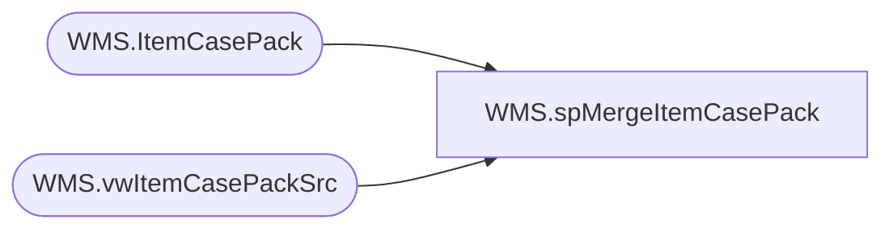

# WMS.spMergeItemCasePack

**Database:** IntegrationStaging  

## Architecture Diagram



## Table Dependencies

| Referenced Table |
|---|
| WMS.ItemCasePack |
| WMS.vwItemCasePackSrc |

## Stored Procedure Code

```sql
CREATE proc [WMS].[spMergeItemCasePack] 

as


-- =====================================================================================================
-- Name: WMS.spMergeItemCasePack
--
-- Description:	Merges from WMS.ItemCasePackStage to WMS.ItemCasePack
--
--
-- Revision History
--		Name:			Date:			Comments:
--		Lizzy Timm		2026-03-20		Created proc.	
-- =====================================================================================================


set nocount on

Merge into WMS.ItemCasePack as target
Using WMS.vwItemCasePackSrc as source
On (
		target.BaseId = source.BaseId
		AND 
		target.StyleCode = source.StyleCode
	)
when matched 
	and (
			ISNULL(source.OrderMultiple,0) <> ISNULL(target.OrderMultiple,0)
			OR 
			ISNULL(source.DistribMultiple,0) <> ISNULL(target.DistribMultiple,0)
			OR
			ISNULL(source.ItemDesc,'x') <> ISNULL(target.ItemDesc,'x')
		)
	then 
		UPDATE
			SET
				target.UpdateDate = getdate()
				, target.OrderMultiple = source.OrderMultiple
				, target.DistribMultiple = source.DistribMultiple
				, target.ItemDesc = source.ItemDesc
When Not Matched By Target 
	Then 
		Insert (
					BaseId
					, StyleCode
					, OrderMultiple
					, DistribMultiple
					, ItemDesc
					, InsertDate
				)
		Values (	
					source.BaseId
					, source.StyleCode
					, source.OrderMultiple
					, source.DistribMultiple
					, source.ItemDesc
					, getdate()
				)
;
```

