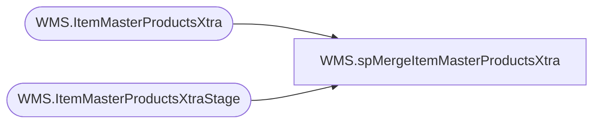

# WMS.spMergeItemMasterProductsXtra

**Database:** IntegrationStaging  

## Architecture Diagram



## Table Dependencies

| Referenced Table |
|---|
| WMS.ItemMasterProductsXtra |
| WMS.ItemMasterProductsXtraStage |

## Stored Procedure Code

```sql
CREATE proc [WMS].[spMergeItemMasterProductsXtra]
as
----------------------------------------------------------------------------------------------------------------------------
--	Dan Tweedie	-	2017-11-06	-	Created proc - Merges Dynamics 365 Item Product data from WMS.ItemMasterProductsStage to WMS.ItemMasterProducts
----------------------------------------------------------------------------------------------------------------------------

set nocount on
merge into WMS.ItemMasterProductsXtra as target
Using WMS.ItemMasterProductsXtraStage as source
on 
	(
		target.PRODUCTNUMBER=source.PRODUCTNUMBER
		and 
		target.Entity = source.Entity
	)
when matched 
	and
		(
			isnull(target.AREIDENTICALCONFIGURATIONSALLOWED,'xxx')<>isnull(source.AREIDENTICALCONFIGURATIONSALLOWED,'xxx') OR
			isnull(target.HARMONIZEDSYSTEMCODE,'xxx')<>source.HARMONIZEDSYSTEMCODE OR
			isnull(target.ISAUTOMATICVARIANTGENERATIONENABLED,'xxx')<>isnull(source.ISAUTOMATICVARIANTGENERATIONENABLED,'xxx') OR
			isnull(target.ISCATCHWEIGHTPRODUCT,'xxx')<>isnull(source.ISCATCHWEIGHTPRODUCT,'xxx') OR
			isnull(target.ISPRODUCTKIT,'xxx')<>isnull(source.ISPRODUCTKIT,'xxx') OR
			isnull(target.ISPRODUCTVARIANTUNITCONVERSIONENABLED,'xxx')<>isnull(source.ISPRODUCTVARIANTUNITCONVERSIONENABLED,'xxx') OR
			isnull(target.NMFCCODE,'xxx')<>isnull(source.NMFCCODE,'xxx') OR
			isnull(target.PRODUCTCOLORGROUPID,'xxx')<>isnull(source.PRODUCTCOLORGROUPID,'xxx') OR
			isnull(target.PRODUCTDESCRIPTION,'xxx')<>isnull(source.PRODUCTDESCRIPTION ,'xxx') OR
			isnull(target.PRODUCTDIMENSIONGROUPNAME,'xxx')<>isnull(source.PRODUCTDIMENSIONGROUPNAME,'xxx') OR
			isnull(target.PRODUCTNAME,'xxx')<>isnull(source.PRODUCTNAME,'xxx') OR
			isnull(target.PRODUCTSEARCHNAME,'xxx')<>isnull(source.PRODUCTSEARCHNAME,'xxx') OR
			isnull(target.PRODUCTSIZEGROUPID,'xxx')<>isnull(source.PRODUCTSIZEGROUPID,'xxx') OR
			isnull(target.PRODUCTSTYLEGROUPID,'xxx')<>isnull(source.PRODUCTSTYLEGROUPID,'xxx') OR
			isnull(target.PRODUCTSUBTYPE,'xxx')<>isnull(source.PRODUCTSUBTYPE,'xxx') OR
			isnull(target.PRODUCTTYPE,'xxx')<>isnull(source.PRODUCTTYPE,'xxx') OR
			isnull(target.RETAILPRODUCTCATEGORYNAME,'xxx')<>isnull(source.RETAILPRODUCTCATEGORYNAME,'xxx') OR
			isnull(target.STCCCODE,'xxx')<>isnull(source.STCCCODE,'xxx') OR
			isnull(target.STORAGEDIMENSIONGROUPNAME,'xxx')<>isnull(source.STORAGEDIMENSIONGROUPNAME,'xxx') OR
			isnull(target.TRACKINGDIMENSIONGROUPNAME,'xxx')<>isnull(source.TRACKINGDIMENSIONGROUPNAME,'xxx') OR
			isnull(target.VARIANTCONFIGURATIONTECHNOLOGY,'xxx')<>isnull(source.VARIANTCONFIGURATIONTECHNOLOGY,'xxx')
		)
	then 
		UPDATE
			SET
				target.AREIDENTICALCONFIGURATIONSALLOWED=source.AREIDENTICALCONFIGURATIONSALLOWED,
				target.HARMONIZEDSYSTEMCODE=source.HARMONIZEDSYSTEMCODE,
				target.ISAUTOMATICVARIANTGENERATIONENABLED=source.ISAUTOMATICVARIANTGENERATIONENABLED,
				target.ISCATCHWEIGHTPRODUCT=source.ISCATCHWEIGHTPRODUCT,
				target.ISPRODUCTKIT=source.ISPRODUCTKIT,
				target.ISPRODUCTVARIANTUNITCONVERSIONENABLED=source.ISPRODUCTVARIANTUNITCONVERSIONENABLED,
				target.NMFCCODE=source.NMFCCODE,
				target.PRODUCTCOLORGROUPID=source.PRODUCTCOLORGROUPID,
				target.PRODUCTDESCRIPTION=source.PRODUCTDESCRIPTION,
				target.PRODUCTDIMENSIONGROUPNAME=source.PRODUCTDIMENSIONGROUPNAME,
				target.PRODUCTNAME=source.PRODUCTNAME,
				target.PRODUCTSEARCHNAME=source.PRODUCTSEARCHNAME,
				target.PRODUCTSIZEGROUPID=source.PRODUCTSIZEGROUPID,
				target.PRODUCTSTYLEGROUPID=source.PRODUCTSTYLEGROUPID,
				target.PRODUCTSUBTYPE=source.PRODUCTSUBTYPE,
				target.PRODUCTTYPE=source.PRODUCTTYPE,
				target.RETAILPRODUCTCATEGORYNAME=source.RETAILPRODUCTCATEGORYNAME,
				target.STCCCODE=source.STCCCODE,
				target.STORAGEDIMENSIONGROUPNAME=source.STORAGEDIMENSIONGROUPNAME,
				target.TRACKINGDIMENSIONGROUPNAME=source.TRACKINGDIMENSIONGROUPNAME,
				target.VARIANTCONFIGURATIONTECHNOLOGY=source.VARIANTCONFIGURATIONTECHNOLOGY,
				target.UpdateDate=getdate()
when NOT MATCHED by Target
	then
		Insert
			(
				AREIDENTICALCONFIGURATIONSALLOWED,
				HARMONIZEDSYSTEMCODE,
				ISAUTOMATICVARIANTGENERATIONENABLED,
				ISCATCHWEIGHTPRODUCT,
				ISPRODUCTKIT,
				ISPRODUCTVARIANTUNITCONVERSIONENABLED,
				NMFCCODE,
				PRODUCTCOLORGROUPID,
				PRODUCTDESCRIPTION,
				PRODUCTDIMENSIONGROUPNAME,
				ProductNumber,
				PRODUCTNAME,
				PRODUCTSEARCHNAME,
				PRODUCTSIZEGROUPID,
				PRODUCTSTYLEGROUPID,
				PRODUCTSUBTYPE,
				PRODUCTTYPE,
				RETAILPRODUCTCATEGORYNAME,
				STCCCODE,
				STORAGEDIMENSIONGROUPNAME,
				TRACKINGDIMENSIONGROUPNAME,
				VARIANTCONFIGURATIONTECHNOLOGY,
				Entity,
				InsertDate
			)
		values
			(
				source.AREIDENTICALCONFIGURATIONSALLOWED,
				source.HARMONIZEDSYSTEMCODE,
				source.ISAUTOMATICVARIANTGENERATIONENABLED,
				source.ISCATCHWEIGHTPRODUCT,
				source.ISPRODUCTKIT,
				source.ISPRODUCTVARIANTUNITCONVERSIONENABLED,
				source.NMFCCODE,
				source.PRODUCTCOLORGROUPID,
				source.PRODUCTDESCRIPTION, 
				source.PRODUCTDIMENSIONGROUPNAME,
				source.ProductNumber,
				source.PRODUCTNAME,
				source.PRODUCTSEARCHNAME,
				source.PRODUCTSIZEGROUPID,
				source.PRODUCTSTYLEGROUPID,
				source.PRODUCTSUBTYPE,
				source.PRODUCTTYPE,
				source.RETAILPRODUCTCATEGORYNAME,
				source.STCCCODE,
				source.STORAGEDIMENSIONGROUPNAME,
				source.TRACKINGDIMENSIONGROUPNAME,
				source.VARIANTCONFIGURATIONTECHNOLOGY,
				source.Entity,
				getdate()
			)

;
```

