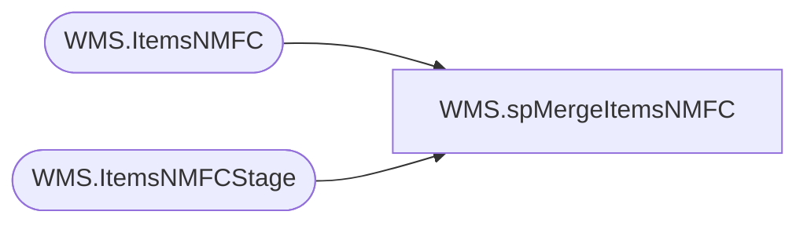

# WMS.spMergeItemsNMFC

**Database:** IntegrationStaging  

## Architecture Diagram



## Table Dependencies

| Referenced Table |
|---|
| WMS.ItemsNMFC |
| WMS.ItemsNMFCStage |

## Stored Procedure Code

```sql
create proc [WMS].[spMergeItemsNMFC]
as
----------------------------------------------------------------------------------------------------------------------------
--	Tim Callahan	-	2020-06-25	-	Created proc - Merges Dynamics 365 Item NMFC data from WMS.ItemsNMFCStage to WMS.ItemsNMFC
----------------------------------------------------------------------------------------------------------------------------

set nocount on
merge into WMS.ItemsNMFC as target
Using WMS.ItemsNMFCStage as source
on 
	(
		target.NMFCCode=source.NMFCCode
	)
when matched 
	and
		(
			isnull(target.DefaultHandlingType,0)<>isnull(source.DefaultHandlingType,0) OR
			isnull(target.LTLClass,0.00)<>isnull(source.LTLClass,0.00) OR
			isnull(target.Name,0.00)<>isnull(source.Name,0.00)
		)
	then 
		UPDATE
			SET
				target.DefaultHandlingType=source.DefaultHandlingType,
				target.LTLClass=source.LTLClass,
				target.Name=source.Name,
				target.UpdateDate=getdate()
when NOT MATCHED by Target
	then
		Insert
			(
				DefaultHandlingType,
				LTLClass,
				Name, 
				NMFCCode, 
				InsertDate

			)
		values
			(
				source.DefaultHandlingType,
				source.LTLClass,
				source.Name,
				source.NMFCCode,
				getdate()
			)

;
```

