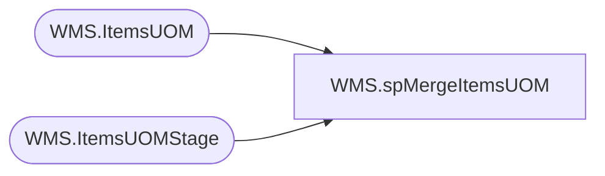

# WMS.spMergeItemsUOM

**Database:** IntegrationStaging  

## Architecture Diagram



## Table Dependencies

| Referenced Table |
|---|
| WMS.ItemsUOM |
| WMS.ItemsUOMStage |

## Stored Procedure Code

```sql
CREATE proc [WMS].[spMergeItemsUOM]
as
----------------------------------------------------------------------------------------------------------------------------
--	Dan Tweedie	-	2017-11-06	-	Created proc - Merges Dynamics 365 Item UOM data from WMS.ItemsUOMStage to WMS.ItemsUOM
----------------------------------------------------------------------------------------------------------------------------

set nocount on
merge into WMS.ItemsUOM as target
Using WMS.ItemsUOMStage as source
on 
	(
		target.PRODUCTNUMBER=source.PRODUCTNUMBER
		and
		target.FROMUNITSYMBOL=source.FROMUNITSYMBOL
		and
		target.TOUNITSYMBOL=source.TOUNITSYMBOL
		and 
		target.Entity = source.Entity
	)
when matched 
	and
		(
			isnull(target.DENOMINATOR,0)<>isnull(source.DENOMINATOR,0) OR
			isnull(target.FACTOR,0.00)<>isnull(source.FACTOR,0.00) OR
			isnull(target.INNEROFFSET,0.00)<>isnull(source.INNEROFFSET,0.00) OR
			isnull(target.NUMERATOR,0)<>isnull(source.NUMERATOR,0) OR
			isnull(target.OUTEROFFSET,0.00)<>isnull(source.OUTEROFFSET,0.00) OR
			isnull(target.ROUNDING,'xxx')<>isnull(source.ROUNDING,'xxx') 
		)
	then 
		UPDATE
			SET
				target.DENOMINATOR=source.DENOMINATOR,
				target.FACTOR=source.FACTOR,
				target.INNEROFFSET=source.INNEROFFSET,
				target.NUMERATOR=source.NUMERATOR,
				target.OUTEROFFSET=source.OUTEROFFSET,
				target.ROUNDING=source.ROUNDING,
				target.UpdateDate=getdate()
when NOT MATCHED by Target
	then
		Insert
			(
				DENOMINATOR,
				FACTOR,
				FROMUNITSYMBOL,
				INNEROFFSET,
				NUMERATOR,
				OUTEROFFSET,
				PRODUCTNUMBER,
				ROUNDING,
				TOUNITSYMBOL,
				Entity,
				InsertDate
			)
		values
			(
				source.DENOMINATOR,
				source.FACTOR,
				source.FROMUNITSYMBOL,
				source.INNEROFFSET,
				source.NUMERATOR,
				source.OUTEROFFSET,
				source.PRODUCTNUMBER,
				source.ROUNDING,
				source.TOUNITSYMBOL,
				source.Entity,
				getdate()
			)

;
```

