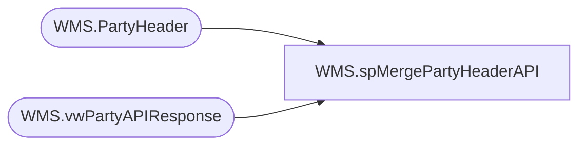

# WMS.spMergePartyHeaderAPI

**Database:** IntegrationStaging  

## Architecture Diagram



## Table Dependencies

| Referenced Table |
|---|
| WMS.PartyHeader |
| WMS.vwPartyAPIResponse |

## Stored Procedure Code

```sql
CREATE proc [WMS].[spMergePartyHeaderAPI] 

as


-- =====================================================================================================
-- Name: spMergePartyHeaderAPI
--
-- Description:	Merges results from from WMS.DynamicsAPILog to WMS.PartyHeader
--
--
-- Revision History
--		Name:			Date:			Comments:
--		Lizzy Timm		2024-06-11		Created proc.	
-- =====================================================================================================


set nocount on;

--UPDATE WMS.PartyHeader
--SET Recent = 0;

--WITH MaxDate AS 
--(
--SELECT MAX(APIDate) AS MaxAPIDate
--FROM WMS.PartyHeader
--WHERE APIDate IS NOT NULL
--)
--UPDATE WMS.PartyHeader
--SET Recent = 1 WHERE APIDate IN (SELECT DISTINCT MaxAPIDate FROM MaxDate);


Merge into WMS.PartyHeader as target
Using WMS.vwPartyAPIResponse as source
On (
		target.PartyID=source.PartyID
	)
when matched 
	then 
		UPDATE
			SET
				target.OrderId=source.OrderId,
				target.APISuccess=source.APISuccess,
				target.APIDate=source.APIDate
;
```

