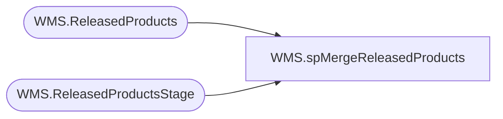

# WMS.spMergeReleasedProducts

**Database:** IntegrationStaging  

## Architecture Diagram



## Table Dependencies

| Referenced Table |
|---|
| WMS.ReleasedProducts |
| WMS.ReleasedProductsStage |

## Stored Procedure Code

```sql
CREATE proc [WMS].[spMergeReleasedProducts] -- Update to Proper Name 

as 

-------------------------------------------------------------------------------------------------------
--	Tim Callahan	-	2025-06-23	-	Created proc - Merges <Data Description> Data from <Staging Table> to <Destination Table>
-------------------------------------------------------------------------------------------------------

set nocount on

merge into WMS.ReleasedProducts  as target
using WMS.ReleasedProductsStage  as source -- Use Entire Table as Source 
--using ( select * from table) as source -- Use SQL Command As Source
on 
	(
		target.dataAreaId=source.dataAreaId -- Key 
			and 
		target.[ItemNumber]=source.[ItemNumber] -- Key
			
	)
When Matched and
	(		
			-- Besure to use isnull logic for compare otherwise may have unintended results 
		    isnull(target.[BABEntitySpecificHTS],'x')<>isnull(source.[BABEntitySpecificHTS],'x') 
       
	)
Then Update
	-- Fields to be updated
	set     
		 --target.[BABEntitySpecificHTS]=source.[BABEntitySpecificHTS],
		 target.[UpdateDate]=getdate()
          
 
When Not Matched by target
Then Insert
	(
		-- Fields to be inserted 
dataAreaId
, ItemNumber
, ProductNumber
, BABEntitySpecificHTS
, InsertDate
	)
Values
	(
  source.dataAreaId
, source.ItemNumber
, source.ProductNumber
, source.BABEntitySpecificHTS
, getdate()

	)
;
```

