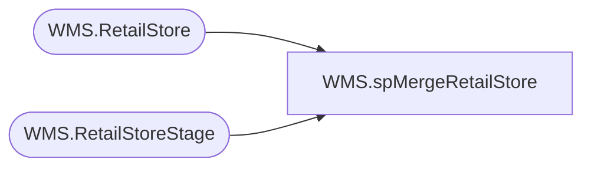

# WMS.spMergeRetailStore

**Database:** IntegrationStaging  

## Architecture Diagram



## Table Dependencies

| Referenced Table |
|---|
| WMS.RetailStore |
| WMS.RetailStoreStage |

## Stored Procedure Code

```sql
CREATE proc [WMS].[spMergeRetailStore] -- Update to Proper Name 

as 

-------------------------------------------------------------------------------------------------------
--	Tim Callahan	-	2022-03-31	-	Created proc - Merges Retail Store Data from WMS.RetailStoreStage to WMS.RetailStore
-------------------------------------------------------------------------------------------------------

set nocount on

merge into WMS.RetailStore as target
using WMS.RetailStoreStage as source -- Use Entire Table as Source 
--using ( select * from table) as source -- Use SQL Command As Source
on 
	(		
		target.WarehouseID = source.WarehouseID
		and 
		target.WarehouseLegalEntity = source.WarehouseLegalEntity

	
	)
When Matched and
	(		
		isnull(target.[BankDropCalculation],'x')<>isnull(target.[BankDropCalculation],'x')OR
		isnull(target.[ChannelProfileName],'x')<>isnull(target.[ChannelProfileName],'x')OR
		isnull(target.[ChannelTimeZone],'x')<>isnull(target.[ChannelTimeZone],'x')OR
		isnull(target.[ChannelTimeZoneInfoId],'x')<>isnull(target.[ChannelTimeZoneInfoId],'x')OR
		isnull(target.[ClosingMethod],'x')<>isnull(target.[ClosingMethod],'x')OR
		isnull(target.[CreateLabelsForZeroPrice],'x')<>isnull(target.[CreateLabelsForZeroPrice],'x')OR
		isnull(target.[CultureName],'x')<>isnull(target.[CultureName],'x')OR
		isnull(target.[Currency],'x')<>isnull(target.[Currency],'x')OR
		isnull(target.[DatabaseName],'x')<>isnull(target.[DatabaseName],'x')OR
		isnull(target.[DefaultCustomerAccount],'x')<>isnull(target.[DefaultCustomerAccount],'x')OR
		isnull(target.[DefaultCustomerLegalEntity],'x')<>isnull(target.[DefaultCustomerLegalEntity],'x')OR
		isnull(target.[DefaultDimensionDisplayValue],'x')<>isnull(target.[DefaultDimensionDisplayValue],'x')OR
		isnull(target.[DisplayTaxPerTaxComponent],'x')<>isnull(target.[DisplayTaxPerTaxComponent],'x')OR
		isnull(target.[ElectronicFundsTransferStoreNumber],'x')<>isnull(target.[ElectronicFundsTransferStoreNumber],'x')OR
		isnull(target.[EndOfBusinessDay],'x')<>isnull(target.[EndOfBusinessDay],'x')OR
		isnull(target.[EventNotificationProfileId],'x')<>isnull(target.[EventNotificationProfileId],'x')OR
		isnull(target.[FunctionalityProfile],'x')<>isnull(target.[FunctionalityProfile],'x')OR
		isnull(target.[GeneratesItemLabels],'x')<>isnull(target.[GeneratesItemLabels],'x')OR
		isnull(target.[GeneratesShelfLabels],'x')<>isnull(target.[GeneratesShelfLabels],'x')OR
		isnull(target.[HideTrainingMode],'x')<>isnull(target.[HideTrainingMode],'x')OR
		isnull(target.[InventoryLookup],'x')<>isnull(target.[InventoryLookup],'x')OR
		isnull(target.[LayoutId],'x')<>isnull(target.[LayoutId],'x')OR
		isnull(target.[LiveDatabaseConnectionProfileName],'x')<>isnull(target.[LiveDatabaseConnectionProfileName],'x')OR
		isnull(target.[MaximumPostingDifference],'x')<>isnull(target.[MaximumPostingDifference],'x')OR
		isnull(target.[MaximumTextLengthOnReceipt],'x')<>isnull(target.[MaximumTextLengthOnReceipt],'x')OR
		isnull(target.[MaxRoundingAmount],'x')<>isnull(target.[MaxRoundingAmount],'x')OR
		isnull(target.[MaxRoundingTaxAmount],'x')<>isnull(target.[MaxRoundingTaxAmount],'x')OR
		isnull(target.[MaxShiftDifferenceAmount],'x')<>isnull(target.[MaxShiftDifferenceAmount],'x')OR
		isnull(target.[MaxTransactionDifferenceAmount],'x')<>isnull(target.[MaxTransactionDifferenceAmount],'x')OR
		isnull(target.[NumberOfTopOrBottomLines],'x')<>isnull(target.[NumberOfTopOrBottomLines],'x')OR
		isnull(target.[OfflineProfileName],'x')<>isnull(target.[OfflineProfileName],'x')OR
		isnull(target.[OneStatementPerDay],'x')<>isnull(target.[OneStatementPerDay],'x')OR
		isnull(target.[OpenFrom],'x')<>isnull(target.[OpenFrom],'x')OR
		isnull(target.[OpenTo],'x')<>isnull(target.[OpenTo],'x')OR
		isnull(target.[OperatingUnitNumber],'x')<>isnull(target.[OperatingUnitNumber],'x')OR
		isnull(target.[OperatingUnitPartyNumber],'x')<>isnull(target.[OperatingUnitPartyNumber],'x')OR
		isnull(target.[PaymentMethodName],'x')<>isnull(target.[PaymentMethodName],'x')OR
		isnull(target.[PaymentMethodToRemoveOrAdd],'x')<>isnull(target.[PaymentMethodToRemoveOrAdd],'x')OR
		isnull(target.[Phone],'x')<>isnull(target.[Phone],'x')OR
		isnull(target.[PriceIncludesSalesTax],'x')<>isnull(target.[PriceIncludesSalesTax],'x')OR
		isnull(target.[ProductCategoryHierarchyName],'x')<>isnull(target.[ProductCategoryHierarchyName],'x')OR
		isnull(target.[ProductNumberOnReceipt],'x')<>isnull(target.[ProductNumberOnReceipt],'x')OR
		isnull(target.[PurchaseOrderItemFilter],'x')<>isnull(target.[PurchaseOrderItemFilter],'x')OR
		isnull(target.[RetailChannelId],'x')<>isnull(target.[RetailChannelId],'x')OR
		isnull(target.[RetailChannelPriceGroup],'x')<>isnull(target.[RetailChannelPriceGroup],'x')OR
		isnull(target.[RetailStoreHardwareStation],'x')<>isnull(target.[RetailStoreHardwareStation],'x')OR
		isnull(target.[RetailStoreLocatorGroupOwner],'x')<>isnull(target.[RetailStoreLocatorGroupOwner],'x')OR
		isnull(target.[RetailStoreTenderType],'x')<>isnull(target.[RetailStoreTenderType],'x')OR
		isnull(target.[RetailTerminal],'x')<>isnull(target.[RetailTerminal],'x')OR
		isnull(target.[RoundingAccountLedgerDimensionDisplayValue],'x')<>isnull(target.[RoundingAccountLedgerDimensionDisplayValue],'x')OR
		isnull(target.[RoundingTaxAccount],'x')<>isnull(target.[RoundingTaxAccount],'x')OR
		isnull(target.[SeparateStatementPerStaffTerminal],'x')<>isnull(target.[SeparateStatementPerStaffTerminal],'x')OR
		isnull(target.[ServiceChargePercentage],'x')<>isnull(target.[ServiceChargePercentage],'x')OR
		isnull(target.[ServiceChargePrompt],'x')<>isnull(target.[ServiceChargePrompt],'x')OR
		isnull(target.[SQLServerName],'x')<>isnull(target.[SQLServerName],'x')OR
		isnull(target.[StartAmountCalculation],'x')<>isnull(target.[StartAmountCalculation],'x')OR
		isnull(target.[StatementMethod],'x')<>isnull(target.[StatementMethod],'x')OR
		isnull(target.[StatementPostAsBusinessDay],'x')<>isnull(target.[StatementPostAsBusinessDay],'x')OR
		isnull(target.[StoreArea],'x')<>isnull(target.[StoreArea],'x')OR
		isnull(target.[StoreNumber],'x')<>isnull(target.[StoreNumber],'x')OR
		isnull(target.[TaxGroupCode],'x')<>isnull(target.[TaxGroupCode],'x')OR
		isnull(target.[TaxGroupLegalEntity],'x')<>isnull(target.[TaxGroupLegalEntity],'x')OR
		isnull(target.[TaxIdentificationNumber],'x')<>isnull(target.[TaxIdentificationNumber],'x')OR
		isnull(target.[TaxOverrideGroupCode],'x')<>isnull(target.[TaxOverrideGroupCode],'x')OR
		isnull(target.[TaxOverrideGroupCodeLegalEntity],'x')<>isnull(target.[TaxOverrideGroupCodeLegalEntity],'x')OR
		isnull(target.[TenderDeclarationCalculation],'x')<>isnull(target.[TenderDeclarationCalculation],'x')OR
		isnull(target.[TermsOfPayment],'x')<>isnull(target.[TermsOfPayment],'x')OR
		isnull(target.[TransactionServiceProfile],'x')<>isnull(target.[TransactionServiceProfile],'x')OR
		isnull(target.[UseCustomerBasedTax],'x')<>isnull(target.[UseCustomerBasedTax],'x')OR
		isnull(target.[UseCustomerBasedTaxExemption],'x')<>isnull(target.[UseCustomerBasedTaxExemption],'x')OR
		isnull(target.[UseDefaultCustomerAccount],'x')<>isnull(target.[UseDefaultCustomerAccount],'x')OR
		isnull(target.[UseDestinationBasedTax],'x')<>isnull(target.[UseDestinationBasedTax],'x')OR
		isnull(target.[WarehouseIdForCustomerOrder],'x')<>isnull(target.[WarehouseIdForCustomerOrder],'x')
       
	)
Then Update
	-- Fields to be updated
	set     
		target.[BankDropCalculation]=source.[BankDropCalculation],
		target.[ChannelProfileName]=source.[ChannelProfileName],
		target.[ChannelTimeZone]=source.[ChannelTimeZone],
		target.[ChannelTimeZoneInfoId]=source.[ChannelTimeZoneInfoId],
		target.[ClosingMethod]=source.[ClosingMethod],
		target.[CreateLabelsForZeroPrice]=source.[CreateLabelsForZeroPrice],
		target.[CultureName]=source.[CultureName],
		target.[Currency]=source.[Currency],
		target.[DatabaseName]=source.[DatabaseName],
		target.[DefaultCustomerAccount]=source.[DefaultCustomerAccount],
		target.[DefaultCustomerLegalEntity]=source.[DefaultCustomerLegalEntity],
		target.[DefaultDimensionDisplayValue]=source.[DefaultDimensionDisplayValue],
		target.[DisplayTaxPerTaxComponent]=source.[DisplayTaxPerTaxComponent],
		target.[ElectronicFundsTransferStoreNumber]=source.[ElectronicFundsTransferStoreNumber],
		target.[EndOfBusinessDay]=source.[EndOfBusinessDay],
		target.[EventNotificationProfileId]=source.[EventNotificationProfileId],
		target.[FunctionalityProfile]=source.[FunctionalityProfile],
		target.[GeneratesItemLabels]=source.[GeneratesItemLabels],
		target.[GeneratesShelfLabels]=source.[GeneratesShelfLabels],
		target.[HideTrainingMode]=source.[HideTrainingMode],
		target.[InventoryLookup]=source.[InventoryLookup],
		target.[LayoutId]=source.[LayoutId],
		target.[LiveDatabaseConnectionProfileName]=source.[LiveDatabaseConnectionProfileName],
		target.[MaximumPostingDifference]=source.[MaximumPostingDifference],
		target.[MaximumTextLengthOnReceipt]=source.[MaximumTextLengthOnReceipt],
		target.[MaxRoundingAmount]=source.[MaxRoundingAmount],
		target.[MaxRoundingTaxAmount]=source.[MaxRoundingTaxAmount],
		target.[MaxShiftDifferenceAmount]=source.[MaxShiftDifferenceAmount],
		target.[MaxTransactionDifferenceAmount]=source.[MaxTransactionDifferenceAmount],
		target.[NumberOfTopOrBottomLines]=source.[NumberOfTopOrBottomLines],
		target.[OfflineProfileName]=source.[OfflineProfileName],
		target.[OneStatementPerDay]=source.[OneStatementPerDay],
		target.[OpenFrom]=source.[OpenFrom],
		target.[OpenTo]=source.[OpenTo],
		target.[OperatingUnitNumber]=source.[OperatingUnitNumber],
		target.[OperatingUnitPartyNumber]=source.[OperatingUnitPartyNumber],
		target.[PaymentMethodName]=source.[PaymentMethodName],
		target.[PaymentMethodToRemoveOrAdd]=source.[PaymentMethodToRemoveOrAdd],
		target.[Phone]=source.[Phone],
		target.[PriceIncludesSalesTax]=source.[PriceIncludesSalesTax],
		target.[ProductCategoryHierarchyName]=source.[ProductCategoryHierarchyName],
		target.[ProductNumberOnReceipt]=source.[ProductNumberOnReceipt],
		target.[PurchaseOrderItemFilter]=source.[PurchaseOrderItemFilter],
		target.[RetailChannelId]=source.[RetailChannelId],
		target.[RetailChannelPriceGroup]=source.[RetailChannelPriceGroup],
		target.[RetailStoreHardwareStation]=source.[RetailStoreHardwareStation],
		target.[RetailStoreLocatorGroupOwner]=source.[RetailStoreLocatorGroupOwner],
		target.[RetailStoreTenderType]=source.[RetailStoreTenderType],
		target.[RetailTerminal]=source.[RetailTerminal],
		target.[RoundingAccountLedgerDimensionDisplayValue]=source.[RoundingAccountLedgerDimensionDisplayValue],
		target.[RoundingTaxAccount]=source.[RoundingTaxAccount],
		target.[SeparateStatementPerStaffTerminal]=source.[SeparateStatementPerStaffTerminal],
		target.[ServiceChargePercentage]=source.[ServiceChargePercentage],
		target.[ServiceChargePrompt]=source.[ServiceChargePrompt],
		target.[SQLServerName]=source.[SQLServerName],
		target.[StartAmountCalculation]=source.[StartAmountCalculation],
		target.[StatementMethod]=source.[StatementMethod],
		target.[StatementPostAsBusinessDay]=source.[StatementPostAsBusinessDay],
		target.[StoreArea]=source.[StoreArea],
		target.[StoreNumber]=source.[StoreNumber],
		target.[TaxGroupCode]=source.[TaxGroupCode],
		target.[TaxGroupLegalEntity]=source.[TaxGroupLegalEntity],
		target.[TaxIdentificationNumber]=source.[TaxIdentificationNumber],
		target.[TaxOverrideGroupCode]=source.[TaxOverrideGroupCode],
		target.[TaxOverrideGroupCodeLegalEntity]=source.[TaxOverrideGroupCodeLegalEntity],
		target.[TenderDeclarationCalculation]=source.[TenderDeclarationCalculation],
		target.[TermsOfPayment]=source.[TermsOfPayment],
		target.[TransactionServiceProfile]=source.[TransactionServiceProfile],
		target.[UseCustomerBasedTax]=source.[UseCustomerBasedTax],
		target.[UseCustomerBasedTaxExemption]=source.[UseCustomerBasedTaxExemption],
		target.[UseDefaultCustomerAccount]=source.[UseDefaultCustomerAccount],
		target.[UseDestinationBasedTax]=source.[UseDestinationBasedTax],
		target.[WarehouseIdForCustomerOrder]=source.[WarehouseIdForCustomerOrder],
target.[UpdateDate]=getdate()
          
 
When Not Matched by target
Then Insert
	(
		-- Fields to be inserted 
			BankDropCalculation, 
			ChannelProfileName, 
			ChannelTimeZone, 
			ChannelTimeZoneInfoId, 
			ClosingMethod, 
			CreateLabelsForZeroPrice, 
			CultureName, 
			Currency, 
			DatabaseName, 
			DefaultCustomerAccount, 
			DefaultCustomerLegalEntity, 
			DefaultDimensionDisplayValue, 
			DisplayTaxPerTaxComponent, 
			ElectronicFundsTransferStoreNumber, 
			EndOfBusinessDay, 
			EventNotificationProfileId, 
			FunctionalityProfile, 
			GeneratesItemLabels, 
			GeneratesShelfLabels, 
			HideTrainingMode, 
			InventoryLookup, 
			LayoutId, 
			LiveDatabaseConnectionProfileName, 
			MaximumPostingDifference, 
			MaximumTextLengthOnReceipt, 
			MaxRoundingAmount, 
			MaxRoundingTaxAmount, 
			MaxShiftDifferenceAmount, 
			MaxTransactionDifferenceAmount, 
			NumberOfTopOrBottomLines, 
			OfflineProfileName, 
			OneStatementPerDay, 
			OpenFrom, 
			OpenTo, 
			OperatingUnitNumber, 
			OperatingUnitPartyNumber, 
			PaymentMethodName, 
			PaymentMethodToRemoveOrAdd, 
			Phone, 
			PriceIncludesSalesTax, 
			ProductCategoryHierarchyName, 
			ProductNumberOnReceipt, 
			PurchaseOrderItemFilter, 
			RetailChannelId, 
			RetailChannelPriceGroup, 
			RetailStoreHardwareStation, 
			RetailStoreLocatorGroupOwner, 
			RetailStoreTenderType, 
			RetailTerminal, 
			RoundingAccountLedgerDimensionDisplayValue, 
			RoundingTaxAccount, 
			SeparateStatementPerStaffTerminal, 
			ServiceChargePercentage, 
			ServiceChargePrompt, 
			SQLServerName, 
			StartAmountCalculation, 
			StatementMethod, 
			StatementPostAsBusinessDay, 
			StoreArea, 
			StoreNumber, 
			TaxGroupCode, 
			TaxGroupLegalEntity, 
			TaxIdentificationNumber, 
			TaxOverrideGroupCode, 
			TaxOverrideGroupCodeLegalEntity, 
			TenderDeclarationCalculation, 
			TermsOfPayment, 
			TransactionServiceProfile, 
			UseCustomerBasedTax, 
			UseCustomerBasedTaxExemption, 
			UseDefaultCustomerAccount, 
			UseDestinationBasedTax, 
			WarehouseId, 
			WarehouseIdForCustomerOrder, 
			WarehouseLegalEntity,
			InsertDate
         
	)
Values
	(
			source.BankDropCalculation, 
			source.ChannelProfileName, 
			source.ChannelTimeZone, 
			source.ChannelTimeZoneInfoId, 
			source.ClosingMethod, 
			source.CreateLabelsForZeroPrice, 
			source.CultureName, 
			source.Currency, 
			source.DatabaseName, 
			source.DefaultCustomerAccount, 
			source.DefaultCustomerLegalEntity, 
			source.DefaultDimensionDisplayValue, 
			source.DisplayTaxPerTaxComponent, 
			source.ElectronicFundsTransferStoreNumber, 
			source.EndOfBusinessDay, 
			source.EventNotificationProfileId, 
			source.FunctionalityProfile, 
			source.GeneratesItemLabels, 
			source.GeneratesShelfLabels, 
			source.HideTrainingMode, 
			source.InventoryLookup, 
			source.LayoutId, 
			source.LiveDatabaseConnectionProfileName, 
			source.MaximumPostingDifference, 
			source.MaximumTextLengthOnReceipt, 
			source.MaxRoundingAmount, 
			source.MaxRoundingTaxAmount, 
			source.MaxShiftDifferenceAmount, 
			source.MaxTransactionDifferenceAmount, 
			source.NumberOfTopOrBottomLines, 
			source.OfflineProfileName, 
			source.OneStatementPerDay, 
			source.OpenFrom, 
			source.OpenTo, 
			source.OperatingUnitNumber, 
			source.OperatingUnitPartyNumber, 
			source.PaymentMethodName, 
			source.PaymentMethodToRemoveOrAdd, 
			source.Phone, 
			source.PriceIncludesSalesTax, 
			source.ProductCategoryHierarchyName, 
			source.ProductNumberOnReceipt, 
			source.PurchaseOrderItemFilter, 
			source.RetailChannelId, 
			source.RetailChannelPriceGroup, 
			source.RetailStoreHardwareStation, 
			source.RetailStoreLocatorGroupOwner, 
			source.RetailStoreTenderType, 
			source.RetailTerminal, 
			source.RoundingAccountLedgerDimensionDisplayValue, 
			source.RoundingTaxAccount, 
			source.SeparateStatementPerStaffTerminal, 
			source.ServiceChargePercentage, 
			source.ServiceChargePrompt, 
			source.SQLServerName, 
			source.StartAmountCalculation, 
			source.StatementMethod, 
			source.StatementPostAsBusinessDay, 
			source.StoreArea, 
			source.StoreNumber, 
			source.TaxGroupCode, 
			source.TaxGroupLegalEntity, 
			source.TaxIdentificationNumber, 
			source.TaxOverrideGroupCode, 
			source.TaxOverrideGroupCodeLegalEntity, 
			source.TenderDeclarationCalculation, 
			source.TermsOfPayment, 
			source.TransactionServiceProfile, 
			source.UseCustomerBasedTax, 
			source.UseCustomerBasedTaxExemption, 
			source.UseDefaultCustomerAccount, 
			source.UseDestinationBasedTax, 
			source.WarehouseId, 
			source.WarehouseIdForCustomerOrder, 
			source.WarehouseLegalEntity,
			getdate()

	)
;
```

