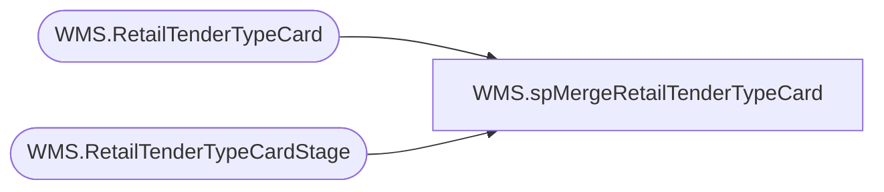

# WMS.spMergeRetailTenderTypeCard

**Database:** IntegrationStaging  

## Architecture Diagram



## Table Dependencies

| Referenced Table |
|---|
| WMS.RetailTenderTypeCard |
| WMS.RetailTenderTypeCardStage |

## Stored Procedure Code

```sql
CREATE proc [WMS].[spMergeRetailTenderTypeCard] -- Update to Proper Name 

as 

-------------------------------------------------------------------------------------------------------
--	Tim Callahan	-	2022-03-31	-	Created proc - Merges Payment Card Type Data from WMS.RetailTenderTypeCardStage to WMS.RetailTenderTypeCard
-------------------------------------------------------------------------------------------------------

set nocount on

merge into WMS.RetailTenderTypeCard as target
using WMS.RetailTenderTypeCardStage source -- Use Entire Table as Source 
--using ( select * from table) as source -- Use SQL Command As Source
on 
	(
		target.[CardTypeId]=source.[CardTypeId] -- Key 
	)
When Matched and
	(		

		isnull(target.[CardIssuer],'x')<>isnull(target.[CardIssuer],'x')OR
		isnull(target.[CardProcessorCode],'x')<>isnull(target.[CardProcessorCode],'x')OR
		isnull(target.[CardTypes],'x')<>isnull(target.[CardTypes],'x')OR
		isnull(target.[Name],'x')<>isnull(target.[Name],'x')OR
		isnull(target.[PaymentSystem],'x')<>isnull(target.[PaymentSystem],'x')OR
		isnull(target.[RetailChannel],'x')<>isnull(target.[RetailChannel],'x')

       
	)
Then Update
	-- Fields to be updated
	set     
		target.[CardIssuer]=source.[CardIssuer],
		target.[CardProcessorCode]=source.[CardProcessorCode],
		target.[CardTypes]=source.[CardTypes],
		target.[Name]=source.[Name],
		target.[PaymentSystem]=source.[PaymentSystem],
		target.[RetailChannel]=source.[RetailChannel],
		target.[UpdateDAte]=getdate()
          
 
When Not Matched by target
Then Insert
	(
		-- Fields to be inserted 
		CardIssuer, 
		CardProcessorCode, 
		CardTypeId, 
		CardTypes, 
		[Name], 
		PaymentSystem, 
		RetailChannel,
		InsertDate
         
	)
Values
	(
		source.CardIssuer, 
		source.CardProcessorCode, 
		source.CardTypeId, 
		source.CardTypes, 
		source.[Name], 
		source.PaymentSystem, 
		source.RetailChannel,
		getdate()

	)
;
```

