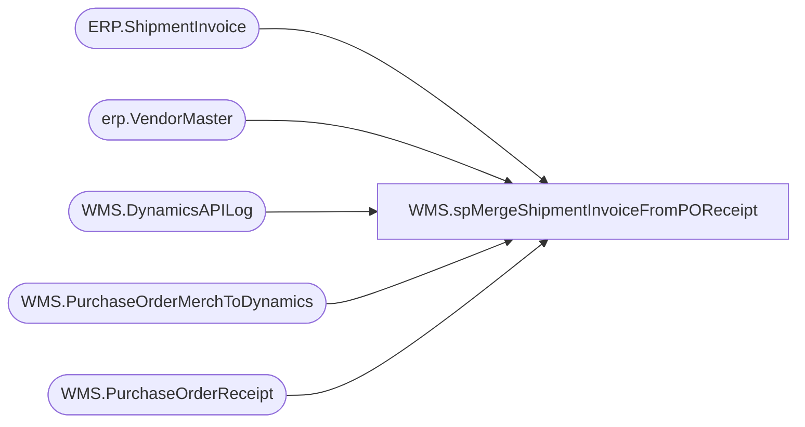

# WMS.spMergeShipmentInvoiceFromPOReceipt

**Database:** IntegrationStaging  

## Architecture Diagram



## Table Dependencies

| Referenced Table |
|---|
| ERP.ShipmentInvoice |
| erp.VendorMaster |
| WMS.DynamicsAPILog |
| WMS.PurchaseOrderMerchToDynamics |
| WMS.PurchaseOrderReceipt |

## Stored Procedure Code

```sql
CREATE proc [WMS].[spMergeShipmentInvoiceFromPOReceipt]

as

set nocount on

;
with 
POCreated as
	(
		select distinct
			e.PONumber as AptosPONumber, 
			case 
					when substring(api.ResponseBody, charindex('Purchase order PO1100', api.ResponseBody, 1)+15, 11) like 'PO1100%' 
						then substring(api.ResponseBody, charindex('Purchase order PO1100', api.ResponseBody, 1)+15, 11) 
					else NULL
			end as Dynamics1100PO,
			e.ItemNumber,
			e.POLineNumber
		from WMS.PurchaseOrderMerchToDynamics e with (nolock)
		join erp.VendorMaster vm with (nolock) 
			on vm.Entity = 1200
			and cast(e.VendorCode as nvarchar) =
				case 
					when vm.OrganizationPhoneticName like '%-%' 
					then substring(vm.OrganizationPhoneticName, 1, charindex('-',vm.OrganizationPhoneticName)-1) 
					else vm.OrganizationPhoneticName 
				end
			and e.FactoryCode =
				case 
					when vm.OrganizationPhoneticName like '%-%' 
					then substring(vm.OrganizationPhoneticName, charindex('-',vm.OrganizationPhoneticName)+1, 20) 
					else e.FactoryCode
				end 
		join WMS.DynamicsAPILog api with (nolock)
			on api.IntegrationName='WMS_PurchaseOrderToDynamics'
			--and e.BatchID=api.BatchID
			and e.PONumber=api.AptosDocumentNumber 
			and vm.VendorAccountNumber=api.PO_OrderAccountNumber

		where 
			case 
				when substring(api.ResponseBody, charindex('Purchase order PO1100', api.ResponseBody, 1)+15, 11) like 'PO1100%' 
					then substring(api.ResponseBody, charindex('Purchase order PO1100', api.ResponseBody, 1)+15, 11) 
				else NULL
			end is not NULL
		--and e.PONumber = '1073553'
	),
POReceipts as
	(
		select 
			AptosPONumber,
			NULL as DlvMode,
			'9900' as InventLocationId,
			ItemID,
			ReceivedQty as Qty,
			convert(varchar, dateadd(hh, -5, MessageQueueDateUTC), 101) as ShipDate,
			POLineNumber
		from WMS.PurchaseOrderReceipt with (nolock)
		where 1=1
		and PostedToDynamics1200ShipmentDate is NULL
		and ReceivedQty > 0
		--and PostedToDynamics1200ShipmentDate>= '2021-01-26'
		--group by 
		--	AptosPONumber,
		--	ItemID,
		--	convert(varchar, dateadd(hh, -5, MessageQueueDateUTC), 101)
	)
select
	pr.DlvMode,
	pr.InventLocationId,
	pr.ItemID,
	pc.Dynamics1100PO as OrderRef,
	pr.Qty,
	pr.ShipDate,
	pr.DlvMode as RecType,
	getdate() as InsertDate,
	0 as Transmitted,
	'1200' as Entity,
	pr.POLineNumber as SALESORDERLINENUMBER
into #PreStage
from POReceipts pr
join POCreated pc 
	on pr.AptosPONumber=pc.AptosPONumber
	and pr.ItemID=pc.ItemNumber
	and pr.POLineNumber=pc.POLineNumber
--where pc.Dynamics1100PO<>'PO110007210'

		
;


merge into ERP.ShipmentInvoice as target 
using #PreStage as source
	on 
		target.OrderRef=source.OrderRef
		and 
		target.Entity=source.Entity
		and 
		target.ItemId=source.ItemId
		and 
		target.SalesOrderLineNumber=source.SalesOrderLineNumber
when not matched by target
	then Insert
		(
			DlvMode,	
			InventLocationId,	
			ItemId,	
			OrderRef,	
			Qty,		
			ShipDate,	
			RecType,		
			Transmitted,	
			Entity,
			SALESORDERLINENUMBER,
			InsertDate
		)
	values
		(
			source.DlvMode,	
			source.InventLocationId,	
			source.ItemId,	
			source.OrderRef,	
			source.Qty,		
			source.ShipDate,	
			source.RecType,	
			source.Transmitted,	
			source.Entity,
			source.SALESORDERLINENUMBER,
			getdate()
		)
;

update WMS.PurchaseOrderReceipt
set PostedToDynamics1200ShipmentDate = getdate()
where PostedToDynamics1200ShipmentDate is null


WMS,spMergeStoreMasterTo3PL,create proc WMS.spMergeStoreMasterTo3PL 

as 

set nocount on

merge into WMS.StoreMasterTo3PL as target
using WMS.StoreMasterTo3PLStage as source
on target.store_nbr=source.store_nbr
when matched 
and	
	isnull(target.name,'x')<>isnull(source.name,'x') or			
	isnull(target.addr_line_1,'x')<>isnull(source.addr_line_1,'x') or	
	isnull(target.addr_line_2,'x')<>isnull(source.addr_line_2,'x') or	
	isnull(target.city,'x')<>isnull(source.city,'x') or	
	isnull(target.state,'x')<>isnull(source.state,'x') or	
	isnull(target.zip,'x')<>isnull(source.zip,'x') or	
	isnull(target.cntry,'x')<>isnull(source.cntry,'x') or	
	isnull(target.addr_line_1CH,'x')<>isnull(source.addr_line_1CH,'x') or	
	isnull(target.addr_line_2CH,'x')<>isnull(source.addr_line_2CH,'x') or	
	isnull(target.cityCH,'x')<>isnull(source.cityCH,'x') or	
	isnull(target.stateCH,'x')<>isnull(source.stateCH,'x') or	
	isnull(target.zipCH,'x')<>isnull(source.zipCH,'x') or	
	isnull(target.cntryCH,'x')<>isnull(source.cntryCH,'x') 
then update
	set
		target.store_nbr=source.store_nbr,			
		target.name=source.name,	
		target.addr_line_1=source.addr_line_1,	
		target.addr_line_2=source.addr_line_2,	
		target.city=source.city,	
		target.state=source.state,	
		target.zip=source.zip,	
		target.cntry=source.cntry,	
		target.addr_line_1CH=source.addr_line_1CH,	
		target.addr_line_2CH=source.addr_line_2CH,	
		target.cityCH=source.cityCH,	
		target.stateCH=source.stateCH,	
		target.zipCH=source.zipCH,	
		target.cntryCH=source.cntryCH,
		target.UpdateDate=getdate()
when not matched by target
then insert
	(
		store_nbr,	
		name,	
		addr_line_1,	
		addr_line_2,	
		city,	
		state,	
		zip,	
		cntry,	
		addr_line_1CH,	
		addr_line_2CH,	
		cityCH,	
		stateCH,	
		zipCH,	
		cntryCH,	
		InsertDate	
	)
values
	(
		source.store_nbr,	
		source.name,	
		source.addr_line_1,	
		source.addr_line_2,	
		source.city,	
		source.state,	
		source.zip,	
		source.cntry,	
		source.addr_line_1CH,	
		source.addr_line_2CH,	
		source.cityCH,	
		source.stateCH,	
		source.zipCH,	
		source.cntryCH,
		getdate()
	)

;
```

