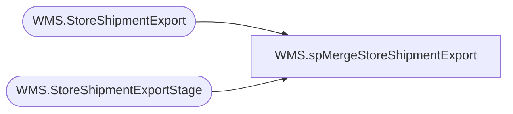

# WMS.spMergeStoreShipmentExport

**Database:** IntegrationStaging  

## Architecture Diagram



## Table Dependencies

| Referenced Table |
|---|
| WMS.StoreShipmentExport |
| WMS.StoreShipmentExportStage |

## Stored Procedure Code

```sql
CREATE proc [WMS].[spMergeStoreShipmentExport]


as 


----------------------------------------------------------------------------------------------------------
-- Dan Tweedie - 2019-06-28	-	Created proc for use with Aptos to Dynamics Distros to Transfer Orders
----------------------------------------------------------------------------------------------------------


set nocount on


merge into WMS.StoreShipmentExport as target
using WMS.StoreShipmentExportStage as source
on 
	target.OrderType=source.OrderType
	and target.AptosShipmentNumber=source.AptosShipmentNumber
	and target.FromWarehouse=source.FromWarehouse
	and target.ToWarehouse=source.ToWarehouse
	and target.AptosDistroNumber=source.AptosDistroNumber
	and target.AptosDistroLineNumber=source.AptosDistroLineNumber
	and target.Company=source.Company
when not matched 
	then insert
		(
			OrderType,
			AptosShipmentNumber,
			FromWarehouse,
			ToWarehouse,
			ModeOfDelivery,
			DeliveryTerms,
			ShipDate,
			ReceiptDate,
			AptosDistroNumber,
			AptosDistroLineNumber,
			ItemNumber,
			Quantity,
			UnitOfMeasure,
			InventoryStatus,
			--CountryCode,
			Company,
			SourceCountry,
			DestinationCountry,
			InsertDate
		)
	values
		(
			source.OrderType,
			source.AptosShipmentNumber,
			source.FromWarehouse,
			source.ToWarehouse,
			source.ModeOfDelivery,
			source.DeliveryTerms,
			source.ShipDate,
			source.ReceiptDate,
			source.AptosDistroNumber,
			source.AptosDistroLineNumber,
			source.ItemNumber,
			source.Quantity,
			source.UnitOfMeasure,
			source.InventoryStatus,
			--source.CountryCode,
			source.Company,
			source.SourceCountry,
			source.DestinationCountry,
			getdate()
		)
;
```

