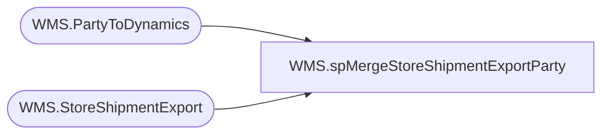

# WMS.spMergeStoreShipmentExportParty

**Database:** IntegrationStaging  

## Architecture Diagram



## Table Dependencies

| Referenced Table |
|---|
| WMS.PartyToDynamics |
| WMS.StoreShipmentExport |

## Stored Procedure Code

```sql
CREATE proc [WMS].[spMergeStoreShipmentExportParty]


as 


-- =====================================================================================================
-- Name: spMergeStoreShipmentExportParty
--
-- Description:	Merges from WMS.PartyToDynamics to WMS.StoreShipmentExport
--
--
-- Revision History
--		Name:			Date:			Comments:
--		Lizzy Timm		2024-06-11		Created proc.	
-- =====================================================================================================


set nocount on


merge into WMS.StoreShipmentExport as target
using WMS.PartyToDynamics as source
on 
	isnull(target.OrderType,'x')=isnull(source.OrderType,'x')
	and isnull(target.AptosShipmentNumber,'x')=isnull(source.PartyID,'x')
	--and target.ToWarehouse=source.ToWarehouse
	and isnull(target.ToWarehouse,'x') = isnull(source.ToWarehouse,'x')
	and isnull(target.AptosDistroLineNumber,0)=isnull(source.LineNumber,0)
	and isnull(target.Company,'x')=isnull(source.Company,'x')
when not matched 
	then insert
		(
			OrderType,
			AptosShipmentNumber,
			FromWarehouse,
			ToWarehouse,
			ModeOfDelivery,
			DeliveryTerms,
			ShipDate,
			ReceiptDate,
			AptosDistroNumber,
			AptosDistroLineNumber,
			ItemNumber,
			Quantity,
			UnitOfMeasure,
			InventoryStatus,
			--CountryCode,
			Company,
			SourceCountry,
			DestinationCountry,
			InsertDate
		)
	values
		(
			source.OrderType,
			source.PartyId,
			source.FromWarehouse,
			source.ToWarehouse,
			source.ModeOfDelivery,
			source.DeliveryTerms,
			source.ShipDate,
			source.ReceiptDate,
			source.AptosDistroNumber,
			source.LineNumber,
			source.ItemNumber,
			source.Quantity,
			source.UnitOfMeasure,
			source.InventoryStatus,
			--source.CountryCode,
			source.Company,
			source.SourceCountry,
			source.DestinationCountry,
			getdate()
		)
;
```

