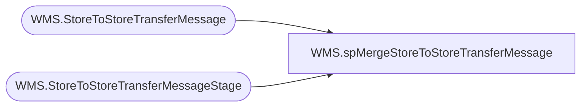

# WMS.spMergeStoreToStoreTransferMessage

**Database:** IntegrationStaging  

## Architecture Diagram



## Table Dependencies

| Referenced Table |
|---|
| WMS.StoreToStoreTransferMessage |
| WMS.StoreToStoreTransferMessageStage |

## Stored Procedure Code

```sql
create proc [WMS].[spMergeStoreToStoreTransferMessage] -- Update to Proper Name 

as 

-------------------------------------------------------------------------------------------------------
--	Tim Callahan	-	2023-02-10	-	Created proc - Merges Transfer Message Trigger Data 
-------------------------------------------------------------------------------------------------------

set nocount on

merge into [WMS].[StoreToStoreTransferMessage] as target
using [WMS].[StoreToStoreTransferMessageStage] as source -- Use Entire Table as Source 
on 
	(
		

		target.TransferOrderNumber=source.TransferOrderNumber
			and
		target.Entity=source.Entity
			and
		target.FromWarehouse=source.FromWarehouse
			and
		target.ToWarehouse=source.ToWarehouse

	)
          
 
When Not Matched by target
Then Insert
	(
		TransferOrderNumber,
		Entity,
		FromWarehouse,
		ToWarehouse,
		InsertDate
         
	)
Values
	(

		source.TransferOrderNumber,
		source.Entity,
		source.FromWarehouse,
		source.ToWarehouse,
		getdate()


	)
;
```

