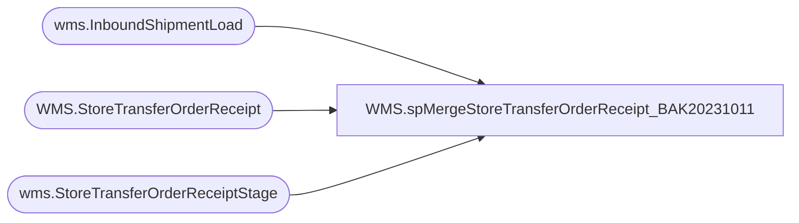

# WMS.spMergeStoreTransferOrderReceipt_BAK20231011

**Database:** IntegrationStaging  

## Architecture Diagram



## Table Dependencies

| Referenced Table |
|---|
| wms.InboundShipmentLoad |
| WMS.StoreTransferOrderReceipt |
| wms.StoreTransferOrderReceiptStage |

## Stored Procedure Code

```sql
CREATE proc [WMS].[spMergeStoreTransferOrderReceipt_BAK20231011] -- Update to Proper Name 

as 

---------------------------------------------------------------------------------------------------------
----	Tim Callahan	-	2022-11-30	-	Created proc
----	Tim Callahan	-	2023-09-26	-	Backed up and Updated Proc source to lookup container ID from License Plate from WMS Inbound Shipment Load for 960\DDC shipments
----										This was in response to DDC shipments not being recieved in Aptos 

---------------------------------------------------------------------------------------------------------

set nocount on

merge into WMS.StoreTransferOrderReceipt as target
using
	(
		select 
		s.InventorySiteId,
		s.WarehouseId, 
		s.DataAreaId as Entity, 
		s.SourceOrderNumber, 
		s.ContainerId,
		--s.TargetLicensePlateNumber,
		isnull(l.ContainerID,s.TargetLicensePlateNumber)  as TargetLicensePlateNumber,
		s.LoadId, 
		s.ShipmentId, 
		s.WarehouseWorkId, 
		s.WarehouseWorkOrderType, 
		s.WarehouseWorkStatus
		from wms.StoreTransferOrderReceiptStage s 
		left join wms.InboundShipmentLoad l (nolock) on s.dataAreaId=l.Entity
											and s.InventorySiteId=l.ToWarehouse
											and s.TargetLicensePlateNumber=l.LicensePlate
											and l.FromWarehouse = '9960'
		where 1=1
		and ISNUMERIC(left(TargetLicensePlateNumber,1)) = 1 

			   
	) as source -- Use SQL Command As Source
on 
	(
		target.[InventorySiteId]=source.[InventorySiteId] -- Key 
		and
		target.[WarehouseId]=source.[WarehouseId] -- Key 
		and 
		target.[Entity] =source.[Entity]
		and 
		target.[SourceOrderNumber] = source.[SourceOrderNumber]
		and 
		target.[TargetLicensePlateNumber] = source.[TargetLicensePlateNumber]
	)
 
When Not Matched by target
Then Insert
	(
		-- Fields to be inserted 
		InventorySiteId, 
		WarehouseId, 
		Entity, 
		SourceOrderNumber, 
		ContainerId, 
		TargetLicensePlateNumber, 
		LoadId, 
		ShipmentId, 
		WarehouseWorkId, 
		WarehouseWorkOrderType, 
		WarehouseWorkStatus, 
		InsertDate
         
	)
Values
	(
		source.InventorySiteId, 
		source.WarehouseId, 
		source.Entity, 
		source.SourceOrderNumber, 
		source.ContainerId, 
		source.TargetLicensePlateNumber, 
		source.LoadId, 
		source.ShipmentId, 
		source.WarehouseWorkId, 
		source.WarehouseWorkOrderType, 
		source.WarehouseWorkStatus, 
		getdate()

	)
;
```

