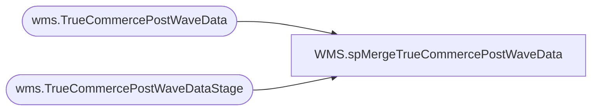

# WMS.spMergeTrueCommercePostWaveData

**Database:** IntegrationStaging  

## Architecture Diagram



## Table Dependencies

| Referenced Table |
|---|
| wms.TrueCommercePostWaveData |
| wms.TrueCommercePostWaveDataStage |

## Stored Procedure Code

```sql
CREATE proc [WMS].[spMergeTrueCommercePostWaveData]

as 

-------------------------------------------------------------------------------------------------------
-- Tim Callahan	2019-11-25	Created Proc for merging post shipment TrueCommerce data 
-------------------------------------------------------------------------------------------------------

set nocount on


merge into wms.[TrueCommercePostWaveData] as target
using wms.[TrueCommercePostWaveDataStage]  as source 
on 
	target.WaveNumber = source.WaveNumber
	and
	target.ShipmentId = source.ShipmentId
	and
	target.SalesOrderNumber = source.SalesOrderNumber
	and 
	target.CustomerAccount = source.CustomerAccount
	and 
	target.DateShipped = source.DateShipped
--when matched and 
--	isnull(target.UOM-Qty,0) <> isnull(source.UOM-Qty,0)
--	or 
--	isnull(target.TotalWeight,0) <> isnull(source.TotalWeight,0)
--	or
--	isnull(target.TotalVolume,0) <> isnull(source.TotalVolume,0)
--then update 
--	set 
--		target.UOM-QTY = source.uom-qty,
--		target.TotalWeight = source.TotalWeight,
--		target.TotalVolume = source.TotalVolume
when not matched by target 
then insert 
	( 
	WaveNumber,
	ShipmentId,
	SalesOrderNumber,
	Purpose,
	CustomerAccount,
	ShipToName,
	DateShipped,
	ShippedQuantity,
	ShippedUOM,
	TotalWeight,
	TotalVolume,
	ShippedFromName,
	InsertDate 
	)
Values 
	( 
	source.WaveNumber,
	source.ShipmentId,
	source.SalesOrderNumber,
	source.Purpose,
	source.CustomerAccount,
	source.ShipToName,
	source.DateShipped,
	source.ShippedQuantity,
	source.ShippedUOM,
	source.TotalWeight,
	source.TotalVolume,
	source.ShippedFromName,
	getdate()
	)
	;
```

