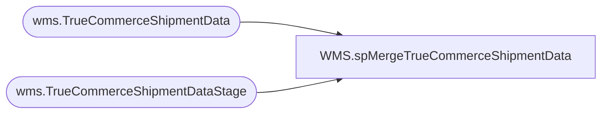

# WMS.spMergeTrueCommerceShipmentData

**Database:** IntegrationStaging  

## Architecture Diagram



## Table Dependencies

| Referenced Table |
|---|
| wms.TrueCommerceShipmentData |
| wms.TrueCommerceShipmentDataStage |

## Stored Procedure Code

```sql
CREATE proc [WMS].[spMergeTrueCommerceShipmentData]

as 

-------------------------------------------------------------------------------------------------------
-- Tim Callahan	2019-11-25	Created Proc for merging post shipment TrueCommerce data 
-------------------------------------------------------------------------------------------------------

set nocount on


select *
from wms.[TrueCommerceShipmentDataStage]

merge into wms.[TrueCommerceShipmentData] as target 
using wms.[TrueCommerceShipmentDataStage] as source 
on 
	target.WaveNumber = source.WaveNumber
	and
	target.Pickticket = source.Pickticket
	and
	target.SalesOrderNumber = source.SalesOrderNumber
	and 
	target.StoreNumber = source.StoreNumber
	and 
	target.UCC128 = source.UCC128
	and 
	target.DateShipped = source.DateShipped
when not matched by target 
then insert 
	(
	UseTrueCommerceLabelSolution,
	WaveNumber,
	Pickticket,
	SalesOrderNumber,
	StoreNumber,
	UCC128,
	ItemNumber,
	ItemDescription,
	ItemDepartment,
	Quantity,
	DateShipped,
	BillOfLading,
	InternalVendorId,
	ShipToName,
	ShipToAddress1,
	ShipToCity,
	ShipToZip,
	ShipFromName,
	ShipFromAddress1,
	ShipFromCity,
	ShipFromZip,
	Code, 
	InsertDate
	)
Values 
	(
	source.UseTrueCommerceLabelSolution,
	source.WaveNumber,
	source.Pickticket,
	source.SalesOrderNumber,
	source.StoreNumber,
	source.UCC128,
	source.ItemNumber,
	source.ItemDescription,
	source.ItemDepartment,
	source.Quantity,
	source.DateShipped,
	source.BillOfLading,
	source.InternalVendorId,
	source.ShipToName,
	source.ShipToAddress1,
	source.ShipToCity,
	source.ShipToZip,
	source.ShipFromName,
	source.ShipFromAddress1,
	source.ShipFromCity,
	source.ShipFromZip,
	source.Code,
	getdate()
	)
	;
```

