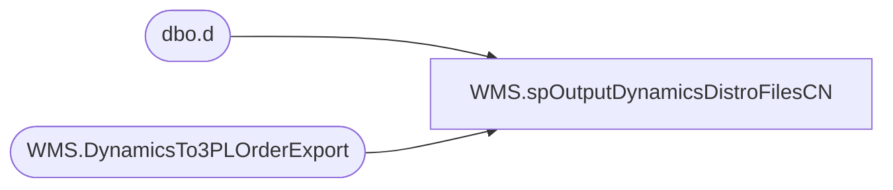

# WMS.spOutputDynamicsDistroFilesCN

**Database:** IntegrationStaging  

## Architecture Diagram



## Table Dependencies

| Referenced Table |
|---|
| dbo.d |
| WMS.DynamicsTo3PLOrderExport |

## Stored Procedure Code

```sql
CREATE proc [WMS].[spOutputDynamicsDistroFilesCN]

as

set nocount on

DECLARE @Output3970 TABLE (OutputMessage NVARCHAR(4000))
DECLARE @Output8502 TABLE (OutputMessage NVARCHAR(4000))
DECLARE @Output8505 TABLE (OutputMessage NVARCHAR(4000))
DECLARE @Output3980 TABLE (OutputMessage NVARCHAR(4000))
DECLARE @Output9942 TABLE (OutputMessage NVARCHAR(4000))
;

-- Drop Temp Tables 
IF (Object_ID('tempdb..##CNDistros3970') IS NOT NULL) DROP TABLE ##CNDistros3970
IF (Object_ID('tempdb..##CNDistros8502') IS NOT NULL) DROP TABLE ##CNDistros8502
IF (Object_ID('tempdb..##CNDistros8505') IS NOT NULL) DROP TABLE ##CNDistros8505
IF (Object_ID('tempdb..##CNDistros3980') IS NOT NULL) DROP TABLE ##CNDistros3980
IF (Object_ID('tempdb..##CNDistros9942') IS NOT NULL) DROP TABLE ##CNDistros9942
IF (Object_ID('tempdb..##CNDistrosALL') IS NOT NULL) DROP TABLE ##CNDistrosALL
;

-- Load Export Data for all CN Warehouses

with DistroData  as (
select RecID,
sourceid, 
destid, 
rec_type, 
message, 
style_code, 
quantity, 
release_date, 
distribution_number, 
ref_field_1, 
DynamicsOrderId, 
short_desc, 
vendor_style, 
color_code, 
document_number,
case when datepart(dw, release_date) < 4 --Sunday-Tuesday
	then 
		case rec_type
			when 1 then 3 -- changed from 2
			when 3 then 4 -- changed from 3
			when 7 then 5 -- changed from 4
			else 2
		end
	else --Wednesday-Saturday
		case rec_type
			when 1 then 3
			when 3 then 4
			when 7 then 5
			else 3 
		end
end as handling_days
from WMS.DynamicsTo3PLOrderExport 
where ExportDate is null and SourceID in ('3970','3980','8502','8505','9942')
--where SourceID in ('3970','3980','8502','8505') -- For Testing Only

), 

SummaryCn as (

select *, 
			case 
				when 
					(datepart(dw, release_date) = 1 and handling_days >= 7)
				OR	(datepart(dw, release_date) = 2 and handling_days >= 6)
				OR	(datepart(dw, release_date) = 3 and handling_days >= 5)
				OR	(datepart(dw, release_date) = 4 and handling_days >= 4)
				OR	(datepart(dw, release_date) = 5 and handling_days >= 3)
				OR	(datepart(dw, release_date) = 6 and handling_days >= 2)
				OR	(datepart(dw, release_date) = 7 and handling_days >= 1)
					then cast( dateadd(dd, (handling_days +1), release_date) as date)
				else cast( dateadd(dd, handling_days, release_date) as date)
			end as expected_ship_date

from DistroData

)

 
select *
into ##CNDistrosALL
from SummaryCn

-- Load Individual China WArehouse Temp Tables
select *
into ##CNDistros3970
from ##CNDistrosALL
Where SourceID in ('3970')


select *
into ##CNDistros8502
from ##CNDistrosALL
where SourceID in ('8502')


select *
into ##CNDistros8505
from ##CNDistrosALL
Where SourceID in ('8505')


select *
into ##CNDistros3980
from ##CNDistrosALL
where SourceID in ('3980')

select *
into ##CNDistros9942
from ##CNDistrosALL
where SourceID in ('9942')

if (select count(*) from ##CNDistros3970) > 0

BEGIN
	--OUTPUT CSV FILE 
	declare @A_counter int,
			@A_shipment varchar(20),
			@A_location varchar(4),
			@A_rectype int,
			@A_query varchar(1000),
			@A_date varchar(52),
			@A_file_name varchar(100),
			@A_file_location varchar(100),
			@A_server varchar(20),
			@A_database varchar(20),
			@A_bcp varchar(1000)

	select @A_counter = count(distinct document_number) from ##CNDistros3970

	while @A_counter > 0

		begin
			select @A_shipment = max(document_number) from ##CNDistros3970
			select @A_location = max(destid) from ##CNDistros3970 where document_number = @A_shipment
			select @A_rectype = max(rec_type) from ##CNDistros3970 where document_number = @A_shipment

			set @A_query = 'set nocount on select document_number, sourceid, destid, rec_type, message, style_code, quantity, convert(varchar, getdate(), 101) release_date, distribution_number, ref_field_1, convert(varchar, expected_ship_date, 101) expected_ship_date from ##CNDistros3970 where document_number = ' + @A_shipment + 'order by style_code'
			select @A_date = replace(replace(replace(replace(convert(varchar, getdate(), 121), ' ', ''), '-', ''), ':', ''), '.', '')
			set @A_file_location = '\\kermode\FileRepository\MERCHANDISING\CN_Distro\OUTBOUND\Distros\'
			--set @A_file_location = '\\stl-ssis-p-01\IntegrationStaging\3PW\CN_Distro\OUTBOUND\Distros\' -- Aptos Decom New Path -- Remark Out Above
			--set @A_file_location = '\\kermode\FileRepository\MERCHANDISING\CN_Distro\OUTBOUND\Distroz\' -- Only For Testing FilePath error handling 
			set @A_file_name = 'DISTRIBUTION_CN_3970' + cast(@A_rectype as varchar) + '-' + @A_location + '.' + @A_date + '.csv'
			set @A_server = 'stl-ssis-p-01'
			set @A_bcp = 'bcp "' + @A_query + '" queryout "' + @A_file_location + @A_file_name + '"  -T -t, -c -S' + @A_server 

			Insert into @Output3970
			exec master..xp_cmdshell @A_bcp

			DELETE FROM @Output3970 WHERE OutputMessage IS NULL

			DECLARE @Statement3970 NVARCHAR(MAX)

			SELECT TOP 1 @Statement3970 = OutputMessage FROM @Output3970

			IF @Statement3970 LIKE '%Error%'
			BEGIN
			  SET @Statement3970 = 'Unexpected error in procedure: ' + @Statement3970
			  RAISERROR(@Statement3970, 16, 1)
			END

			--Set ExportDate
			IF @Statement3970 not LIKE '%Error%'
			Begin
				update d
				set d.ExportDate = getdate()
				from WMS.DynamicsTo3PLOrderExport d
				join ##CNDistros3970 e 
					on d.RecID=e.RecID
				where e.document_number=@A_shipment
			 End 

			delete from ##CNDistros3970 where document_number = @A_shipment
			select @A_counter = count(distinct document_number) from ##CNDistros3970

			if @A_counter < 1

			break
		else
			continue

		end


END


--===============================================================================================
--EXPORT DISTROS FOR WHSE 8502
--===============================================================================================
		

if (select count(*) from ##CNDistros8502) > 0

BEGIN
		--OUTPUT CSV FILE 
		declare @C_counter int,
				@C_shipment varchar(20),
				@C_location varchar(4),
				@C_rectype int,
				@C_query varchar(1000),
				@C_date varchar(52),
				@C_file_name varchar(100),
				@C_file_location varchar(100),
				@C_server varchar(20),
				@C_bcp varchar(1000)

		select @C_counter = count(distinct document_number) from ##CNDistros8502

		while @C_counter > 0

			begin
				select @C_shipment = max(document_number) from ##CNDistros8502
				select @C_location = max(destid) from ##CNDistros8502 where document_number = @C_shipment
				select @C_rectype = max(rec_type) from ##CNDistros8502 where document_number = @C_shipment

				set @C_query = 'set nocount on select document_number, destid, sourceid, rec_type, message, style_code, quantity, convert(varchar, getdate(), 101) release_date, distribution_number, ref_field_1, convert(varchar, expected_ship_date, 101) expected_ship_date from ##CNDistros8502 where document_number = ' + @C_shipment + 'order by style_code'
				select @C_date = replace(replace(replace(replace(convert(varchar, getdate(), 121), ' ', ''), '-', ''), ':', ''), '.', '')
				set @C_file_location = '\\kermode\FileRepository\MERCHANDISING\CN_Distro\OUTBOUND\Distros\'
				--set @C_file_location = '\\stl-ssis-p-01\IntegrationStaging\3PW\CN_Distro\OUTBOUND\Distros\' -- Aptos Decom New Path -- Remark Out Above
				--set @C_file_location = '\\kermode\FileRepository\MERCHANDISING\CN_Distro\OUTBOUND\Distroz\' -- Only For Testing FilePath error handling 
				set @C_file_name = 'DISTRIBUTION_CN_8502' + cast(@C_rectype as varchar) + '-' + @C_location + '.' + @C_date + '.csv'
				set @C_server = 'stl-ssis-p-01'
				set @C_bcp = 'bcp "' + @C_query + '" queryout "' + @C_file_location + @C_file_name + '"  -T -t, -c -S' + @C_server 

				Insert into @Output8502
				exec master..xp_cmdshell @C_bcp

				DELETE FROM @Output8502 WHERE OutputMessage IS NULL

				DECLARE @Statement8502 NVARCHAR(MAX)

				SELECT TOP 1 @Statement8502 = OutputMessage FROM @Output8502

				IF @Statement8502 LIKE '%Error%'
				BEGIN
				  SET @Statement8502 = 'Unexpected error in procedure: ' + @Statement8502
				  RAISERROR(@Statement8502, 16, 1)
				END

				IF @Statement8502 not LIKE '%Error%'
				Begin 
					update d
					set d.ExportDate = getdate()
					from WMS.DynamicsTo3PLOrderExport d
					join ##CNDistros8502 e 
						on d.RecID=e.RecID
					where e.document_number=@C_shipment
				End 


				delete from ##CNDistros8502 where document_number = @C_shipment
				select @C_counter = count(distinct document_number) from ##CNDistros8502

				if @C_counter < 1

				break
			else
				continue

			end


END


--===============================================================================================
--EXPORT DISTROS FOR WHSE 8505
--===============================================================================================

if (select count(*) from ##CNDistros8505) > 0

BEGIN

	--OUTPUT CSV FILE 
	declare @D_counter int,
			@D_shipment varchar(20),
			@D_location varchar(4),
			@D_rectype int,
			@D_query varchar(1000),
			@D_date varchar(52),
			@D_file_name varchar(100),
			@D_file_location varchar(100),
			@D_server varchar(20),
			@D_bcp varchar(1000)

	select @D_counter = count(distinct document_number) from ##CNDistros8505

	while @D_counter > 0

		begin
			select @D_shipment = max(document_number) from ##CNDistros8505
			select @D_location = max(destid) from ##CNDistros8505 where document_number = @D_shipment
			select @D_rectype = max(rec_type) from ##CNDistros8505 where document_number = @D_shipment

			set @D_query = 'set nocount on select document_number, sourceid, destid, rec_type, message, style_code, quantity, convert(varchar, getdate(), 101) release_date, distribution_number, ref_field_1, convert(varchar, expected_ship_date, 101) expected_ship_date from ##CNDistros8505 where document_number = ' + @D_shipment + 'order by style_code'
			select @D_date = replace(replace(replace(replace(convert(varchar, getdate(), 121), ' ', ''), '-', ''), ':', ''), '.', '')
			set @D_file_location = '\\kermode\FileRepository\MERCHANDISING\CN_Distro\OUTBOUND\Distros\'
			--set @D_file_location = '\\stl-ssis-p-01\IntegrationStaging\3PW\CN_Distro\OUTBOUND\Distros\' -- Aptos Decom New Path -- Remark Out Above
			--set @D_file_location = '\\kermode\FileRepository\MERCHANDISING\CN_Distro\OUTBOUND\Distroz\' -- Only For Testing FilePath error handling 
			set @D_file_name = 'DISTRIBUTION_CN_8505' + cast(@D_rectype as varchar) + '-' + @D_location + '.' + @D_date + '.csv'
			set @D_server = 'stl-ssis-p-01'
			set @D_bcp = 'bcp "' + @D_query + '" queryout "' + @D_file_location + @D_file_name + '"  -T -t, -c -S' + @D_server 

			Insert into @Output8505	
			exec master..xp_cmdshell @D_bcp
			DELETE FROM @Output8505 WHERE OutputMessage IS NULL

			DECLARE @Statement8505 NVARCHAR(MAX)

			SELECT TOP 1 @Statement8505 = OutputMessage FROM @Output8505

			IF @Statement8505 LIKE '%Error%'
			BEGIN
			  SET @Statement8505 = 'Unexpected error in procedure: ' + @Statement8505
			  RAISERROR(@Statement8505, 16, 1)
			END


			IF @Statement8505 not LIKE '%Error%'
			Begin 
				update d
				set d.ExportDate = getdate()
				from WMS.DynamicsTo3PLOrderExport d
				join ##CNDistros8505 e 
					on d.RecID=e.RecID
				where e.document_number=@D_shipment
			End 

			delete from ##CNDistros8505 where document_number = @D_shipment
			select @D_counter = count(distinct document_number) from ##CNDistros8505

			if @D_counter < 1

			break
		else
			continue

		end


END

---========================
--	 3980
--=============================


if (select count(*) from ##CNDistros3980) > 0

BEGIN
	--OUTPUT CSV FILE 
	declare @B_counter int,
			@B_shipment varchar(20),
			@B_location varchar(4),
			@B_rectype int,
			@B_query varchar(1000),
			@B_date varchar(52),
			@B_file_name varchar(100),
			@B_file_location varchar(100),
			@B_server varchar(20),
			@B_database varchar(20),
			@B_bcp varchar(1000)

	select @B_counter = count(distinct document_number) from ##CNDistros3980

	while @B_counter > 0

		begin
			select @B_shipment = max(document_number) from ##CNDistros3980
			select @B_location = max(destid) from ##CNDistros3980 where document_number = @B_shipment
			select @B_rectype = max(rec_type) from ##CNDistros3980 where document_number = @B_shipment

			set @B_query = 'set nocount on select document_number, sourceid, destid, rec_type, message, style_code, quantity, convert(varchar, getdate(), 101) release_date, distribution_number, ref_field_1, convert(varchar, expected_ship_date, 101) expected_ship_date from ##CNDistros3980 where document_number = ' + @B_shipment + 'order by style_code'
			select @B_date = replace(replace(replace(replace(convert(varchar, getdate(), 121), ' ', ''), '-', ''), ':', ''), '.', '')
			set @B_file_location = '\\kermode\FileRepository\MERCHANDISING\CN_Distro\OUTBOUND\Distros\'
			--set @B_file_location = '\\stl-ssis-p-01\IntegrationStaging\3PW\CN_Distro\OUTBOUND\Distros\' -- Aptos Decom New Path -- Remark Out Above
			--set @B_file_location = '\\kermode\FileRepository\MERCHANDISING\CN_Distro\OUTBOUND\Distroz\' -- Only For Testing FilePath error handling 
			set @B_file_name = 'DISTRIBUTION_CN_3980' + cast(@B_rectype as varchar) + '-' + @B_location + '.' + @B_date + '.csv'
			set @B_server = 'stl-ssis-p-01'
			set @B_bcp = 'bcp "' + @B_query + '" queryout "' + @B_file_location + @B_file_name + '"  -T -t, -c -S' + @B_server 

			Insert into @Output3980
			exec master..xp_cmdshell @B_bcp

			DELETE FROM @Output3980 WHERE OutputMessage IS NULL

			DECLARE @Statement3980 NVARCHAR(MAX)

			SELECT TOP 1 @Statement3980 = OutputMessage FROM @Output3980

			IF @Statement3980 LIKE '%Error%'
			BEGIN
			  SET @Statement3980 = 'Unexpected error in procedure: ' + @Statement3980
			  RAISERROR(@Statement3980, 16, 1)
			END


			--Set ExportDate
			IF @Statement3980 not LIKE '%Error%'
			Begin 
				update d
				set d.ExportDate = getdate()
				from WMS.DynamicsTo3PLOrderExport d
				join ##CNDistros3980 e 
					on d.RecID=e.RecID
				where e.document_number=@B_shipment
			End 

			delete from ##CNDistros3980 where document_number = @B_shipment
			select @B_counter = count(distinct document_number) from ##CNDistros3980

			if @B_counter < 1

			break
		else
			continue

		end


END

---========================
--	 EXPORT DISTROS FOR WHSE 9942
--=============================
if (select count(*) from ##CNDistros9942) > 0

BEGIN
	--OUTPUT CSV FILE 
	declare @E_counter int,
			@E_shipment varchar(20),
			@E_location varchar(4),
			@E_rectype int,
			@E_query varchar(1000),
			@E_date varchar(52),
			@E_file_name varchar(100),
			@E_file_location varchar(100),
			@E_server varchar(20),
			@E_database varchar(20),
			@E_bcp varchar(1000)

	select @E_counter = count(distinct document_number) from ##CNDistros9942

	while @E_counter > 0

		begin
			select @E_shipment = max(document_number) from ##CNDistros9942
			select @E_location = max(destid) from ##CNDistros9942 where document_number = @E_shipment
			select @E_rectype = max(rec_type) from ##CNDistros9942 where document_number = @E_shipment

			set @E_query = 'set nocount on select document_number, sourceid, destid, rec_type, message, style_code, quantity, convert(varchar, getdate(), 101) release_date, distribution_number, ref_field_1, convert(varchar, expected_ship_date, 101) expected_ship_date from ##CNDistros9942 where document_number = ' + @E_shipment + 'order by style_code'
			select @E_date = replace(replace(replace(replace(convert(varchar, getdate(), 121), ' ', ''), '-', ''), ':', ''), '.', '')
			set @E_file_location = '\\kermode\FileRepository\MERCHANDISING\CN_Distro\OUTBOUND\Distros\'
			--set @E_file_location = '\\stl-ssis-p-01\IntegrationStaging\3PW\CN_Distro\OUTBOUND\Distros\' -- Aptos Decom New Path -- Remark Out Above
			--set @E_file_location = '\\kermode\FileRepository\MERCHANDISING\CN_Distro\OUTBOUND\Distroz\' -- Only For Testing FilePath error handling 
			set @E_file_name = 'DISTRIBUTION_CN_9942' + cast(@E_rectype as varchar) + '-' + @E_location + '.' + @E_date + '.csv'
			set @E_server = 'stl-ssis-p-01'
			set @E_bcp = 'bcp "' + @E_query + '" queryout "' + @E_file_location + @E_file_name + '"  -T -t, -c -S' + @E_server 

			Insert into @Output9942
			exec master..xp_cmdshell @E_bcp

			DELETE FROM @Output9942 WHERE OutputMessage IS NULL

			DECLARE @Statement9942 NVARCHAR(MAX)

			SELECT TOP 1 @Statement9942 = OutputMessage FROM @Output9942

			IF @Statement9942 LIKE '%Error%'
			BEGIN
			  SET @Statement9942 = 'Unexpected error in procedure: ' + @Statement9942
			  RAISERROR(@Statement9942, 16, 1)
			END


			--Set ExportDate
			IF @Statement9942 not LIKE '%Error%'
			Begin 
				update d
				set d.ExportDate = getdate()
				from WMS.DynamicsTo3PLOrderExport d
				join ##CNDistros9942 e 
					on d.RecID=e.RecID
				where e.document_number=@E_shipment
			End 

			delete from ##CNDistros9942 where document_number = @E_shipment
			select @E_counter = count(distinct document_number) from ##CNDistros9942

			if @E_counter < 1

			break
		else
			continue

		end

END
```

