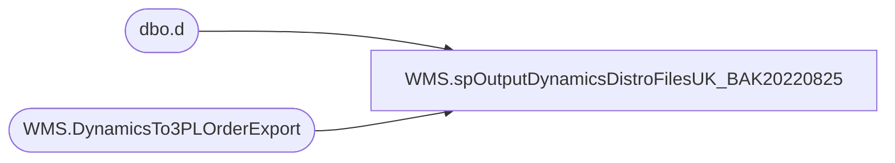

# WMS.spOutputDynamicsDistroFilesUK_BAK20220825

**Database:** IntegrationStaging  

## Architecture Diagram



## Table Dependencies

| Referenced Table |
|---|
| dbo.d |
| WMS.DynamicsTo3PLOrderExport |

## Stored Procedure Code

```sql
CREATE proc [WMS].[spOutputDynamicsDistroFilesUK_BAK20220825]

as

set nocount on

IF (Object_ID('tempdb..##UKDistros') IS NOT NULL) DROP TABLE ##UKDistros
select *
into ##UKDistros
from WMS.DynamicsTo3PLOrderExport 
where ExportDate is null 
and SourceID='2970'

IF (select count(*) from ##UKDistros) > 0

begin

	declare @counter int,
			@shipment varchar(20),
			@location varchar(4),
			@rectype int,
			@query varchar(1000),
			@date varchar(52),
			@file_name varchar(100),
			@file_location varchar(100),
			@server varchar(20),
			@bcp varchar(1000)


	select @counter = count(distinct document_number) from ##UKDistros

	while @counter > 0

		begin
			select @shipment = max(document_number) from ##UKDistros
			select @location = max(destid) from ##UKDistros where document_number = @shipment
			select @rectype = max(rec_type) from ##UKDistros where document_number = @shipment

			set @query = 'set nocount on select document_number, destid, rec_type, message, style_code, quantity, convert(varchar, getdate(), 101), distribution_number, ref_field_1 from ##UKDistros where document_number = ' + @shipment + 'order by style_code'
			select @date = replace(replace(replace(replace(convert(varchar, getdate(), 121), ' ', ''), '-', ''), ':', ''), '.', '')
			set @file_location = '\\kermode\FileRepository\MERCHANDISING\UK_Distro\OUTBOUND\'
			set @file_name = 'DISTRIBUTION_UK_' + cast(@rectype as varchar) + '-' + @location + '.' + @date + '.csv'
			set @server = 'stl-ssis-p-01'
			set @bcp = 'bcp "' + @query + '" queryout "' + @file_location + @file_name + '"  -T -t, -c -S' + @server 

			exec master..xp_cmdshell @bcp

			--Set ExportDate
			update d
			set d.ExportDate = getdate()
			from WMS.DynamicsTo3PLOrderExport d
			join ##UKDistros e 
				on d.RecID=e.RecID
			where e.document_number=@shipment

			delete from ##UKDistros where document_number = @shipment
			select @counter = count(distinct document_number) from ##UKDistros

			if @counter < 1

			break
		else
			continue

		end

end
```

