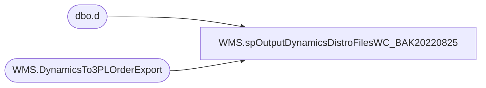

# WMS.spOutputDynamicsDistroFilesWC_BAK20220825

**Database:** IntegrationStaging  

## Architecture Diagram



## Table Dependencies

| Referenced Table |
|---|
| dbo.d |
| WMS.DynamicsTo3PLOrderExport |

## Stored Procedure Code

```sql
create proc [WMS].[spOutputDynamicsDistroFilesWC_BAK20220825]

as 

set nocount on 

IF (Object_ID('tempdb..##WCDistros') IS NOT NULL) DROP TABLE ##WCDistros
select *
into ##WCDistros
from WMS.DynamicsTo3PLOrderExport 
where ExportDate is null 
and SourceID='0960'


if (select count(*) from ##WCDistros) > 0 

begin

	--Generate WC File
	declare 
		@query varchar(1000),
		@date varchar(52),
		@file_name varchar(100),
		@file_location varchar(100),
		@server varchar(20),
		@bcp varchar(1000)

	select
		@query = 'set nocount on select document_number,destid,rec_type,message,style_code,quantity,convert(varchar, getdate(), 101) as ExportDate,distribution_number,ref_field_1,short_desc,vendor_style,color_code from ##WCDistros order by  document_number, style_code',
		@date = replace(replace(replace(replace(convert(varchar, getdate(), 121), ' ', ''), '-', ''), ':', ''), '.', ''),
		@file_location = '\\kermode\FileRepository\MERCHANDISING\WC_Distro\OUTBOUND\',
		@file_name = 'DISTRIBUTION_WC.' + @date + '.txt',
		@server = 'stl-ssis-p-01',
		@bcp = 'bcp "' + @query + '" queryout "' + @file_location + @file_name + '"  -T -c -S' + @server 
	
	exec master..xp_cmdshell @bcp

	--------------------------------
--Set ExportDate
	update d
	set d.ExportDate = getdate()
	from WMS.DynamicsTo3PLOrderExport d
	join ##WCDistros e 
		on d.RecID=e.RecID

end


WMS,spOutputPhysicalInventoryFile,CREATE proc [WMS].[spOutputPhysicalInventoryFile]

@StoreList nvarchar(max),
@FileStage nvarchar(max),
@FName nvarchar(max)

as

--IF (Object_ID('IntegrationStaging..tmpDMTInv') IS NOT NULL) DROP TABLE tmpDMTInv
--select StyleCode,LocationCode,Qty 
--into tmpDMTInv
--from IntegrationStaging.WMS.vwNonWhsePhysicalInventory 


declare @SQL nvarchar(max)
select @SQL ='select StyleCode,LocationCode,Qty from IntegrationStaging.WMS.vwNonWhsePhysicalInventory where cast(LocationCode as int) in ' + @StoreList 

exec spOutputXMLFile
@Query=@SQL ,
@FileLocation=@FileStage, 
@FileName=@FName 

--exec wms.spOutputPhysicalInventoryFile
--@StoreList='(1)',
--@FileStage='\\sharebear1\Shared\PhysicalInventory\',
--@Fname ='test.txt'
```

