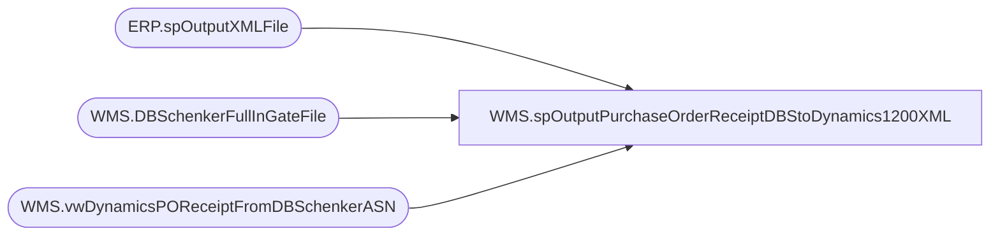

# WMS.spOutputPurchaseOrderReceiptDBStoDynamics1200XML

**Database:** IntegrationStaging  

## Architecture Diagram



## Table Dependencies

| Referenced Table |
|---|
| ERP.spOutputXMLFile |
| WMS.DBSchenkerFullInGateFile |
| WMS.vwDynamicsPOReceiptFromDBSchenkerASN |

## Stored Procedure Code

```sql
CREATE proc [WMS].[spOutputPurchaseOrderReceiptDBStoDynamics1200XML]
@DropFile varchar(500)

as

---======================================================================================================================
--	Dan Tweedie	-	2019-09-09	Created proc
---======================================================================================================================

set nocount on

if (object_id('tempdb..#po') is not null) drop table #po
select *
into #po
from WMS.vwDynamicsPOReceiptFromDBSchenkerASN
--where Dynamics1200PO  in ('PO120002823','PO120002827')

--update WMS.DBSchenkerFullInGateFile 
----where POReceiptExportDate is NULL
--set POReceiptExportDate = NULL


if (select count(*) from #po) > 0

begin

	declare @concat varchar(100)

	select @concat = concat(
										'PurchOrderReceipt_',
										datepart(yyyy, getdate()),
										datepart(mm, getdate()),
										datepart(dd, getdate()),
										datepart(hh, getdate()),
										datepart(mi, getdate()),
										datepart(ss, getdate()),
										datepart(ms, getdate()),
										'.xml'
									)

		exec ERP.spOutputXMLFile
			@Query = 'select XMLData from IntegrationStaging.WMS.vwPurchaseOrderReceiptDBStoDynamics1200XML', 
			@FileLocation = @DropFile,  --'\\stl-ssis-p-01\IntegrationStaging\ERP\Outbound\D365\POReceipts',
			@FileName = @concat

		update dbs
		set 
			dbs.POReceiptExportDate = getdate(),
			dbs.Dynamics1200PO=po.Dynamics1200PO
		from WMS.DBSchenkerFullInGateFile dbs
		join #po po 
			on dbs.PurchaseOrder=po.PurchaseOrder
			and dbs.ManufacturerCode=po.FactoryCode
			and dbs.ProductCode=po.ProductCode
			and cast(dbs.ShippedQty as int)=po.ShippedQty
			and convert(varchar, cast(fullIngateAtLoadPort as date),101)=po.InGateDate
			and dbs.POReceiptExportDate is NULL
end
```

