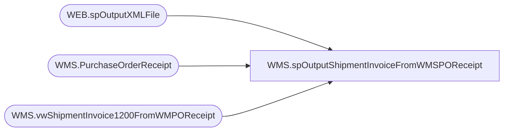

# WMS.spOutputShipmentInvoiceFromWMSPOReceipt

**Database:** IntegrationStaging  

## Architecture Diagram



## Table Dependencies

| Referenced Table |
|---|
| WEB.spOutputXMLFile |
| WMS.PurchaseOrderReceipt |
| WMS.vwShipmentInvoice1200FromWMPOReceipt |

## Stored Procedure Code

```sql
CREATE proc [WMS].[spOutputShipmentInvoiceFromWMSPOReceipt]
@DropFolder varchar(100)


as

set nocount on

-- =====================================================================================================
-- Name:  wms.spOutputShipmentInvoiceFromWMSPOReceipt
--
-- Description:	Outputs Shipment Invoice XML to push to Dynamics365 ERP
--				 
-- Revision History
--		Name:			Date:			Comments:
--		Dan Tweedie		2017-12-14		Created proc
-- =====================================================================================================


declare 
	@dateString varchar(20),
	@file varchar(100),
	@sql varchar(100),
	@RowsToSend int
	--@DropFolder varchar(100)
	--select @DropFolder = '\\stl-dynsnc-t-01\BABWIntegrations\WMS_SO\test1\1200\Inbound\'

Select @RowsToSend = count(*) from WMS.vwShipmentInvoice1200FromWMPOReceipt with (nolock)
		

if @RowsToSend > 0
begin
	select 
		@dateString = replace(replace(replace(replace(convert(varchar, getdate(), 121), '-', ''), ':', ''), '.', ''),' ', ''),
		@file = 'S' + @datestring + '.xml',
		@sql = 'select * from IntegrationStaging.WMS.vwShipmentInvoice1200FromWMPOReceiptXML'

	exec WEB.spOutputXMLFile 
	@Query = @sql, 
	@FileLocation = @DropFolder, 
	@FileName = @file

	update WMS.PurchaseOrderReceipt
	set PostedToDynamics1200ShipmentDate = getdate()
	where PostedToDynamics1200ShipmentDate is null
end
```

