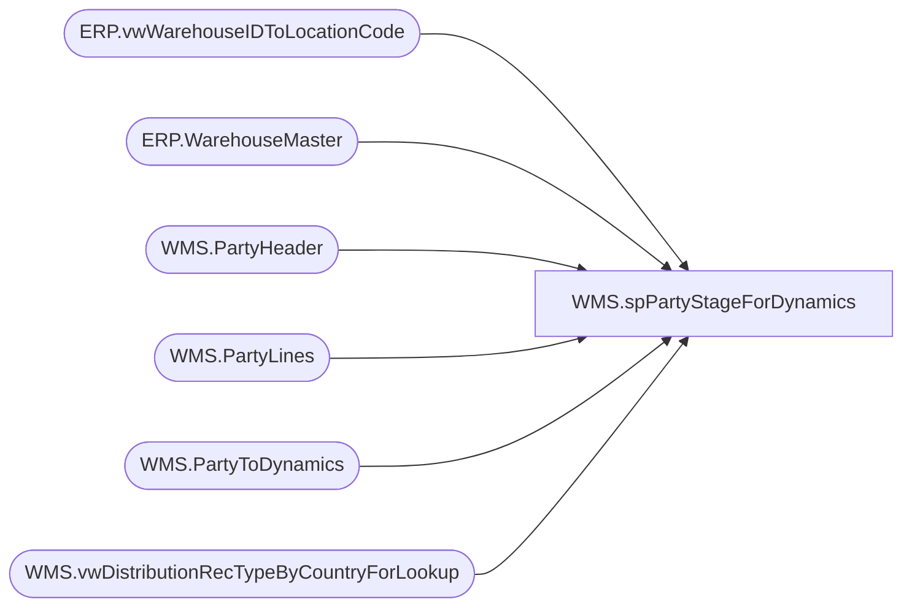

# WMS.spPartyStageForDynamics

**Database:** IntegrationStaging  

## Architecture Diagram



## Table Dependencies

| Referenced Table |
|---|
| ERP.vwWarehouseIDToLocationCode |
| ERP.WarehouseMaster |
| WMS.PartyHeader |
| WMS.PartyLines |
| WMS.PartyToDynamics |
| WMS.vwDistributionRecTypeByCountryForLookup |

## Stored Procedure Code

```sql
CREATE proc [WMS].[spPartyStageForDynamics] 

as


-- =====================================================================================================
-- Name: spPartyStageForDynamics
--
-- Description:	Populates WMS.PartyToDynamics
--
--
-- Revision History
--		Name:			Date:			Comments:
--		Lizzy Timm		2024-06-11		Created proc.	
-- =====================================================================================================

set nocount on;

-- Identify parties that do not meet requirements
IF (Object_ID('tempdb..#PartyReq') IS NOT null) DROP TABLE #PartyReq
SELECT DISTINCT h.PartyId
  INTO #PartyReq
  FROM WMS.PartyHeader h
	LEFT JOIN WMS.PartyLines l ON h.PartyId = l.PartyId
	LEFT JOIN ERP.vwWarehouseIDToLocationCode tw with (nolock) ON RIGHT('0000' + cast(h.StoreNumber as varchar), 4) = tw.LocationCode AND tw.Entity = '1100'	
  WHERE 
  (
		h.StoreNumber IS NULL
		OR l.ItemNumber IS NULL
		OR l.Quantity IS NULL
		OR tw.WarehouseID IS NULL
	)
	AND (h.SendData = 1 OR l.SendData = 1);

IF (Object_ID('tempdb..#PartyReq') IS NOT null)
BEGIN
	DELETE FROM #PartyReq
	WHERE PartyId IS NULL
END;


WITH CountryCode AS
	(
		SELECT DISTINCT WarehouseID, 
		 CASE
			WHEN PrimaryAddressCountryRegionId = 'USA' THEN 'US'
			WHEN PrimaryAddressCountryRegionId = 'CAN' THEN 'CA'
			ELSE PrimaryAddressCountryRegionId
		  END AS CountryCode
		FROM ERP.WarehouseMaster with (nolock) WHERE Entity = '1100' AND ISNUMERIC(WarehouseId) = 1 AND PrimaryAddressCountryRegionId <> ''
	),
  RecType AS
	(
		SELECT DISTINCT PartyID,
			CASE WHEN DATEDIFF(day, getdate(),PartyDate) > 7 THEN '54' -- 54 = FEDEX-GROU
			ELSE '53' -- 53 = FEDEX-2DAY
		   END AS rec_type
		  FROM WMS.PartyHeader
	),
  TransitDays AS
	(
		SELECT DISTINCT PartyID,
			CONVERT(varchar(10), getdate(),23) AS ShipDate,
			7 AS TransitDays		
		  FROM WMS.PartyHeader
	)

INSERT INTO WMS.PartyToDynamics
SELECT 
	h.PartyId -- AptosShipmentNumber
	,'1013' AS FromWarehouse
	, tw.WarehouseID AS ToWarehouse
	, l.LineNumber -- AptosDistroLineNumber
	, l.ItemNumber
	, l.Quantity
	, 'ea' AS UnitOfMeasure
	, '1100' AS Company
	,  NULL AS CountryCode
	, 'BestServe' AS DeliveryTerms
	, rt.ModeOfDelivery
	, 'TransferOrder' AS OrderType
	, td.ShipDate
	, CASE
		WHEN (datepart(dw, td.ShipDate) = 2 and td.TransitDays > 4)
			or (datepart(dw, td.ShipDate) = 3 and td.TransitDays > 3)
			or (datepart(dw, td.ShipDate) = 4 and td.TransitDays > 2)
			or (datepart(dw, td.ShipDate) = 5 and td.TransitDays > 1)
			or (datepart(dw, td.ShipDate) = 6)
		  THEN cast(dateadd(day, (td.TransitDays + 2), td.ShipDate) as date)
		ELSE cast(dateadd(day, (td.TransitDays), td.ShipDate) as date)
		END AS ReceiptDate		
	, CONVERT(varchar, h.PartyDate, 23) AS PartyDate
	, 'AVAIL' as InventoryStatus
	, NULL AS AptosDistroNumber
	, 'US' AS SourceCountry
	, cc.CountryCode AS DestinationCountry
  FROM WMS.PartyHeader h
	left JOIN WMS.PartyLines l ON h.PartyId = l.PartyId
	left JOIN ERP.vwWarehouseIDToLocationCode tw with (nolock) ON RIGHT('0000' + cast(h.StoreNumber as varchar), 4) = tw.LocationCode AND tw.Entity = '1100'	
	left JOIN CountryCode cc ON  tw.WarehouseID = cc.WarehouseID
	left JOIN RecType rc ON h.PartyId = rc.PartyId
	left JOIN WMS.vwDistributionRecTypeByCountryForLookup rt  with (nolock) ON rc.Rec_Type = rt.RecType AND cc.CountryCode = rt.Country
	left JOIN TransitDays td ON h.PartyId = td.PartyId
WHERE h.PartyId NOT IN (SELECT DISTINCT PartyId FROM #PartyReq)
	AND CAST(h.PartyDate AS date) > CAST(DATEADD(week,-1,getdate()) AS date)
	AND (h.SendData = 1 OR l.SendData = 1)
;


UPDATE WMS.PartyHeader
  SET SendData = 0
	, APISuccess = 0
  WHERE PartyId IN (SELECT DISTINCT PartyId FROM #PartyReq);

UPDATE WMS.PartyLines
  SET SendData = 0
  WHERE PartyId IN (SELECT DISTINCT PartyId FROM #PartyReq);
```

