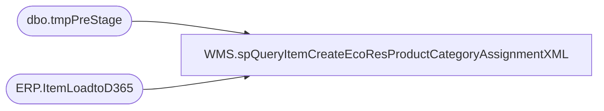

# WMS.spQueryItemCreateEcoResProductCategoryAssignmentXML

**Database:** IntegrationStaging  

## Architecture Diagram



## Table Dependencies

| Referenced Table |
|---|
| dbo.tmpPreStage |
| ERP.ItemLoadtoD365 |

## Stored Procedure Code

```sql
CREATE proc [WMS].[spQueryItemCreateEcoResProductCategoryAssignmentXML]
@Entity varchar(4),
@ItemType varchar(10)


as

---- To use during testing:
--DECLARE @ItemType varchar(10), @Entity varchar(4)
--SET @ItemType = 'Merch'
--SET @Entity = '1100'

set nocount on;


with
XMLStage (xml) as
	(	
		select 	
			ps1.ProductNumber as '@PRODUCTNUMBER',
			ps1.PRODUCTCATEGORYNAME as '@PRODUCTCATEGORYNAME',	
			ps1.PRODUCTCATEGORYHIERARCHYNAME as '@PRODUCTCATEGORYHIERARCHYNAME',
			cast('0.000000' as numeric(7,6)) as '@DISPLAYORDER'
		from tmpPreStage ps1
		where 1=1
		and exists (select e.ItemNumber 
						from ERP.ItemLoadtoD365 e 
						where e.ItemNumber=ps1.ITEMNUMBER 
						and e.ServiceItem = case when @ItemType='Serv' then 1 else 0 end)
		for xml path('EcoResProductCategoryAssignmentEntity'), root('Document'), TYPE
	)
select cast(XML as xml) as XMLData
from XMLStage
;
```

