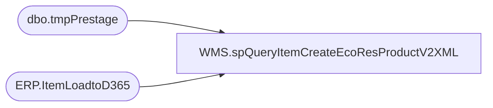

# WMS.spQueryItemCreateEcoResProductV2XML

**Database:** IntegrationStaging  

## Architecture Diagram



## Table Dependencies

| Referenced Table |
|---|
| dbo.tmpPrestage |
| ERP.ItemLoadtoD365 |

## Stored Procedure Code

```sql
CREATE proc [WMS].[spQueryItemCreateEcoResProductV2XML]
@Entity varchar(4),
@ItemType varchar(10)


as

------ To use during testing:
--DECLARE @ItemType varchar(10), @Entity varchar(4)
--SET @ItemType = 'Merch'
--SET @Entity = '1100'

set nocount on;

with
XMLStage (xml) as
	(
		select 
			ps.PRODUCTNUMBER as '@PRODUCTNUMBER',		
			ps.HARMONIZEDSYSTEMCODE as '@HARMONIZEDSYSTEMCODE',
			ps.ISPRODUCTKIT as '@ISPRODUCTKIT',
			ps.NMFCCODE as '@NMFCCODE',
			ps.PRODUCTDESCRIPTION as '@PRODUCTDESCRIPTION',
			ps.PRODUCTNAME as '@PRODUCTNAME',
			ps.PRODUCTSEARCHNAME as '@PRODUCTSEARCHNAME',
			'1' as '@PRODUCTSUBTYPE',
			ps.PRODUCTTYPE as '@PRODUCTTYPE',
			ps.COLORDESCRIPTION as '@COLORDESCRIPTION'					
		from tmpPrestage ps
		where 1=1
		and exists (select e.ItemNumber 
						from ERP.ItemLoadtoD365 e 
						where e.ItemNumber=ps.ITEMNUMBER 
						and e.ServiceItem = case when @ItemType='Serv' then 1 else 0 end)
		for xml path ('EcoResProductV2Entity'), root('Document'), TYPE
	)
select cast(XML as xml) as XMLData
from XMLStage
;
```

