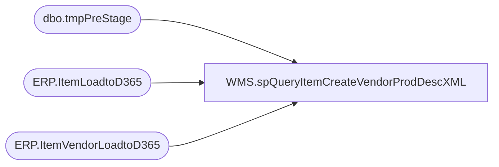

# WMS.spQueryItemCreateVendorProdDescXML

**Database:** IntegrationStaging  

## Architecture Diagram



## Table Dependencies

| Referenced Table |
|---|
| dbo.tmpPreStage |
| ERP.ItemLoadtoD365 |
| ERP.ItemVendorLoadtoD365 |

## Stored Procedure Code

```sql
CREATE proc [WMS].[spQueryItemCreateVendorProdDescXML]
@Entity varchar(4)
--,@ItemType varchar(10)

as

---- To use during testing:
--DECLARE @ItemType varchar(10), @Entity varchar(4)
--SET @ItemType = 'Merch'
--SET @Entity = '1100'


set nocount on

-- 2023-11-13	LizzyT	Jira BIB-647 with BAB Design Document - Retail Item Create - Merch to D365 V2 PO Writing
		SELECT DISTINCT i.ITEMNUMBER,
			v.DataAreaID,
			'SALESTAX' as SALESSALESTAXITEMGROUPCODE,
			v.VendorAccountNumber as APPROVEDVENDORACCOUNTNUMBER,
			convert(varchar, v.EFFECTIVEDATE, 101) as EFFECTIVEDATE,
			convert(varchar, '12/31/2154', 101) as EXPIRATIONDATE,
			v.VendorAccountNumber,
			v.VendorProductNumber,
			i.VendorProductDescription,
			v.VendorExportedToDynamics
		INTO #PO
		FROM ERP.ItemLoadtoD365	i
			JOIN ERP.ItemVendorLoadtoD365 v ON i.ITEMNUMBER = v.ITEMNUMBER AND i.Entity = v.DataAreaID
		where 1=1
		and i.SendData = 1
		and i.Entity = @Entity 
		and v.deletedFromSource IS NULL --LT
;
with
XMLStage (xml) as
	(
		SELECT
			po2.ITEMNUMBER as '@ITEMNUMBER',
			po2.VendorAccountNumber as '@VendorAccountNumber',
			po2.VendorProductNumber as '@VendorProductNumber',
			po2.VendorProductDescription as '@VendorProductDescription'
		FROM #PO po2
		where 1=1
		and exists (select e.ItemNumber 
						--from ERP.ItemLoadtoD365 e 
						from tmpPreStage e
						where e.ItemNumber=po2.ItemNumber
							AND e.Entity = po2.DataAreaID
						)
		for xml path ('PurchVendorProductDescriptionV2Entity'), root('Document'), TYPE
	)
select cast(XML as xml) as XMLData
from XMLStage
;
```

