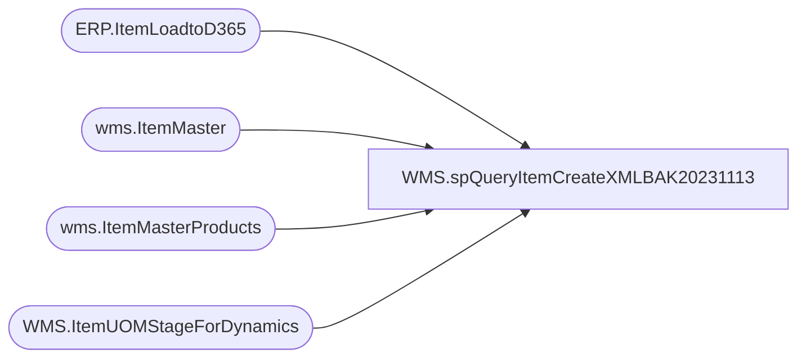

# WMS.spQueryItemCreateXMLBAK20231113

**Database:** IntegrationStaging  

## Architecture Diagram



## Table Dependencies

| Referenced Table |
|---|
| ERP.ItemLoadtoD365 |
| wms.ItemMaster |
| wms.ItemMasterProducts |
| WMS.ItemUOMStageForDynamics |

## Stored Procedure Code

```sql
CREATE proc [WMS].[spQueryItemCreateXMLBAK20231113]
@Entity varchar(4),
@ItemType varchar(10)


as

set nocount on

		select
			--=====VALUES WILL ALWAYS COME FROM MERCH=========================================================
			e.entity,
			e.ITEMNUMBER, 
			e.PRODUCTNUMBER, 
			e.PRODUCTDESCRIPTION,	
			e.PRODUCTNAME,	
			isnull(e.SEARCHNAME,'') as SEARCHNAME,
			isnull(e.HARMONIZEDSYSTEMCODE,'') as HARMONIZEDSYSTEMCODE,
			case when e.Entity=3001 then NULL else isnull(e.ORIGINCOUNTRYREGIONID,'') end as ORIGINCOUNTRYREGIONID,
			e.HierarchyGroup as PRODUCTCATEGORYNAME,
			--================================================================================================
			--=====VALUES WILL ALWAYS BE HARD-CODED===========================================================
			--'Merchandise' as PRODUCTCATEGORYNAME, 
			--'Procurement Categories' as PRODUCTCATEGORYHIERARCHYNAME, 
			'Retail Product Hierarchy' as PRODUCTCATEGORYHIERARCHYNAME,
			--case when e.ITEMMODELGROUPID='SERV' then 'Service' else 'Merch' end as 'PROPERTYID',
			case when e.ServiceItem=1 then '' else 'Merch' end as PROPERTYID, 
			'0' as OVERDELIVERYPCT, 
			e.ItemGroup as ITEMGROUPID,
			--case when e.ServiceItem=1 then 'SERV' else 'MERCH' end as ITEMGROUPID, 
			--case when e.ITEMMODELGROUPID='SERV' then 2 else 1 end as 'PRODUCTTYPE',
			case when e.ServiceItem=1 then '2' else '1' end as PRODUCTTYPE,	
			'1' as PRODUCTSUBTYPE,
			case when e.ServiceItem=1 then '0' else '100' end as PURCHASEUNDERDELIVERYPERCENTAGE ,
			case when e.ServiceItem=1 then '0' else '100' end as SALESUNDERDELIVERYPERCENTAGE, 
			case when e.ServiceItem=1 then '0' else '100' end as UNDERDELIVERYPCT,
			case when e.ServiceItem=1 then 'SWL' else 'BABWMS' end as STORAGEDIMENSIONGROUPNAME
			--================================================================================================
		into #UpdatesAndHardCoded
		FROM ERP.ItemLoadtoD365 e
		where 1=1
		and e.SendData = 1
		and e.Entity = @Entity


		select 
			--=====WILL SEND DATA PRODUCT DATA DOWNLOADED FROM DYNAMICS===================
			im.entity,
			im.ProductNumber,
			im.ItemNumber,
			im.PRODUCTSEARCHNAME,		
			case 
				when im.TRACKINGDIMENSIONGROUPNAME=''
					then NULL
				else im.TRACKINGDIMENSIONGROUPNAME
			end as TRACKINGDIMENSIONGROUPNAME,	
			case
				when im.STORAGEDIMENSIONGROUPNAME=''
					then NULL
				else im.STORAGEDIMENSIONGROUPNAME
			end as STORAGEDIMENSIONGROUPNAME,
			im.UNITCOSTQUANTITY, 	
			im.UNITCOST, 	
			im.SALESUNITSYMBOL,	
			im.SALESUNDERDELIVERYPERCENTAGE,	
			im.SALESPRICEQUANTITY,	
			im.SALESPRICE,
			im.SALESOVERDELIVERYPERCENTAGE,	
			im.PURCHASEUNITSYMBOL, 
			im.PURCHASEUNDERDELIVERYPERCENTAGE,	
			im.PURCHASEPRICEQUANTITY, 
			im.PURCHASEPRICE,	
			im.PURCHASEOVERDELIVERYPERCENTAGE,	
			case 
				when im.ITEMMODELGROUPID =''
					then NULL
				else im.ITEMMODELGROUPID
			end as ITEMMODELGROUPID,	
			im.INVENTORYUNITSYMBOL,
			case
				when im.ARETRANSPORTATIONMANAGEMENTPROCESSESENABLED='yes'
					then 1
				else 0
			end as ARETRANSPORTATIONMANAGEMENTPROCESSESENABLED,
			p.NMFCCODE,
			case 
				when p.ISPRODUCTKIT='yes' 
					then 1
				else 0
			end as ISPRODUCTKIT,
			case 
				when im.UNITCONVERSIONSEQUENCEGROUPID =''
					then NULL
				else im.UNITCONVERSIONSEQUENCEGROUPID
			end as UNITCONVERSIONSEQUENCEGROUPID,
			case 
				when im.WAREHOUSEMOBILEDEVICEDESCRIPTIONLINE2 = '' 
					then NULL 
				else im.WAREHOUSEMOBILEDEVICEDESCRIPTIONLINE2
			end as WAREHOUSEMOBILEDEVICEDESCRIPTIONLINE2,
			case 
				when im.PRODUCTGROUPID=''
					then NULL
				else im.PRODUCTGROUPID
			end as PRODUCTGROUPID, 
			case 
				when im.INVENTORYRESERVATIONHIERARCHYNAME=''
					then NULL
				else im.INVENTORYRESERVATIONHIERARCHYNAME
			end as INVENTORYRESERVATIONHIERARCHYNAME
			--============================================================================
		into #DynamicsData
		from wms.ItemMaster im 
		join wms.ItemMasterProducts p on im.ItemNumber=p.ProductNumber
		where 1=1
		and isnumeric(im.ItemNumber)=1
		and exists (select u.ProductNumber from #UpdatesAndHardCoded u where u.ProductNumber=p.ProductNumber and u.entity=im.entity)

		select  
			i.entity,
			i.ProductNumber,
			i.ProductName as 'PRODUCTNAME',
			i.ProductDescription as 'PRODUCTDESCRIPTION',
			isnull(i.SalesPrice,0) as 'SALESPRICE',
			isnull(i.PurchasePrice,0) as 'PURCHASEPRICE',
			i.ProductSearchName as 'PRODUCTSEARCHNAME',
			'1' as 'PRODUCTTYPE',
			--case when i.ITEMMODELGROUPID='SERV' then 2 else 1 end as 'PRODUCTTYPE',
			'1' as 'PRODUCTSUBTYPE',
			i.HierarchyGroup as 'PRODUCTCATEGORYNAME',
			'Retail Product Hierarchy' as 'PRODUCTCATEGORYHIERARCHYNAME',
			'FAK70' as 'NMFCCODE',
			'0' as 'ISPRODUCTKIT',
			'NEW' as 'WAREHOUSEMOBILEDEVICEDESCRIPTIONLINE2',
			'1' as 'UNITCOSTQUANTITY',
			'0' as 'UNITCOST',
			--'EAIPCS' as 'UNITCONVERSIONSEQUENCEGROUPID',
			i.UNITCONVERSIONSEQUENCEGROUPID as UNITCONVERSIONSEQUENCEGROUPID,
			case when i.ServiceItem=1 then '0' else '100' end as  'UNDERDELIVERYPCT',
			'NONE' as 'TRACKINGDIMENSIONGROUPNAME',
			 --case when i.ITEMMODELGROUPID='SERV' then 'SERVICE' else 'BABWMS' end as 'STORAGEDIMENSIONGROUPNAME',
			 'BABWMS' as 'STORAGEDIMENSIONGROUPNAME',
			'EA' as 'SALESUNITSYMBOL',
			case when i.ServiceItem=1 then '0' else '100' end as 'SALESUNDERDELIVERYPERCENTAGE',
			'1' as 'SALESPRICEQUANTITY',
			'0' as 'SALESOVERDELIVERYPERCENTAGE',
			'EA' as 'PURCHASEUNITSYMBOL',
			case when i.ServiceItem=1 then '0' else '100' end as 'PURCHASEUNDERDELIVERYPERCENTAGE',
			'1' as 'PURCHASEPRICEQUANTITY',
			'0' as 'PURCHASEOVERDELIVERYPERCENTAGE',
			 --case when i.ITEMMODELGROUPID='SERV' then 'Service' else 'Merch' end as 'PROPERTYID',
			 'Merch' as 'PROPERTYID',
			'Merch' as 'PRODUCTGROUPID',
			'0' as 'OVERDELIVERYPCT',
			i.ITEMMODELGROUPID as 'ITEMMODELGROUPID',
			i.ITEMGROUP as 'ITEMGROUPID',
			'EA' as 'INVENTORYUNITSYMBOL',
			 case when i.ITEMMODELGROUPID='SERV' then '' else 'BABW' end as 'INVENTORYRESERVATIONHIERARCHYNAME', 
			'1' as 'ARETRANSPORTATIONMANAGEMENTPROCESSESENABLED',
			i.ItemNumber as 'ITEMNUMBER'
		into #OriginalNewAndHardCoded
		FROM ERP.ItemLoadtoD365 i
		join #UpdatesAndHardCoded u 
			on i.entity=u.entity
			and i.ProductNumber=u.ProductNumber
		group by 
			i.entity, 
			i.ProductNumber,
			i.ItemNumber,
			i.ProductName,
			i.ProductDescription,
			isnull(i.SalesPrice,0),
			isnull(i.PurchasePrice,0),
			i.ProductSearchName,
			--case when i.ITEMMODELGROUPID='SERV' then 2 else 1 end ,
			i.HierarchyGroup,
			i.ITEMMODELGROUPID,
			i.ITEMGROUP,
			i.UNITCONVERSIONSEQUENCEGROUPID,
			i.serviceItem 


		select  
			--UPDATES AND HARD-CODES
			u.ProductNumber as PRODUCT_NUMBER,
			u.ITEMNUMBER,	
			u.PRODUCTNUMBER,	
			u.PRODUCTDESCRIPTION,	
			u.PRODUCTNAME,	
			u.SEARCHNAME,	
			u.HARMONIZEDSYSTEMCODE,	
			u.ORIGINCOUNTRYREGIONID,	
			u.PRODUCTCATEGORYNAME,	
			u.PRODUCTCATEGORYHIERARCHYNAME,	
			u.UNDERDELIVERYPCT,	
			u.PROPERTYID,	
			u.OVERDELIVERYPCT,	
			u.ITEMGROUPID,
			u.PRODUCTTYPE,	
			u.PRODUCTSUBTYPE,	
			--IF NO DYNAMICS DATA, THEN ORIGINAL HARD-CODED
			cast(isnull(dd.PRODUCTSEARCHNAME,o.PRODUCTSEARCHNAME) as nvarchar(100)) as PRODUCTSEARCHNAME,
			cast(isnull(dd.TRACKINGDIMENSIONGROUPNAME,o.TRACKINGDIMENSIONGROUPNAME) as varchar(4)) as TRACKINGDIMENSIONGROUPNAME,	
			--cast(isnull(dd.STORAGEDIMENSIONGROUPNAME,o.STORAGEDIMENSIONGROUPNAME) as varchar(6)) as STORAGEDIMENSIONGROUPNAME,	
			u.STORAGEDIMENSIONGROUPNAME,
			isnull(dd.UNITCOSTQUANTITY,o.UNITCOSTQUANTITY) as UNITCOSTQUANTITY,	
			--isnull(dd.UNITCOST,o.UNITCOST) as UNITCOST,	
			isnull(dd.PURCHASEPRICE,o.PURCHASEPRICE) as UNITCOST,
			cast(isnull(dd.SALESUNITSYMBOL,o.SALESUNITSYMBOL) as varchar(2)) as SALESUNITSYMBOL,	
			--cast(isnull(dd.SALESUNDERDELIVERYPERCENTAGE,o.SALESUNDERDELIVERYPERCENTAGE) as int) as SALESUNDERDELIVERYPERCENTAGE,
			cast(u.SALESUNDERDELIVERYPERCENTAGE as int) as SALESUNDERDELIVERYPERCENTAGE,
			isnull(dd.SALESPRICEQUANTITY,o.SALESPRICEQUANTITY) as SALESPRICEQUANTITY,	
			isnull(dd.SALESPRICE,o.SALESPRICE) as SALESPRICE,	
			cast(isnull(dd.SALESOVERDELIVERYPERCENTAGE,o.SALESOVERDELIVERYPERCENTAGE) as int) as SALESOVERDELIVERYPERCENTAGE,	
			cast(isnull(dd.PURCHASEUNITSYMBOL,o.PURCHASEUNITSYMBOL) as varchar(2)) as PURCHASEUNITSYMBOL,	
			--cast(isnull(dd.PURCHASEUNDERDELIVERYPERCENTAGE,o.PURCHASEUNDERDELIVERYPERCENTAGE) as int) as PURCHASEUNDERDELIVERYPERCENTAGE,	
			cast(u.PURCHASEUNDERDELIVERYPERCENTAGE as int) as PURCHASEUNDERDELIVERYPERCENTAGE,
			isnull(dd.PURCHASEPRICEQUANTITY,o.PURCHASEPRICEQUANTITY) as PURCHASEPRICEQUANTITY,	
			isnull(dd.PURCHASEPRICE,o.PURCHASEPRICE) as PURCHASEPRICE,	
			cast(isnull(dd.PURCHASEOVERDELIVERYPERCENTAGE,o.PURCHASEOVERDELIVERYPERCENTAGE) as int) as PURCHASEOVERDELIVERYPERCENTAGE,	
			cast(isnull(dd.ITEMMODELGROUPID,o.ITEMMODELGROUPID) as varchar(7)) as ITEMMODELGROUPID,	
			cast(isnull(dd.INVENTORYUNITSYMBOL,o.INVENTORYUNITSYMBOL) as varchar(2)) as INVENTORYUNITSYMBOL,	
			isnull(dd.ARETRANSPORTATIONMANAGEMENTPROCESSESENABLED,o.ARETRANSPORTATIONMANAGEMENTPROCESSESENABLED) as ARETRANSPORTATIONMANAGEMENTPROCESSESENABLED,	
			cast(isnull(dd.NMFCCODE,o.NMFCCODE) as varchar(5)) as NMFCCODE,	
			isnull(dd.ISPRODUCTKIT,o.ISPRODUCTKIT) as ISPRODUCTKIT,
			case 
				when u.ItemGroupID='SERV'
					then ''
				else cast(isnull(dd.UNITCONVERSIONSEQUENCEGROUPID,o.UNITCONVERSIONSEQUENCEGROUPID) as varchar(10)) 
			end as UNITCONVERSIONSEQUENCEGROUPID,
			case
				when u.ItemGroupID='SERV'
					then ''
				else 'NEW' -- cast(isnull(dd.WAREHOUSEMOBILEDEVICEDESCRIPTIONLINE2,o.WAREHOUSEMOBILEDEVICEDESCRIPTIONLINE2) as varchar(10)) 
			end as WAREHOUSEMOBILEDEVICEDESCRIPTIONLINE2,
			cast(isnull(dd.PRODUCTGROUPID,o.PRODUCTGROUPID) as varchar(10)) as PRODUCTGROUPID, 
			
			case 
				when u.ItemGroupID='SERV' 
					then NULL 
				else cast(isnull(dd.INVENTORYRESERVATIONHIERARCHYNAME,o.INVENTORYRESERVATIONHIERARCHYNAME) as varchar(10)) 
			end as INVENTORYRESERVATIONHIERARCHYNAME
		into #Prestage
		from #UpdatesAndHardCoded u
		left join #DynamicsData dd 
			on u.entity=dd.entity
			and u.ProductNumber=dd.ItemNumber
		join #OriginalNewAndHardCoded o 
			on u.entity=o.entity
			and u.ProductNumber=o.ProductNumber

;
with
XMLStage (xml) as
	(
		select 
			ps.PRODUCTNUMBER as '@PRODUCTNUMBER',		
			ps.HARMONIZEDSYSTEMCODE as '@HARMONIZEDSYSTEMCODE',
			ps.ISPRODUCTKIT as '@ISPRODUCTKIT',
			ps.NMFCCODE as '@NMFCCODE',
			ps.PRODUCTDESCRIPTION as '@PRODUCTDESCRIPTION',
			ps.PRODUCTNAME as '@PRODUCTNAME',
			ps.PRODUCTSEARCHNAME as '@PRODUCTSEARCHNAME',
			--ps.PRODUCTSUBTYPE as '@PRODUCTSUBTYPE',
			'1' as '@PRODUCTSUBTYPE',
			ps.PRODUCTTYPE as '@PRODUCTTYPE',
					(	
						select 	
							ps1.ProductNumber as '@PRODUCTNUMBER',
							ps1.PRODUCTCATEGORYNAME as '@PRODUCTCATEGORYNAME',	
							ps1.PRODUCTCATEGORYHIERARCHYNAME as '@PRODUCTCATEGORYHIERARCHYNAME',
							cast('0.000000' as numeric(7,6)) as '@DISPLAYORDER'
						from #PreStage ps1
						where ps1.ProductNumber=ps.ProductNumber
						for xml path('EcoResProductCategoryAssignmentEntity'), type
					),
			(
				select 
					ps2.ITEMNUMBER as '@ITEMNUMBER',
					--ps2.ARETRANSPORTATIONMANAGEMENTPROCESSESENABLED as '@ARETRANSPORTATIONMANAGEMENTPROCESSESENABLED',
					'1' as '@ARETRANSPORTATIONMANAGEMENTPROCESSESENABLED',
					ps2.INVENTORYRESERVATIONHIERARCHYNAME as '@INVENTORYRESERVATIONHIERARCHYNAME',
					--ps2.INVENTORYUNITSYMBOL as '@INVENTORYUNITSYMBOL',
					'EA' as '@INVENTORYUNITSYMBOL', --per design doc, hard-coded for all
					ps2.ITEMGROUPID as '@ITEMGROUPID',
					ps2.ITEMMODELGROUPID as '@ITEMMODELGROUPID',
					case when @Entity=3001 then '' else isnull(ps2.ORIGINCOUNTRYREGIONID,'') end as '@ORIGINCOUNTRYREGIONID',
					--ps2.ORIGINCOUNTRYREGIONID as '@ORIGINCOUNTRYREGIONID',
					cast('0' as numeric(38,4)) as '@OVERDELIVERYPCT',	
					ps2.PRODUCTNUMBER as '@PRODUCTNUMBER',
					ps2.PROPERTYID as '@PROPERTYID',	
					cast('0' as numeric(38,4)) as '@PURCHASEOVERDELIVERYPERCENTAGE',
					cast(ps2.PURCHASEPRICE as numeric(38,4)) as '@PURCHASEPRICE',
					--cast(ps2.PURCHASEPRICEQUANTITY as numeric(38,4)) as '@PURCHASEPRICEQUANTITY',
					'1' as '@PURCHASEPRICEQUANTITY',
					cast(ps2.PURCHASEUNDERDELIVERYPERCENTAGE as numeric(38,4)) as '@PURCHASEUNDERDELIVERYPERCENTAGE',
					--ps2.PURCHASEUNITSYMBOL as '@PURCHASEUNITSYMBOL',	
					'EA' as '@PURCHASEUNITSYMBOL',	
					cast('0' as numeric(38,4)) as '@SALESOVERDELIVERYPERCENTAGE',
					cast(ps2.SALESPRICE as numeric(38,4)) as '@SALESPRICE',
					--cast(ps2.SALESPRICEQUANTITY as numeric(38,4)) as '@SALESPRICEQUANTITY',
					'1' as '@SALESPRICEQUANTITY',
					cast(ps2.SALESUNDERDELIVERYPERCENTAGE as numeric(38,4)) as '@SALESUNDERDELIVERYPERCENTAGE',
					--ps2.SALESUNITSYMBOL as '@SALESUNITSYMBOL',
					'EA' as '@SALESUNITSYMBOL',
					ps2.SEARCHNAME as '@SEARCHNAME',
					ps2.STORAGEDIMENSIONGROUPNAME as '@STORAGEDIMENSIONGROUPNAME',
					ps2.TRACKINGDIMENSIONGROUPNAME as '@TRACKINGDIMENSIONGROUPNAME',
					cast(ps2.UNDERDELIVERYPCT as numeric(38,4)) as '@UNDERDELIVERYPCT',
					ps2.UNITCONVERSIONSEQUENCEGROUPID as '@UNITCONVERSIONSEQUENCEGROUPID',
					cast(ps2.UNITCOST as numeric(38,4)) as '@UNITCOST',
					--ps2.UNITCOST as '@UNITCOST',
					--cast(ps2.UNITCOSTQUANTITY as numeric(38,4)) as '@UNITCOSTQUANTITY',
					'1' as '@UNITCOSTQUANTITY',
					ps2.WAREHOUSEMOBILEDEVICEDESCRIPTIONLINE2 as '@WAREHOUSEMOBILEDEVICEDESCRIPTIONLINE2',
					--'NEW' as '@WAREHOUSEMOBILEDEVICEDESCRIPTIONLINE2',	
						( --UOM - ONLY INCLUDE ON THE FIRST PASS / ITEM CREATE
								select 
									cast(uom.style_code as varchar(6)) as '@PRODUCTNUMBER',
									uom.FROMUNITSYMBOL as '@FROMUNITSYMBOL',
									uom.TOUNITSYMBOL as '@TOUNITSYMBOL',
									uom.DENOMINATOR as '@DENOMINATOR',
									uom.FACTOR as '@FACTOR',
									'0.000000' as '@INNEROFFSET',
									'1' as '@NUMERATOR',
									'0.000000' as '@OUTEROFFSET',
									'0' as '@ROUNDING'
								from WMS.ItemUOMStageForDynamics uom with (nolock)
								where uom.style_code in (
															select e.ItemNumber
															from ERP.ItemLoadtoD365 e
															where 1=1
															and e.SendData = 1 --this is only set on insert or update
															and e.UpdateDate is null --this is only set on update, means this is the first time item is flowing
															and e.entity=1100
															and e.ItemNumber=ps.ProductNumber
															group by e.ItemNumber
														) --ONLY INCLUDE UOM IF THE ITEM IS NEW
								and uom.style_code=ps.ProductNumber
								--and uom.style_code='025855'
								for xml path ('EcoResProductSpecificUnitOfMeasureConversionEntity'), TYPE
						),
						(
							select NULL as '@x'
							for xml path ('WHSItemPhysicalDimensionDetailEntity'), TYPE
						)
					from #PreStage ps2 
					where ps2.ProductNumber=ps.ProductNumber
					for xml path('BABMerchItemCreateEcoResReleasedProductV2Entity'), TYPE
				)
		from #PreStage ps
		where 1=1
		and exists (select e.ItemNumber 
						from ERP.ItemLoadtoD365 e 
						where e.ItemNumber=ps.ITEMNUMBER 
						and e.ServiceItem = case when @ItemType='Serv' then 1 else 0 end)
		for xml path ('BABMerchItemCreateEcoResProductV2Entity'), root('Document'), TYPE
	)
select cast(XML as xml) as XMLData
from XMLStage
;
```

