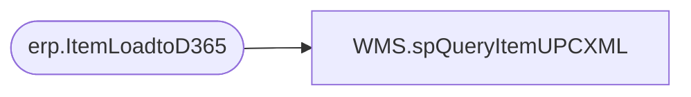

# WMS.spQueryItemUPCXML

**Database:** IntegrationStaging  

## Architecture Diagram



## Table Dependencies

| Referenced Table |
|---|
| erp.ItemLoadtoD365 |

## Stored Procedure Code

```sql
CREATE proc [WMS].[spQueryItemUPCXML]
@Entity varchar(4)

as

set nocount on

select 
	ItemNumber as '@ITEMNUMBER',
	'ea' as '@PRODUCTQUANTITYUNITSYMBOL',
	'GS1-128' as '@BARCODESETUPID',
	UPC as '@BARCODE',
	'No' as '@ISDEFAULTDISPLAYEDBARCODE',
	'No' as '@ISDEFAULTPRINTEDBARCODE',
	'Yes' as '@ISDEFAULTSCANNEDBARCODE',
	'1' as '@PRODUCTQUANTITY'
from erp.ItemLoadtoD365
where 1=1
and SendData=1
and entity=@Entity
and UpdateDate is null --NEED TO ONLY SEND UPC IF THE ITEM IS NEW --- WE KNOW AN ITEM IS NEW IF SENDATA=1 AND UPDATEDATE IS NULL
--and ItemNumber in ('031463','031462','022552','023286')
group by 
	ItemNumber, 
	UPC
for xml path('EcoResProductBarcodeV3Entity'), root('Document'), TYPE
```

