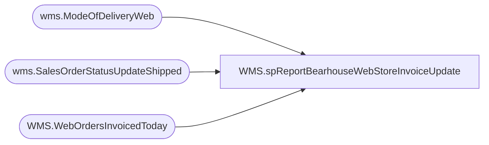

# WMS.spReportBearhouseWebStoreInvoiceUpdate

**Database:** IntegrationStaging  

## Architecture Diagram



## Table Dependencies

| Referenced Table |
|---|
| wms.ModeOfDeliveryWeb |
| wms.SalesOrderStatusUpdateShipped |
| WMS.WebOrdersInvoicedToday |

## Stored Procedure Code

```sql
CREATE proc [WMS].[spReportBearhouseWebStoreInvoiceUpdate] 


as

---------------------------------------------------------------------------------------------------------------------------------------------------
--	Tim Callahan	04/08/2020	Created Proce for SSRS Report that will reflect WebStore Invoice each day 
---------------------------------------------------------------------------------------------------------------------------------------------------
set nocount on 

truncate table [WMS].[WebOrdersInvoicedToday]

insert into [WMS].[WebOrdersInvoicedToday]
select  distinct s.DeckSalesOrderReferenceNumber,
case when m.SHIP_VIA = 'STND'
	then 'Standard'
	else m.SHIP_VIA_DESC end as ship_via_desc, 
s.ShipConfirmDateTime, -- Just for validation
convert (datetime, ShipConfirmDateTime At time Zone  'UTC' AT Time Zone  'Eastern Standard Time') as OhioShipConfirmDateTime
from wms.SalesOrderStatusUpdateShipped s (nolock) 
join wms.ModeOfDeliveryWeb m (nolock) on m.ModeOfDelivery=s.ModeOfDelivery 
										and m.SHIP_VIA not in ('W300','W350','INTERNATIONAL') -- International all fall under Standard, causing duplicates
where datediff(dd,
	convert (datetime, ShipConfirmDateTime At time Zone  'UTC' AT Time Zone  'Eastern Standard Time'),
	dateadd(hh,1,getdate())
) = 0 -- Integration Server is Central Time 
order by 3, 1, 2

		

WMS,spReportDynamicsAptosPOReceipts,CREATE proc WMS.spReportDynamicsAptosPOReceipts
@date1 date, @date2 date

as 
set nocount on

select 
	PurchaseOrderNumber DynamicsPONumber,
	AptosPONumber,
	ProductReceiptDate,
	ItemNumber,
	ProductDescription,
	sum(OrderedPurchaseQuantity) as OrderedPurchaseQuantity,
	sum(ReceivedPurchaseQuantity) as ReceivedPurchaseQuantity,
	sum(RemainingPurchaseQuantity) as RemainingPurchaseQuantity
from wms.vwDynamicsPurchaseOrderReceipts
where ProductReceiptDate between @date1 and @date2
group by 
	PurchaseOrderNumber,
	AptosPONumber,
	ProductReceiptDate,
	ItemNumber,
	ProductDescription
order by 
	ProductReceiptDate, 
	AptosPONumber, 
	ItemNumber
```

