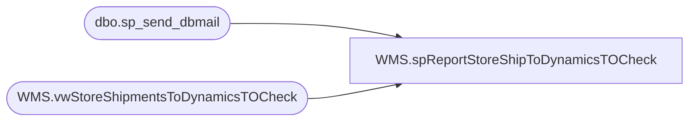

# WMS.spReportStoreShipToDynamicsTOCheck

**Database:** IntegrationStaging  

## Architecture Diagram



## Table Dependencies

| Referenced Table |
|---|
| dbo.sp_send_dbmail |
| WMS.vwStoreShipmentsToDynamicsTOCheck |

## Stored Procedure Code

```sql
CREATE proc [WMS].[spReportStoreShipToDynamicsTOCheck]
as 
-- =====================================================================================================
-- Name: WMS.spReportStoreShipToDynamicsTOCheck
--
-- Description:	Email Corperate Applications team a report that lists store shipments that have not attempted to push through the API to Dynamics; JIRA BIB-769
--
-- Revision History
--		Name:			Date:			Comments:
--		Lizzy Timm		06/18/2024		Created proc
-- =====================================================================================================
set nocount on;


IF (Object_ID('tempdb..#Shipments') IS NOT null) DROP TABLE #Shipments
SELECT DISTINCT Company
	, AptosShipmentNumber
	, FromWarehouse
	, ToWarehouse
	, convert(varchar, InsertDate, 22) [StoreShipmentExportInsertDate]
	, convert(varchar, ExportDate, 22) [AttemptedExportDate]
	, DistroCount
  INTO #Shipments
  FROM WMS.vwStoreShipmentsToDynamicsTOCheck

IF (SELECT COUNT(*) FROM #Shipments) > 0
BEGIN
----- Email results	
	DECLARE @xml NVARCHAR(MAX)
		, @btext nvarchar(max)
		, @body NVARCHAR(MAX)
		, @sub NVARCHAR(MAX)
		, @shipDate NVARCHAR(30)


	SET @xml = CAST(
		( SELECT ISNULL(CAST(Company AS varchar), '-') AS 'td',''
			,ISNULL(CAST(AptosShipmentNumber AS varchar), '0') AS 'td',''
			,ISNULL(CAST(FromWarehouse AS varchar), '0') AS 'td',''
			,ISNULL(CAST(ToWarehouse AS varchar), '0') AS 'td',''
			,ISNULL(CAST(DistroCount AS varchar), '0') AS 'td',''
			,ISNULL(CAST(AttemptedExportDate AS varchar), '0') AS 'td',''
		  FROM #Shipments
		FOR XML PATH('tr'), ELEMENTS ) AS NVARCHAR(MAX)
	  )


	SET @body = '<html><body><H3>Store Shipments To Dynamics TO Check</H3><div>The below records are staged to push to D365 but have not pushed through the API.</div><br>'
				+ '<table border = 1 style="border-collapse: collapse; padding: 5px;"> 
						<tr style="background-color: #0056a2; color: #ffffff;">
							<th> Company </th> 
							<th> Shipment </th> 
							<th> Warehouse </th> 
							<th> Store </th> 
							<th> Distro Count </th> 	
							<th> Attempted Export DateTime (Central) </th> 						
						</tr>' 
				+ @xml
				+ '</table>'
	SET @btext = @body + '<p style="font-size:12px;"><br><br>This report was generated from STL-SSIS-P-01.IntegrationStaging.WMS.spReportStoreShipToDynamicsTOCheck</p></body></html>'
	SET @sub = 'ALERT - Store Shipments To Dynamics TO Check Report'

	exec msdb.dbo.sp_send_dbmail
	@profile_name = 'BIAdmin',
	@recipients = 'enterprisesystemsalerts@buildabear.com;distrobears@buildabear.com;',
	@blind_copy_recipients = 'LizzyT@buildabear.com;',
	@body = @btext,
	@subject = @sub,
	@body_format = 'HTML'
END
```

