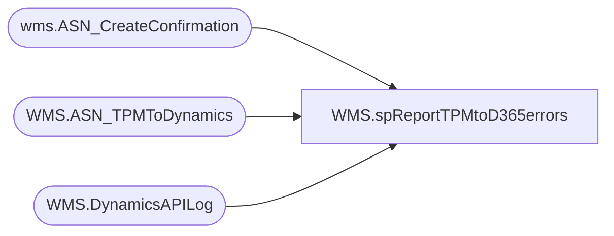

# WMS.spReportTPMtoD365errors

**Database:** IntegrationStaging  

## Architecture Diagram



## Table Dependencies

| Referenced Table |
|---|
| wms.ASN_CreateConfirmation |
| WMS.ASN_TPMToDynamics |
| WMS.DynamicsAPILog |

## Stored Procedure Code

```sql
CREATE proc [WMS].[spReportTPMtoD365errors] 
@days int,
@shipment varchar(50)

as

---------------------------------------------------------------------------------------------------------------------------------------------------
--	Ian Wallace	  02/08/2021	data source for WMS_TPM_to_D365_errors report on CLB SSRS server
---------------------------------------------------------------------------------------------------------------------------------------------------
set nocount on 

if (@shipment = '') 
BEGIN
	
with 
ShipmentAPI as
    (
        select distinct 
            e.Shipment as TPMShipment,
            max(e.sentTo365) ExportDate,
            case 
                when api.ResponseBody like '%hasErrors":true%' 
                    then 'Yes'
                else 'NO'
            end as HasAPIError,
            isnull(api.ResponseBody,api.ExceptionError) as APIResponseBody
        from WMS.ASN_TPMToDynamics e with (nolock)
        join  WMS.DynamicsAPILog api with (nolock)
            on api.IntegrationName='WMS_ASNCreate'
            and e.BatchID=api.BatchID
            and e.Shipment=api.TPMShipmentNumber
        where datediff(dd, api.InsertDate, getdate()) <=@days
        group by 
            e.Shipment,
            case 
                when api.ResponseBody like '%hasErrors":true%' 
                    then 'Yes'
                else 'NO'
            end,
            isnull(api.ResponseBody,api.ExceptionError)
    ),
ASNConfirmation as
    (
        select 
            ASnShipmentNumber as ShipmentNumberConfirmed,
            case 
                when message like 'Aptos PO % successfully assigned to ASN%'
                    then 1
                else 0
            end as isASNCreated,
            case 
                when errorMessage = '' 
                    then NULL 
                else errorMessage 
            end as errorMessage,
            EnqueuedTimeCST ASNConfirmationDate,
            replace(right(message,14),'.','') as DynamicsLoadNumber
        from wms.ASN_CreateConfirmation
        group by 
            ASnShipmentNumber,
            case 
                when message like 'Aptos PO % successfully assigned to ASN%'
                    then 1
                else 0
            end,
            case 
                when errorMessage = '' 
                    then NULL 
                else errorMessage 
            end,
            EnqueuedTimeCST,
            replace(right(message,14),'.','')
    )
select 
    api.TPMShipment,    
    api.ExportDate,    
    api.HasAPIError,    
    api.APIResponseBody,    
    asn.ShipmentNumberConfirmed,    
    asn.isASNCreated,    
    asn.errorMessage,    
    asn.ASNConfirmationDate,    
    asn.DynamicsLoadNumber
from ShipmentAPI api
left join ASNConfirmation asn on api.TPMShipment=asn.ShipmentNumberConfirmed
where
    --cases for 'failure' to send the email
    api.HasAPIError='yes'
    or asn.errorMessage is not null
	--or asn.isASNCreated = 0
    --or isnull(asn.DynamicsLoadNumber,'') =''
END
if (@shipment <> '') 
BEGIN
	
with 
ShipmentAPI as
    (
        select distinct 
            e.Shipment as TPMShipment,
            max(e.sentTo365) ExportDate,
            case 
                when api.ResponseBody like '%hasErrors":true%' 
                    then 'Yes'
                else 'NO'
            end as HasAPIError,
            isnull(api.ResponseBody,api.ExceptionError) as APIResponseBody
        from WMS.ASN_TPMToDynamics e with (nolock)
        join  WMS.DynamicsAPILog api with (nolock)
            on api.IntegrationName='WMS_ASNCreate'
            and e.BatchID=api.BatchID
            and e.Shipment=api.TPMShipmentNumber
        where datediff(dd, api.InsertDate, getdate()) <=@days
        group by 
            e.Shipment,
            case 
                when api.ResponseBody like '%hasErrors":true%' 
                    then 'Yes'
                else 'NO'
            end,
            isnull(api.ResponseBody,api.ExceptionError)
    ),
ASNConfirmation as
    (
        select 
            ASnShipmentNumber as ShipmentNumberConfirmed,
            case 
                when message like 'Aptos PO % successfully assigned to ASN%'
                    then 1
                else 0
            end as isASNCreated,
            case 
                when errorMessage = '' 
                    then NULL 
                else errorMessage 
            end as errorMessage,
            EnqueuedTimeCST ASNConfirmationDate,
            replace(right(message,14),'.','') as DynamicsLoadNumber
        from wms.ASN_CreateConfirmation
        group by 
            ASnShipmentNumber,
            case 
                when message like 'Aptos PO % successfully assigned to ASN%'
                    then 1
                else 0
            end,
            case 
                when errorMessage = '' 
                    then NULL 
                else errorMessage 
            end,
            EnqueuedTimeCST,
            replace(right(message,14),'.','')
    )
select 
    api.TPMShipment,    
    api.ExportDate,    
    api.HasAPIError,    
    api.APIResponseBody,    
    asn.ShipmentNumberConfirmed,    
    asn.isASNCreated,    
    asn.errorMessage,    
    asn.ASNConfirmationDate,    
    asn.DynamicsLoadNumber
from ShipmentAPI api
left join ASNConfirmation asn on api.TPMShipment=asn.ShipmentNumberConfirmed
where
    api.TPMShipment = @shipment 
    --cases for 'failure' to send the email
	AND
    (api.HasAPIError='yes'
    or asn.errorMessage is not null)
	--or asn.isASNCreated = 0
    --or isnull(asn.DynamicsLoadNumber,'') ='')
END
```

