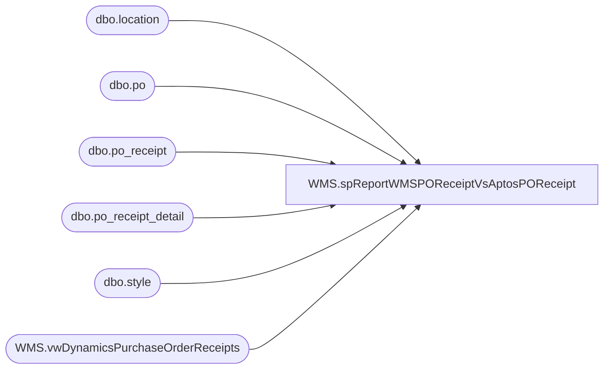

# WMS.spReportWMSPOReceiptVsAptosPOReceipt

**Database:** IntegrationStaging  

## Architecture Diagram



## Table Dependencies

| Referenced Table |
|---|
| dbo.location |
| dbo.po |
| dbo.po_receipt |
| dbo.po_receipt_detail |
| dbo.style |
| WMS.vwDynamicsPurchaseOrderReceipts |

## Stored Procedure Code

```sql
CREATE proc WMS.spReportWMSPOReceiptVsAptosPOReceipt
@date1 date, @date2 date

as

--declare @offset int
--select @offset= datediff(hh, getdate(), getutcdate())

;


with 
DynReceipts as 
	(
		--select 
		--	--cast(r.InsertDate as date) DynReceiptCapturedDate,
		--	--cast(dateadd(hh,-@offset, r.MessageQueueDateUTC) as date) as ReceiptDate, 
		--	cast(r.MessageQueueDateUTC as date) as ReceiptDate,
		--	r.ItemID as ItemNumber, 
		--	p.ProductDescription,
		--	sum (r.ReceivedQty-r.CanceledQty) as Quantity,
		--	r.AptosPONumber as PurchaseOrderNumber
		--	--case when r.ASN='' then NULL else r.ASN end as ASN --ASNs are mostly empty and when including, causing false variance, would need to fix out join still
		--from wms.PurchaseOrderReceipt r 
		--join wms.ItemMasterProducts p on r.ItemID=right(p.productnumber,6) and p.Entity = '1100'
		--join wms.ItemMaster im on p.ProductNumber=im.ProductNumber and p.Entity=im.Entity and im.NecessaryProductionWorkingTimeSchedulingPropertyId = 'Merch'
		--where 
		--	Warehouse in ('9980')
		--and (cast(dateadd(hh,-5, MessageQueueDateUTC) as date) >= @date)--cast(getdate()-90 as date))
		----and r.AptosPoNumber='1078601'
		----and r.ItemID='030129'
		--group by 
		--	--cast(r.InsertDate as date),
		--	--cast(dateadd(hh,-@offset, r.MessageQueueDateUTC) as date), 
		--	cast(r.MessageQueueDateUTC as date),
		--	r.ItemID, 
		--	p.ProductDescription,
		--	r.AptosPONumber
		select 
			AptosPONumber PurchaseOrderNumber,
			ProductReceiptDate as ReceiptDate,
			ItemNumber,
			ProductDescription,
			sum(ReceivedPurchaseQuantity) Quantity
		from WMS.vwDynamicsPurchaseOrderReceipts
		--where datediff(dd, ProductReceiptDate, getdate())<=120
		where ReceivingWarehouseID='9980'
		and ProductReceiptDate >= @date1
		and ProductReceiptDate <= @date2
		--order by ProductReceiptDate, AptosPONumber, AptosPOShipmentLineNumber, LineNumber
		group by 
			AptosPONumber,
			ProductReceiptDate,
			ItemNumber,
			ProductDescription
	),
--AptosReceiptStage as
--	(
--		select 
--			pr.po_no as PONumber,
--			--pr.po_receipt_no AptosDocument,
--			cast(pr.receive_date as date) as AptosReceiptDate,
--			--pr.packing_list_no as AptosASN,
--			s.style_code,
--			sum(units_received) AptosReceiptQty
--		from bedrockdb02.me_01.dbo.import_po_receipt pr with (nolock)
--		join bedrockdb02.me_01.dbo.import_po_receipt_sku prs with (nolock) on pr.import_po_receipt_id=prs.import_po_receipt_id
--		join bedrockdb02.me_01.dbo.upc upc with (nolock) on prs.upc_number=upc.upc_number
--		join bedrockdb02.me_01.dbo.sku sku with (nolock) on upc.sku_id=sku.sku_id
--		join bedrockdb02.me_01.dbo.style s with (nolock) on sku.style_id=s.style_id
--		where exists (
--						select dr.PurchaseOrderNumber 
--						from DynReceipts dr 
--						where dr.PurchaseOrderNumber=pr.po_no 
--						and dr.ItemNumber=s.style_code 
--						--and isnull(dr.asn,'n/a')=isnull(pr.packing_list_no,'n/a')
--						and cast(pr.receive_date as date)= dr.ReceiptDate
--					)
--		--and pr.po_no='1076162'
--		group by 
--			pr.po_no,
--			--pr.po_receipt_no,
--			cast(pr.receive_date as date),
--			--pr.packing_list_no,
--			s.style_code
--	),--select * from AptosReceiptStage where PONumber='1078601',
AptosReceipts as
	(
		select 
			po.po_no PONumber,
			--pr.document_no AptosDocument,
			--cast(pr.create_date as date) AptosReceiptCreateDate,
			cast(pr.receive_date as date) AptosReceiptDate,
			--pr.packing_list_no as AptosASN,
			s.style_code,
			sum(prd.units_received) AptosReceiptQty
		from bedrockdb02.me_01.dbo.po po with (nolock)
		join bedrockdb02.me_01.dbo.po_receipt pr with (nolock) on po.po_id=pr.po_id
		join bedrockdb02.me_01.dbo.location l with (nolock) on pr.location_id=l.location_id
		join bedrockdb02.me_01.dbo.po_receipt_detail prd with (nolock) on pr.po_receipt_id=prd.po_receipt_id
		join bedrockdb02.me_01.dbo.style s with (nolock) on prd.style_id=s.style_id
		where 1=1
		--and po.po_no='1076162'
		and exists (
						select dr.PurchaseOrderNumber 
						from DynReceipts dr 
						where dr.PurchaseOrderNumber=po.po_no 
						and dr.ItemNumber=s.style_code 
						--and isnull(dr.asn,'n/a')=isnull(pr.packing_list_no,'n/a')
						and cast(pr.receive_date as date)= dr.ReceiptDate
					)
		--and exists (
		--				select ars.PONumber 
		--				from AptosReceiptStage ars	
		--				where ars.PONumber=po.po_no
		--				--and ars.AptosDocument=pr.document_no
		--				and ars.AptosReceiptDate=dr.ReceiptDate
		--				--and isnull(ars.AptosASN,'n/a')=isnull(pr.packing_list_no,'n/a')
		--				and ars.style_code=s.style_code
		--			)
		group by 
			po.po_no,
			--pr.document_no,
			--cast(pr.create_date as date),
			cast(pr.receive_date as date),
			--pr.packing_list_no,
			s.style_code
	)-- select * from AptosReceipts where PONumber='1079324'
select 
	--DynReceiptCapturedDate,
	d.ReceiptDate,
	d.PurchaseOrderNumber,
	--d.ASN,
	d.ItemNumber,
	d.ProductDescription,
	d.Quantity,
	--ars.AptosDocument,
	--ars.AptosReceiptDate,
--ars.AptosReceiptQty AptosStagedQty,
	--a.AptosDocument,
	--a.AptosReceiptCreateDate,
	--a.AptosReceiptDate,
	a.AptosReceiptQty,
	d.Quantity-a.AptosReceiptQty VarianceQty
from DynReceipts d
--left join AptosReceiptStage ars 
--	on d.PurchaseOrderNumber=ars.PONumber
--	and d.ItemNumber=ars.style_code
--	and d.ReceiptDate=ars.AptosReceiptDate
----	and case when d.ASN='' then 'na' else d.ASN end=isnull(ars.AptosASN,'na')
left join AptosReceipts a 
	on d.PurchaseOrderNumber=a.PONumber
	and d.ItemNumber=a.style_code
	and d.ReceiptDate=a.AptosReceiptDate
--	and case when d.ASN='' then 'na' else d.ASN end=isnull(a.AptosASN,'na')
	--and a.AptosDocument=ars.AptosDocument
where --a.AptosDocument is null
d.ReceiptDate=a.AptosReceiptDate
and isnull(a.AptosReceiptQty,0) <> isnull(d.Quantity,0)
```

