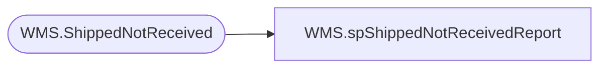

# WMS.spShippedNotReceivedReport

**Database:** IntegrationStaging  

## Architecture Diagram



## Table Dependencies

| Referenced Table |
|---|
| WMS.ShippedNotReceived |

## Stored Procedure Code

```sql
CREATE proc [WMS].[spShippedNotReceivedReport]
@district integer

WITH RECOMPILE 

as 

set nocount on 


----------------------------------------------------------------------------------------------------
--//       	                                                                    //--
----------------------------------------------------------------------------------------------------

if @district = 0
BEGIN
select * from [WMS].[ShippedNotReceived] where  DmId is not null
END
ELSE 
BEGIN
select * from [WMS].[ShippedNotReceived] where DmId = @district
END
```

