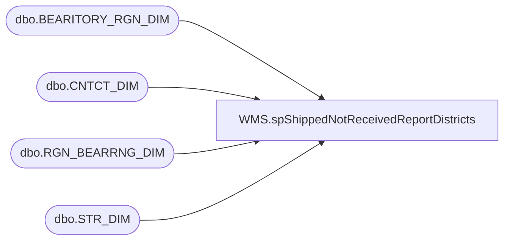

# WMS.spShippedNotReceivedReportDistricts

**Database:** IntegrationStaging  

## Architecture Diagram



## Table Dependencies

| Referenced Table |
|---|
| dbo.BEARITORY_RGN_DIM |
| dbo.CNTCT_DIM |
| dbo.RGN_BEARRNG_DIM |
| dbo.STR_DIM |

## Stored Procedure Code

```sql
--exec [WMS].[spShippedNotReceivedReportDistricts]


CREATE proc [WMS].[spShippedNotReceivedReportDistricts]
--@district varchar(150)

WITH RECOMPILE 

as 

set nocount on 


----------------------------------------------------------------------------------------------------
--//       	                                                                    //--
----------------------------------------------------------------------------------------------------
	
	SELECT 'All' as DistrictName, 'noreply@buildabear.com' as Email, 0 as DmId
	
	union
	
	--SELECT distinct BD.NM as DistrictName, CD.EMAIL  as EMail
	----INTO #AllDistricts 
	--,BD.BEARITORY_ID as DmId
	--		FROM KODIAK.babwmstrdata.dbo.STR_DIM s
	--		left join KODIAK.babwmstrdata.dbo.BEARITORY_DIM BD on S.BEARITORY_ID = BD.BEARITORY_ID
	--		INNER JOIN KODIAK.babwmstrdata.dbo.CNTCT_DIM CD WITH (NOLOCK) ON BD.CNTCT_ID = CD.CNTCT_ID
	--		join KODIAK.babwmstrdata.dbo.RGN_BEARRNG_DIM RBD on BD.RGN_ID = RBD.RGN_ID and RBD.END_DT >= getdate() 
	--		INNER JOIN KODIAK.babwmstrdata.dbo.CNTCT_DIM CD2 WITH (NOLOCK) ON RBD.CNTCT_ID = CD2.CNTCT_ID 
	--		--where BD.NM = @district

			SELECT distinct BD.NM as DistrictName, CD.EMAIL  as EMail
	--INTO #AllDistricts 
	,BD.BEARITORY_ID as DmId
			FROM KODIAK.babwmstrdata.dbo.STR_DIM s
			--left join KODIAK.babwmstrdata.dbo.BEARITORY_DIM BD on S.BEARITORY_ID = BD.BEARITORY_ID
			left join  KODIAK.babwmstrdata.dbo.BEARITORY_RGN_DIM bd  on s.BEARITORY_ID = bd.BEARITORY_ID
			INNER JOIN KODIAK.babwmstrdata.dbo.CNTCT_DIM CD WITH (NOLOCK) ON BD.CNTCT_ID = CD.CNTCT_ID
			join KODIAK.babwmstrdata.dbo.RGN_BEARRNG_DIM RBD on BD.RGN_ID = RBD.RGN_ID and RBD.END_DT >= getdate() 
			INNER JOIN KODIAK.babwmstrdata.dbo.CNTCT_DIM CD2 WITH (NOLOCK) ON RBD.CNTCT_ID = CD2.CNTCT_ID 
			where bd.END_DT = '2399-12-31'
```

